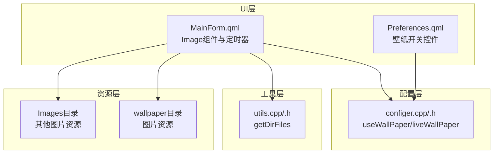
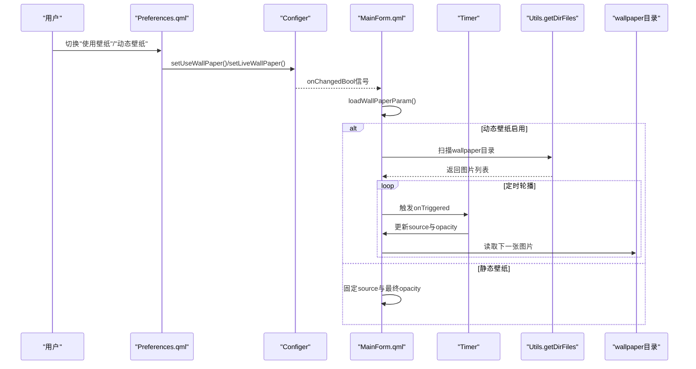
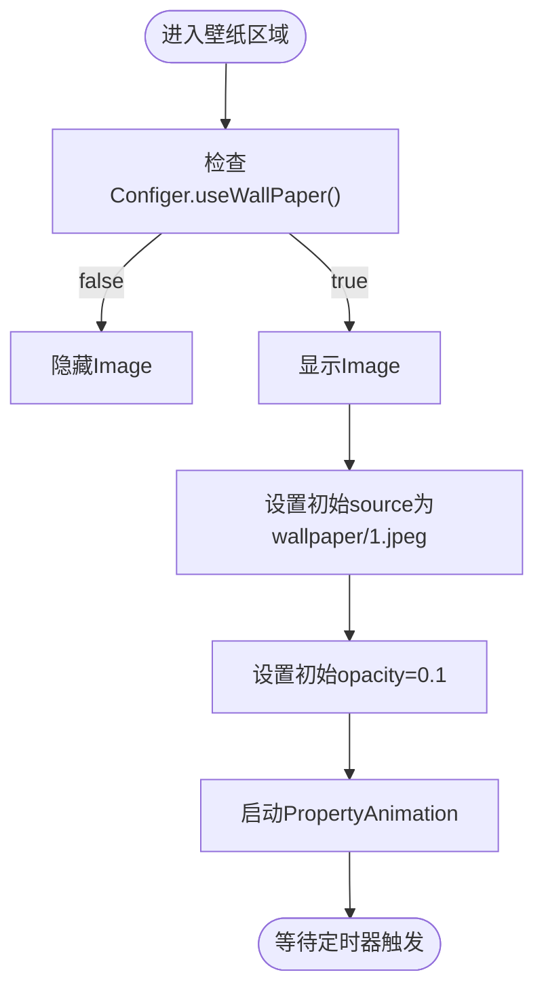
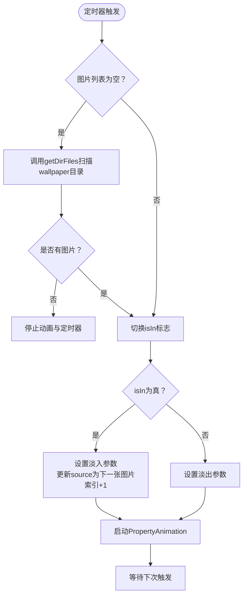
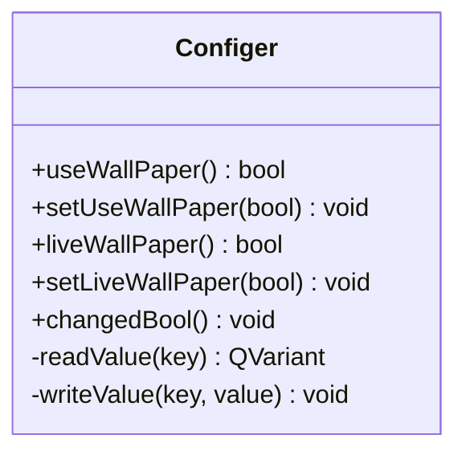
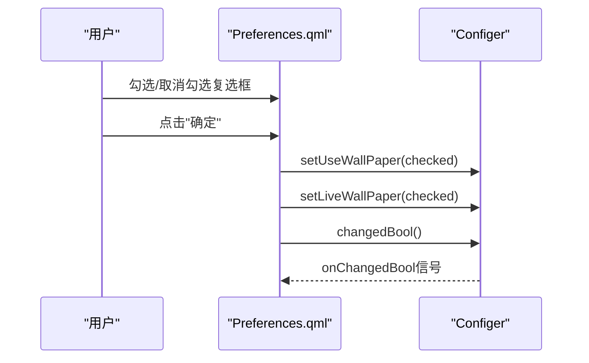
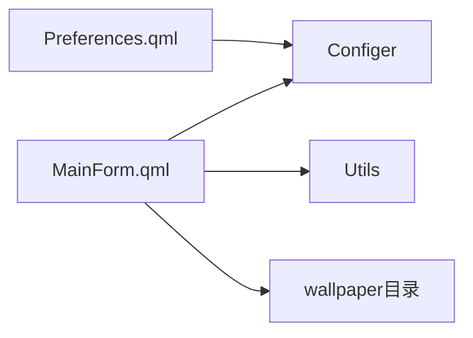

# 壁纸资源管理

<cite>
**本文档引用的文件**
- [MainForm.qml](file://src/QmlUI/MainForm.qml)
- [Preferences.qml](file://src/QmlUI/Preferences.qml)
- [configer.cpp](file://src/configer.cpp)
- [configer.h](file://src/configer.h)
- [utils.cpp](file://src/utils.cpp)
- [utils.h](file://src/utils.h)
</cite>

## 目录
1. [简介](#简介)
2. [项目结构](#项目结构)
3. [核心组件](#核心组件)
4. [架构概览](#架构概览)
5. [详细组件分析](#详细组件分析)
6. [依赖关系分析](#依赖关系分析)
7. [性能考虑](#性能考虑)
8. [故障排除指南](#故障排除指南)
9. [结论](#结论)

## 简介
本文件针对QmlPlugins项目的壁纸资源管理系统进行全面技术文档化，重点覆盖以下方面：
- wallpaper目录的组织与文件管理策略
- 动态壁纸更换的实现原理与配置流程
- 用户界面集成方式与交互逻辑
- 壁纸显示效果、缩放模式与适配策略
- 资源加载机制、缓存与内存管理
- 文件格式要求、分辨率标准与质量优化建议
- 具体代码示例路径，帮助开发者快速定位实现位置

## 项目结构
壁纸功能主要分布在以下模块中：
- UI层：主窗体中的Image组件负责壁纸渲染，偏好设置界面提供开关控制
- 配置层：Configer类提供壁纸启用状态与动态壁纸开关的持久化存储
- 工具层：Utils类提供目录扫描能力，用于发现wallpaper目录下的可用图片资源
- 资源层：bin/resources/wallpaper与bin/Images等目录存放静态资源



**图表来源**
- [MainForm.qml:266-342](file://src/QmlUI/MainForm.qml#L266-L342)
- [Preferences.qml:279-351](file://src/QmlUI/Preferences.qml#L279-L351)
- [configer.cpp:167-190](file://src/configer.cpp#L167-L190)
- [utils.cpp:11-11](file://src/utils.cpp#L11-L11)

**章节来源**
- [MainForm.qml:266-342](file://src/QmlUI/MainForm.qml#L266-L342)
- [Preferences.qml:279-351](file://src/QmlUI/Preferences.qml#L279-L351)
- [configer.cpp:167-190](file://src/configer.cpp#L167-L190)
- [utils.cpp:11-11](file://src/utils.cpp#L11-L11)

## 核心组件
- 壁纸Image组件：位于主窗体，负责渲染wallpaper目录中的图片，并通过透明度动画实现淡入淡出效果
- 动态切换定时器：周期性触发，按顺序轮播wallpaper目录中的图片
- 配置器Configer：提供useWallPaper与liveWallPaper两个布尔配置项，支持读写
- 目录扫描工具Utils：提供getDirFiles函数，用于扫描指定目录并返回符合过滤条件的文件列表
- 偏好设置界面：提供两个复选框用于开启/关闭壁纸与动态壁纸功能

**章节来源**
- [MainForm.qml:266-342](file://src/QmlUI/MainForm.qml#L266-L342)
- [configer.cpp:167-190](file://src/configer.cpp#L167-L190)
- [utils.cpp:11-11](file://src/utils.cpp#L11-L11)
- [Preferences.qml:279-351](file://src/QmlUI/Preferences.qml#L279-L351)

## 架构概览
壁纸系统采用分层设计，UI层通过配置器与工具层协作完成资源发现与渲染。



**图表来源**
- [Preferences.qml:325-327](file://src/QmlUI/Preferences.qml#L325-L327)
- [configer.cpp:167-190](file://src/configer.cpp#L167-L190)
- [MainForm.qml:284-342](file://src/QmlUI/MainForm.qml#L284-L342)
- [utils.cpp:11-11](file://src/utils.cpp#L11-L11)

## 详细组件分析

### 壁纸Image组件与显示策略
- 可见性控制：由Configer.useWallPaper()决定是否显示
- 缩放模式：fillMode为Stretch，适配全屏显示
- 透明度动画：PropertyAnimation在0与0.1之间切换，形成淡入淡出效果
- 深度层级：z=0，确保壁纸位于最底层
- 初始资源：默认指向wallpaper/1.jpeg，实际运行时会被动态替换



**图表来源**
- [MainForm.qml:266-273](file://src/QmlUI/MainForm.qml#L266-L273)

**章节来源**
- [MainForm.qml:266-273](file://src/QmlUI/MainForm.qml#L266-L273)

### 动态壁纸切换逻辑
- 定时器参数：interval初始为5毫秒，随后根据播放状态调整
- 轮播状态机：isIn标志位控制“进入”和“退出”两个阶段，分别对应淡入与淡出
- 图片列表：首次触发时调用Utils.getDirFiles扫描wallpaper目录，支持*.jpeg、*.jpg、*.bmp、*.png
- 循环播放：索引越界时重置到0，实现循环



**图表来源**
- [MainForm.qml:284-322](file://src/QmlUI/MainForm.qml#L284-L322)
- [utils.cpp:11-11](file://src/utils.cpp#L11-L11)

**章节来源**
- [MainForm.qml:284-322](file://src/QmlUI/MainForm.qml#L284-L322)
- [utils.cpp:11-11](file://src/utils.cpp#L11-L11)

### 配置器Configer与持久化
- useWallPaper：控制是否启用壁纸
- liveWallPaper：控制是否启用动态壁纸
- 存储方式：以整数形式存储（1表示true，0表示false），通过readValue/writeValue读写
- 信号机制：changedBool在值变更时发出，供UI响应



**图表来源**
- [configer.h:180-184](file://src/configer.h#L180-L184)
- [configer.cpp:167-190](file://src/configer.cpp#L167-L190)

**章节来源**
- [configer.h:180-184](file://src/configer.h#L180-L184)
- [configer.cpp:167-190](file://src/configer.cpp#L167-L190)

### 偏好设置界面集成
- 控件布局：两个RowLayout，上方放置两个CheckBox（使用壁纸、动态壁纸）
- 提交处理：点击确定时调用Configer.setUseWallPaper与setLiveWallPaper，并触发changedBool
- 文案本地化：文本通过qsTr进行翻译



**图表来源**
- [Preferences.qml:279-335](file://src/QmlUI/Preferences.qml#L279-L335)
- [configer.cpp:167-190](file://src/configer.cpp#L167-L190)

**章节来源**
- [Preferences.qml:279-335](file://src/QmlUI/Preferences.qml#L279-L335)

### 目录扫描与资源发现
- 接口：Utils.getDirFiles(path, filter)返回匹配的文件列表
- 使用场景：在动态壁纸模式下首次触发时扫描wallpaper目录
- 过滤规则：支持*.jpeg、*.jpg、*.bmp、*.png四种扩展名

```mermaid
flowchart TD
Call["调用getDirFiles(\"./wallpaper/\", filters)"] --> BuildFilter["构建过滤器列表"]
BuildFilter --> ScanDir["扫描目录"]
ScanDir --> Match{"匹配文件？"}
Match --> |否| Empty["返回空列表"]
Match --> |是| Return["返回文件列表"]
```

**图表来源**
- [utils.cpp:11-11](file://src/utils.cpp#L11-L11)
- [MainForm.qml:293-298](file://src/QmlUI/MainForm.qml#L293-L298)

**章节来源**
- [utils.cpp:11-11](file://src/utils.cpp#L11-L11)
- [MainForm.qml:293-298](file://src/QmlUI/MainForm.qml#L293-L298)

## 依赖关系分析
- MainForm.qml依赖Configer进行状态判断，依赖Utils进行资源发现
- Preferences.qml依赖Configer进行配置写入
- Configer提供统一的配置读写接口，内部使用键值对存储
- Utils提供跨平台的目录扫描能力



**图表来源**
- [Preferences.qml:325-327](file://src/QmlUI/Preferences.qml#L325-L327)
- [MainForm.qml:284-342](file://src/QmlUI/MainForm.qml#L284-L342)
- [configer.cpp:167-190](file://src/configer.cpp#L167-L190)
- [utils.cpp:11-11](file://src/utils.cpp#L11-L11)

**章节来源**
- [Preferences.qml:325-327](file://src/QmlUI/Preferences.qml#L325-L327)
- [MainForm.qml:284-342](file://src/QmlUI/MainForm.qml#L284-L342)
- [configer.cpp:167-190](file://src/configer.cpp#L167-L190)
- [utils.cpp:11-11](file://src/utils.cpp#L11-L11)

## 性能考虑
- 资源加载
  - 首次轮播时进行目录扫描，后续重复使用已获取的文件列表，避免频繁IO
  - 图片路径使用file:协议，直接从本地目录加载
- 动画与定时器
  - 动画时长固定为1000ms，淡入淡出时间均衡
  - 定时器间隔在播放阶段为5000ms，在过渡阶段为0ms，减少CPU占用
- 内存管理
  - Image组件随可见性变化而显示/隐藏，避免不必要的渲染
  - 若无可用图片，自动停止定时器与动画，释放资源
- 缓存策略
  - 当前实现未显式缓存图片对象；可通过Qt的Image缓存机制间接受益
  - 建议在高分辨率场景下限制同时存在的Image实例数量

[本节为通用性能建议，不直接分析具体文件，故无章节来源]

## 故障排除指南
- 问题：动态壁纸不生效
  - 检查Configer.liveWallPaper()是否为true
  - 确认wallpaper目录存在且包含受支持的图片格式
  - 查看定时器是否正常触发
- 问题：图片无法显示或闪烁
  - 检查Image的source路径是否正确
  - 确认fillMode与父容器尺寸匹配
  - 调整PropertyAnimation的duration以适应设备性能
- 问题：切换配置后UI未更新
  - 确保Configer.changedBool()被调用
  - 检查MainForm.qml中的Connections是否正确绑定

**章节来源**
- [MainForm.qml:284-342](file://src/QmlUI/MainForm.qml#L284-L342)
- [configer.cpp:167-190](file://src/configer.cpp#L167-L190)

## 结论
QmlPlugins的壁纸系统通过清晰的分层设计实现了简洁高效的动态壁纸功能：
- UI层负责渲染与交互，配置层提供持久化能力，工具层负责资源发现
- 采用定时器+PropertyAnimation的组合实现平滑的轮播效果
- 支持多种常见图片格式，具备良好的可扩展性
- 建议在生产环境中进一步完善错误处理、资源缓存与性能监控，以提升用户体验与稳定性