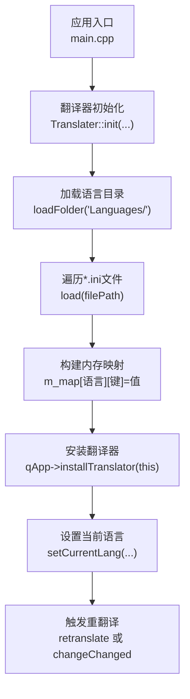
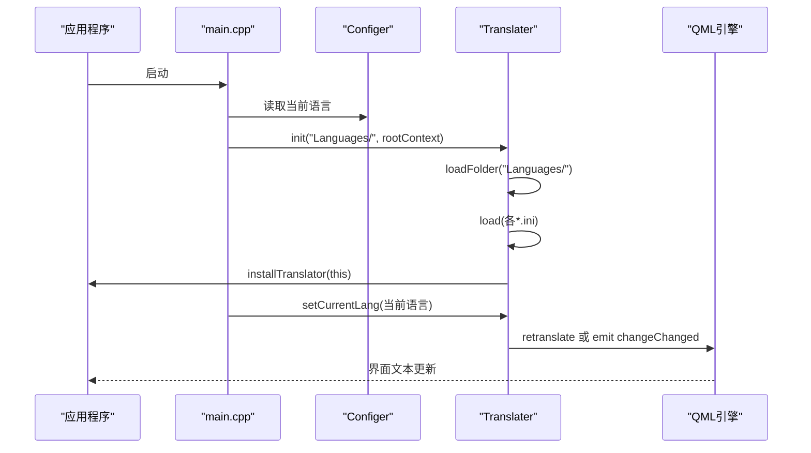
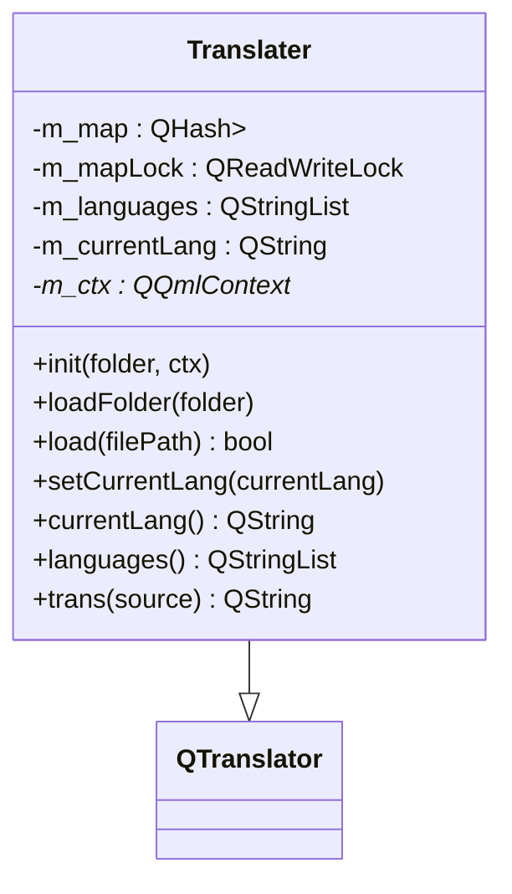
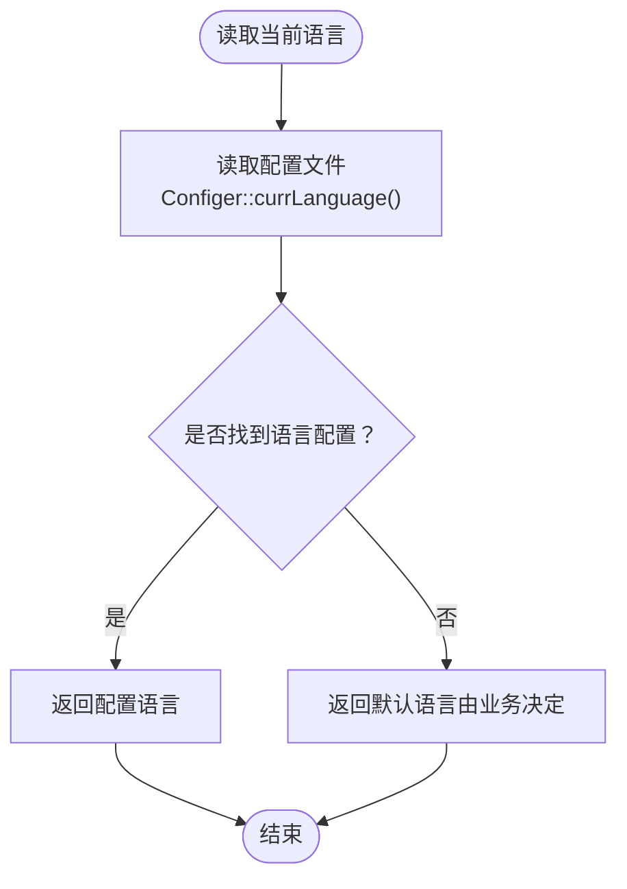
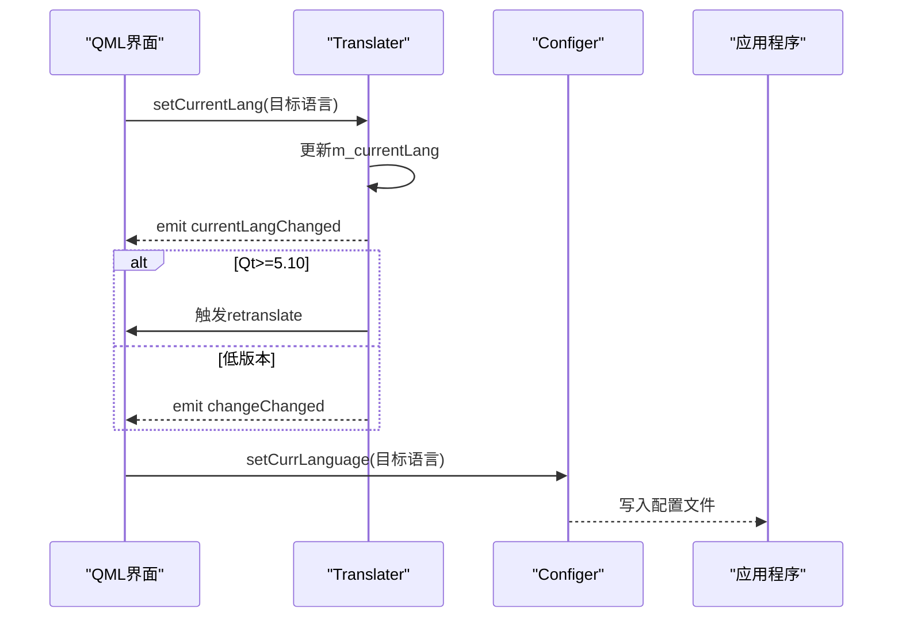
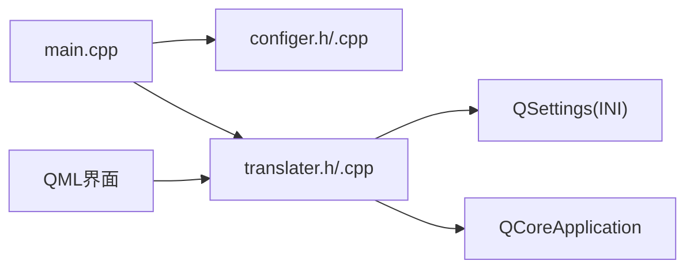

# 多语言资源配置

<cite>
**本文引用的文件**
- [translater.h](file://src/translater.h)
- [translater.cpp](file://src/translater.cpp)
- [main.cpp](file://src/main.cpp)
- [configer.h](file://src/configer.h)
- [configer.cpp](file://src/configer.cpp)
- [cn.ini（resources）](file://resources/Languages/cn.ini)
- [en.ini（resources）](file://resources/Languages/en.ini)
- [cn.ini（bin）](file://bin/Languages/cn.ini)
- [en.ini（bin）](file://bin/Languages/en.ini)
</cite>

## 目录
1. [简介](#简介)
2. [项目结构](#项目结构)
3. [核心组件](#核心组件)
4. [架构总览](#架构总览)
5. [组件详解](#组件详解)
6. [依赖关系分析](#依赖关系分析)
7. [性能与并发特性](#性能与并发特性)
8. [故障排查指南](#故障排查指南)
9. [结论](#结论)
10. [附录](#附录)

## 简介
本文件面向QmlPlugins项目的多语言资源配置，系统性阐述languages目录的结构、语言文件组织方式、中文与英文语言包的配置方法、翻译键值对管理、语言切换机制（含运行时切换与配置持久化）、翻译文件格式规范与编码要求、更新策略以及多语言资源的维护与质量保障流程，并提供基于源码的调用路径与使用示例。

## 项目结构
- 多语言资源位于两个位置：
  - 开发/打包资源目录：resources/Languages/*.ini
  - 运行时可执行目录：bin/Languages/*.ini
- 语言文件命名规范：cn.ini（简体中文）、en.ini（英语）
- 语言文件采用INI格式，包含两段：
  - [default]：用于声明该文件的语言名称（例如“简体中文”或“English”）
  - [Translate]：键值对集合，键为统一标识符，值为对应语言的文本

图表来源
- [main.cpp:54-58](file://src/main.cpp#L54-L58)
- [translater.cpp:24-37](file://src/translater.cpp#L24-L37)
- [translater.cpp:48-76](file://src/translater.cpp#L48-L76)
- [translater.cpp:78-94](file://src/translater.cpp#L78-L94)
- [translater.cpp:123-136](file://src/translater.cpp#L123-L136)

章节来源
- [main.cpp:54-58](file://src/main.cpp#L54-L58)
- [configer.h:52-53](file://src/configer.h#L52-L53)

## 核心组件
- Translater：自定义QTranslator子类，负责加载INI语言文件、维护语言映射、提供运行时切换与重翻译能力
- Configer：全局配置单例，负责读取/写入当前语言等配置项
- 语言文件：cn.ini、en.ini，分别提供简体中文与英文的键值对

章节来源
- [translater.h:27-107](file://src/translater.h#L27-L107)
- [translater.cpp:19-22](file://src/translater.cpp#L19-L22)
- [configer.h:98-120](file://src/configer.h#L98-L120)
- [configer.cpp:52-60](file://src/configer.cpp#L52-L60)

## 架构总览
应用启动时，从Configer读取当前语言，构造Translater并初始化语言目录；随后安装翻译器，设置当前语言，触发重翻译以使QML界面生效。

图表来源
- [main.cpp:54-58](file://src/main.cpp#L54-L58)
- [translater.cpp:24-37](file://src/translater.cpp#L24-L37)
- [translater.cpp:48-76](file://src/translater.cpp#L48-L76)
- [translater.cpp:78-94](file://src/translater.cpp#L78-L94)
- [translater.cpp:123-136](file://src/translater.cpp#L123-L136)

## 组件详解

### Translater类
- 职责
  - 加载语言目录下的所有INI文件
  - 解析每个INI文件，提取语言名与键值对，存入内存映射
  - 对外提供QML上下文属性，支持运行时切换语言并触发重翻译
- 关键接口
  - init(folder, ctx)：初始化并安装翻译器
  - loadFolder(folder)：扫描目录并逐个加载INI
  - load(filePath)：解析INI，填充映射
  - setCurrentLang(lang)：设置当前语言并触发重翻译
  - trans(source)：根据当前语言查找翻译
- 数据结构
  - m_map：QHash<QString, QHash<QString, QString>>，第一层键为语言名，第二层键为翻译键，值为翻译文本
  - m_mapLock：读写锁，保护并发访问
  - m_languages：语言列表
  - m_currentLang：当前语言
- 信号
  - currentLangChanged、languagesChanged、changeChanged、langLoaded、folderLoaded

图表来源
- [translater.h:27-107](file://src/translater.h#L27-L107)
- [translater.cpp:19-22](file://src/translater.cpp#L19-L22)

章节来源
- [translater.h:27-107](file://src/translater.h#L27-L107)
- [translater.cpp:24-37](file://src/translater.cpp#L24-L37)
- [translater.cpp:48-76](file://src/translater.cpp#L48-L76)
- [translater.cpp:78-94](file://src/translater.cpp#L78-L94)
- [translater.cpp:123-136](file://src/translater.cpp#L123-L136)

### Configer类
- 职责
  - 提供全局配置读写，包括当前语言currLanguage
  - 通过QSettings以INI格式读写配置
- 关键接口
  - currLanguage()/setCurrLanguage(lang)
  - 读写底层使用readValue/writeValue

图表来源
- [configer.cpp:52-60](file://src/configer.cpp#L52-L60)

章节来源
- [configer.h:98-120](file://src/configer.h#L98-L120)
- [configer.cpp:52-60](file://src/configer.cpp#L52-L60)

### 语言文件格式与组织
- 文件位置
  - 开发/打包资源：resources/Languages/cn.ini、resources/Languages/en.ini
  - 运行时目录：bin/Languages/cn.ini、bin/Languages/en.ini
- INI结构
  - [default]：Language = 语言名称（如“简体中文”、“English”）
  - [Translate]：键值对，键为统一标识符，值为对应语言文本
- 示例要点
  - 键命名建议遵循模块前缀（如Login.Title、Topbar.Quit），便于维护与查找
  - 文本内容按功能模块分节注释，便于定位与校对

章节来源
- [cn.ini（resources）:1-300](file://resources/Languages/cn.ini#L1-L300)
- [en.ini（resources）:1-298](file://resources/Languages/en.ini#L1-L298)
- [cn.ini（bin）:1-300](file://bin/Languages/cn.ini#L1-L300)
- [en.ini（bin）:1-298](file://bin/Languages/en.ini#L1-L298)

### 语言切换机制与运行时切换
- 切换流程
  - 通过Translater::setCurrentLang设置目标语言
  - 发出currentLangChanged信号
  - 在Qt 5.10及以上版本，调用QMLEngine::retranslate触发界面重翻译
  - 低版本则发出changeChanged信号，由QML侧监听并刷新
- 配置持久化
  - Configer::setCurrLanguage将当前语言写回配置文件
  - 下次启动时由Configer读取并传给Translater::init

图表来源
- [translater.cpp:123-136](file://src/translater.cpp#L123-L136)
- [configer.cpp:57-60](file://src/configer.cpp#L57-L60)

章节来源
- [translater.cpp:123-136](file://src/translater.cpp#L123-L136)
- [configer.cpp:57-60](file://src/configer.cpp#L57-L60)

### 翻译键值对管理
- 建议策略
  - 键命名规范：模块前缀+控件/文案标识，避免冲突
  - 分节注释：按界面模块分段，便于定位与批量校对
  - 统一占位符：如%1、%2，确保不同语言下顺序正确
- 更新策略
  - 新增键：在各语言文件的[Translate]段落中添加
  - 删除键：清理各语言文件中的对应键，保持一致性
  - 重构键名：集中迁移时，先在所有语言文件中替换，再更新代码引用

章节来源
- [cn.ini（resources）:10-300](file://resources/Languages/cn.ini#L10-L300)
- [en.ini（resources）:9-298](file://resources/Languages/en.ini#L9-L298)

### 编码与格式规范
- 文件编码：建议使用UTF-8（无BOM），确保跨平台显示一致
- INI格式：键值对以“=”连接，空格不影响解析
- 键名与值：避免使用特殊字符，必要时进行转义
- 注释：使用“#”开头，便于区分功能模块

章节来源
- [cn.ini（resources）:1-300](file://resources/Languages/cn.ini#L1-L300)
- [en.ini（resources）:1-298](file://resources/Languages/en.ini#L1-L298)

### 维护方法与质量保证
- 维护流程
  - 变更评审：新增/修改键需在所有语言文件同步更新
  - 自动化校验：提供脚本检查缺失键或多余键
  - 本地化测试：在目标语言环境下验证显示效果
- 质量保证
  - 术语统一：建立术语表，避免同义词不同译
  - 上下文一致：同一语境下的表达风格统一
  - 可读性优先：避免过长或嵌套复杂的句子

## 依赖关系分析
- main.cpp依赖Configer读取语言配置，并将当前语言传递给Translater
- Translater依赖QSettings加载INI文件，依赖QCoreApplication安装翻译器
- QML通过translater上下文属性使用翻译服务

图表来源
- [main.cpp:54-58](file://src/main.cpp#L54-L58)
- [configer.h:98-120](file://src/configer.h#L98-L120)
- [translater.cpp:24-37](file://src/translater.cpp#L24-L37)

章节来源
- [main.cpp:54-58](file://src/main.cpp#L54-L58)
- [configer.h:98-120](file://src/configer.h#L98-L120)
- [translater.cpp:24-37](file://src/translater.cpp#L24-L37)

## 性能与并发特性
- 内存映射：使用QHash嵌套结构，查找复杂度平均O(1)，适合高频读取
- 并发安全：读写分离锁（QReadWriteLock），读多写少场景下提升吞吐
- 初始化成本：一次性加载目录内所有INI，后续切换仅触发重翻译，避免重复IO

章节来源
- [translater.h:96-106](file://src/translater.h#L96-L106)
- [translater.cpp:85-90](file://src/translater.cpp#L85-L90)

## 故障排查指南
- 问题：界面未显示翻译
  - 检查Translater::init是否被调用且安装了翻译器
  - 检查语言目录路径是否正确（默认“Languages/”）
  - 检查当前语言是否设置成功
- 问题：切换语言后界面不变
  - 确认Qt版本是否满足retranslate条件
  - 检查QML是否监听changeChanged或调用retranslate
- 问题：新增键无效
  - 确认各语言文件均包含该键
  - 确认键名拼写一致，无多余空格
- 问题：中文显示乱码
  - 确认INI文件保存为UTF-8编码
  - 确认系统字体支持中文显示

章节来源
- [translater.cpp:24-37](file://src/translater.cpp#L24-L37)
- [translater.cpp:123-136](file://src/translater.cpp#L123-L136)
- [cn.ini（resources）:1-300](file://resources/Languages/cn.ini#L1-L300)
- [en.ini（resources）:1-298](file://resources/Languages/en.ini#L1-L298)

## 结论
QmlPlugins的多语言方案以INI文件为核心，结合Translater的内存映射与运行时切换能力，实现了简洁高效的本地化支持。通过Configer的配置持久化与清晰的键值对管理策略，可在保证性能的同时，持续迭代与优化多语言资源。

## 附录

### 代码示例（调用路径）
- 应用启动时加载语言并设置当前语言
  - [main.cpp:54-58](file://src/main.cpp#L54-L58)
- 初始化翻译器并安装
  - [translater.cpp:24-37](file://src/translater.cpp#L24-L37)
- 加载语言目录与文件
  - [translater.cpp:48-76](file://src/translater.cpp#L48-L76)
  - [translater.cpp:78-94](file://src/translater.cpp#L78-L94)
- 设置当前语言并触发重翻译
  - [translater.cpp:123-136](file://src/translater.cpp#L123-L136)
- 读取/写入当前语言配置
  - [configer.cpp:52-60](file://src/configer.cpp#L52-L60)
  - [configer.cpp:57-60](file://src/configer.cpp#L57-L60)