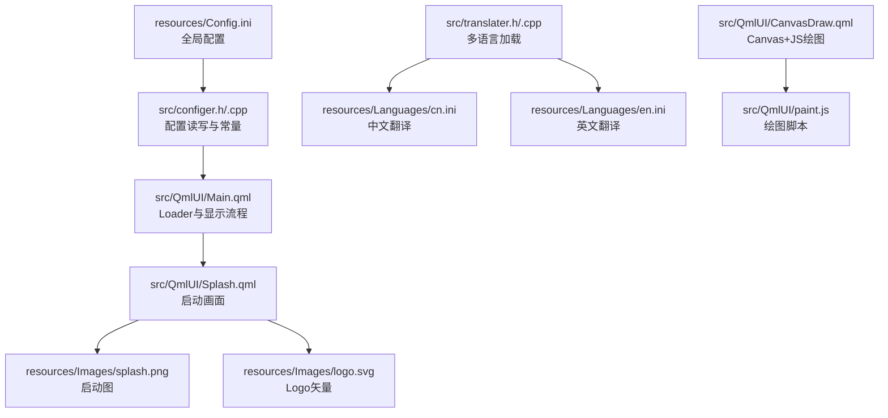
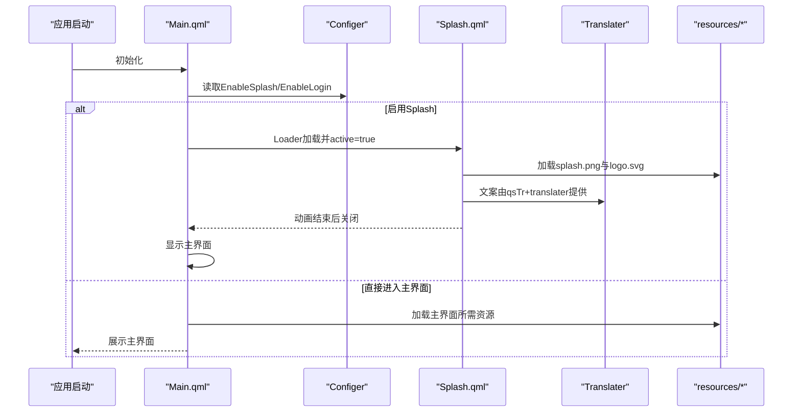
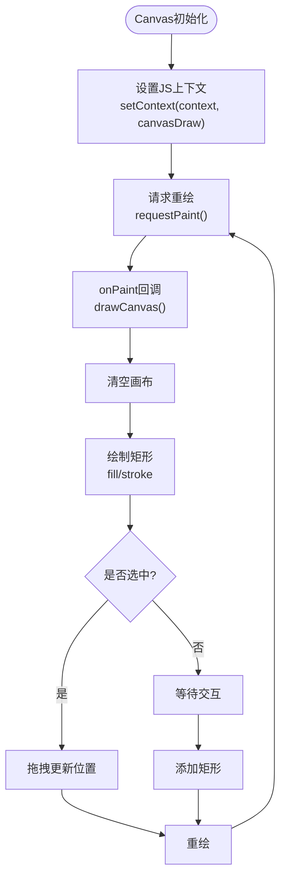
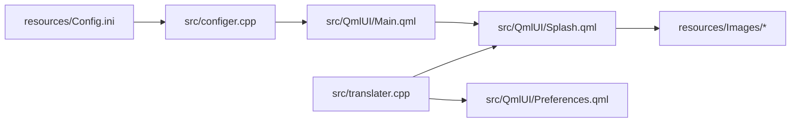

# 资源管理

<cite>
**本文引用的文件**
- [resources/Config.ini](file://resources/Config.ini)
- [src/configer.h](file://src/configer.h)
- [src/configer.cpp](file://src/configer.cpp)
- [src/translater.h](file://src/translater.h)
- [src/translater.cpp](file://src/translater.cpp)
- [src/QmlUI/Splash.qml](file://src/QmlUI/Splash.qml)
- [src/QmlUI/Main.qml](file://src/QmlUI/Main.qml)
- [src/QmlUI/CanvasDraw.qml](file://src/QmlUI/CanvasDraw.qml)
- [src/QmlUI/paint.js](file://src/QmlUI/paint.js)
- [resources/Languages/cn.ini](file://resources/Languages/cn.ini)
- [resources/Languages/en.ini](file://resources/Languages/en.ini)
</cite>

## 目录
1. [简介](#简介)
2. [项目结构](#项目结构)
3. [核心组件](#核心组件)
4. [架构总览](#架构总览)
5. [详细组件分析](#详细组件分析)
6. [依赖关系分析](#依赖关系分析)
7. [性能考虑](#性能考虑)
8. [故障排查指南](#故障排查指南)
9. [结论](#结论)
10. [附录](#附录)

## 简介
本文件面向QmlPlugins项目的资源管理系统，围绕以下目标展开：图片资源的组织与命名规范、加载机制；壁纸资源的管理、动态更换与显示效果；启动画面（Splash）的配置、显示逻辑与用户体验优化；JavaScript脚本在QML中的集成、绘图与动画实现；以及资源优化策略、缓存与内存管理的最佳实践。文档以仓库现有实现为依据，结合配置项与代码行为，给出可操作的指导。

## 项目结构
资源相关的核心目录与文件如下：
- 资源根目录：resources/
  - Images/：图片资源存放区（含启动图、图标、通用背景等）
  - Languages/：多语言翻译文件（cn.ini、en.ini）
  - Splash/：启动画面相关资源（若存在）
  - Config.ini：全局配置项（包含启动画面、登录、壁纸、语言等开关与参数）
- 运行时资源：bin/（部署产物目录，包含Images、Splash、Languages等）
- QML界面：src/QmlUI/*.qml
- 配置与国际化：src/configer.*、src/translater.*

图表来源
- [resources/Config.ini:1-103](file://resources/Config.ini#L1-L103)
- [src/configer.h:43-89](file://src/configer.h#L43-L89)
- [src/configer.cpp:102-190](file://src/configer.cpp#L102-L190)
- [src/QmlUI/Main.qml:6-41](file://src/QmlUI/Main.qml#L6-L41)
- [src/QmlUI/Splash.qml:60-95](file://src/QmlUI/Splash.qml#L60-L95)
- [src/translater.h:27-107](file://src/translater.h#L27-L107)
- [src/translater.cpp:48-94](file://src/translater.cpp#L48-L94)
- [src/QmlUI/CanvasDraw.qml:1-103](file://src/QmlUI/CanvasDraw.qml#L1-L103)
- [src/QmlUI/paint.js:1-139](file://src/QmlUI/paint.js#L1-L139)

章节来源
- [resources/Config.ini:1-103](file://resources/Config.ini#L1-L103)
- [src/configer.h:43-89](file://src/configer.h#L43-L89)
- [src/configer.cpp:102-190](file://src/configer.cpp#L102-L190)
- [src/QmlUI/Main.qml:6-41](file://src/QmlUI/Main.qml#L6-L41)
- [src/QmlUI/Splash.qml:60-95](file://src/QmlUI/Splash.qml#L60-L95)
- [src/translater.h:27-107](file://src/translater.h#L27-L107)
- [src/translater.cpp:48-94](file://src/translater.cpp#L48-L94)
- [src/QmlUI/CanvasDraw.qml:1-103](file://src/QmlUI/CanvasDraw.qml#L1-L103)
- [src/QmlUI/paint.js:1-139](file://src/QmlUI/paint.js#L1-L139)

## 核心组件
- 配置中心（Configer）
  - 提供统一的配置读写接口，暴露大量QML可调用的布尔/整数/字符串属性，涵盖启动画面、登录、壁纸、语言、字体、相机等。
  - 通过宏定义集中管理资源路径（如Images、Splash、Languages），便于跨平台部署。
- 启动画面（Splash.qml）
  - 基于Window与Image/Text/ProgressBar等元素构成，支持不同显示模式（普通/最大化/全屏）。
  - 通过Configer.splashFormShowMode()与Configer.enableLogin()控制显示与流程衔接。
- 多语言（Translater）
  - 加载.ini翻译文件，构建语言映射表，支持切换语言并触发QML重翻译。
- Canvas绘图（CanvasDraw.qml + paint.js）
  - 在QML Canvas中集成JS脚本，实现矩形绘制、选择、拖拽、重绘等交互逻辑。
- 资源路径与命名规范
  - 路径常量集中在configer.h中，QML侧通过相对路径引用resources/Images与resources/Languages。
  - 图片命名采用语义化（如splash.png、logo.svg、icon.png、backimage.png、checked.png、unchecked.png），SVG用于矢量图标，PNG用于位图素材。

章节来源
- [src/configer.h:98-277](file://src/configer.h#L98-L277)
- [src/configer.cpp:102-190](file://src/configer.cpp#L102-L190)
- [src/QmlUI/Splash.qml:7-58](file://src/QmlUI/Splash.qml#L7-L58)
- [src/translater.h:27-107](file://src/translater.h#L27-L107)
- [src/translater.cpp:48-94](file://src/translater.cpp#L48-L94)
- [src/QmlUI/CanvasDraw.qml:1-103](file://src/QmlUI/CanvasDraw.qml#L1-L103)
- [src/QmlUI/paint.js:1-139](file://src/QmlUI/paint.js#L1-L139)

## 架构总览
下图展示了资源管理在启动流程中的关键交互：Main.qml作为入口，根据Config.ini与Configer的配置决定是否显示Splash或直接进入主界面；Splash负责加载图片与文字资源，并在进度完成后关闭；Translater负责语言资源加载与切换；CanvasDraw与paint.js共同实现绘图与交互。

图表来源
- [src/QmlUI/Main.qml:6-41](file://src/QmlUI/Main.qml#L6-L41)
- [src/configer.cpp:102-190](file://src/configer.cpp#L102-L190)
- [src/QmlUI/Splash.qml:60-95](file://src/QmlUI/Splash.qml#L60-L95)
- [src/translater.cpp:24-37](file://src/translater.cpp#L24-L37)

## 详细组件分析

### 图片资源组织与加载机制
- 存放位置
  - resources/Images/：存放位图与通用图标（如splash.png、logo.svg、icon.png、backimage.png、checked.png、unchecked.png）。
  - bin/Images/：运行时产物目录，包含部署后的图片资源。
- 加载方式
  - QML中通过“file:”协议与相对路径访问资源，例如“file:Images/splash.png”、“file:"Images/logo.svg"”。
  - Configer.h中定义了RES_PATH、QML_RES_PATH等路径常量，便于统一管理。
- 命名规范
  - 语义化命名：如splash、logo、icon、backimage、checked、unchecked。
  - 矢量优先：logo.svg等采用SVG，保证缩放清晰；其他图标与背景图采用PNG。
- 最佳实践
  - 将常用图标统一为SVG，减少多分辨率适配成本。
  - 对大图（如启动图）建议在resources与bin目录保持一致，避免运行时缺失。

章节来源
- [src/QmlUI/Splash.qml:60-95](file://src/QmlUI/Splash.qml#L60-L95)
- [src/configer.h:43-89](file://src/configer.h#L43-L89)

### 壁纸资源管理、动态更换与显示效果
- 配置项
  - UseWallPaper、LiveWallPaper：分别控制是否启用壁纸与动态壁纸。
- 控制流程
  - Preferences界面提供勾选控件，保存至Configer，随后通过Configer.changedBool()信号通知界面刷新。
  - 实际壁纸应用逻辑在具体界面中实现（例如主界面背景），此处强调配置项与界面联动。
- 显示效果
  - 建议使用Image填充背景，fillMode与smooth属性提升视觉质量；动态壁纸可通过动画或定时器更新内容。
- 注意事项
  - 动态壁纸需注意性能，避免频繁重绘导致卡顿。
  - 壁纸路径应与RES_PATH保持一致，确保跨平台部署一致性。

章节来源
- [resources/Config.ini:17-18](file://resources/Config.ini#L17-L18)
- [src/configer.cpp:168-190](file://src/configer.cpp#L168-L190)
- [src/QmlUI/Preferences.qml:69-70](file://src/QmlUI/Preferences.qml#L69-L70)

### 启动画面（Splash）配置、显示逻辑与用户体验优化
- 配置项
  - EnableSplash、SplashFormShowMode、SplashCanClose：控制是否启用、显示模式（普通/最大化/全屏）、是否可关闭。
- 显示逻辑
  - Main.qml根据Configer结果决定Loader加载Splash或直接进入主界面。
  - Splash.qml在可见时启动进度动画，完成后关闭，再触发下一个界面显示。
- 用户体验优化
  - 启动图尺寸与桌面分辨率匹配，避免拉伸。
  - 进度条动画时长与实际初始化耗时匹配，避免过短导致“假死”或过长造成等待焦虑。
  - Logo与标语文案来自翻译文件，确保多语言一致性。

章节来源
- [resources/Config.ini:10-16](file://resources/Config.ini#L10-L16)
- [src/configer.cpp:102-134](file://src/configer.cpp#L102-L134)
- [src/QmlUI/Main.qml:6-41](file://src/QmlUI/Main.qml#L6-L41)
- [src/QmlUI/Splash.qml:7-58](file://src/QmlUI/Splash.qml#L7-L58)

### JavaScript脚本集成、绘图与动画效果
- 集成方式
  - CanvasDraw.qml通过import引入paint.js，并在onAvailableChanged中传递Canvas上下文给JS。
- 绘图功能
  - JS定义矩形对象与绘制逻辑，支持添加、选择、拖拽、重绘与清空。
  - QML Canvas的onPaint事件回调JS绘制函数，确保渲染一致性。
- 动画效果
  - 启动画面使用NumberAnimation驱动进度条，实现平滑过渡。
  - 建议在Canvas场景中使用requestAnimationFrame风格的重绘策略，避免阻塞主线程。

图表来源
- [src/QmlUI/CanvasDraw.qml:17-52](file://src/QmlUI/CanvasDraw.qml#L17-L52)
- [src/QmlUI/paint.js:69-89](file://src/QmlUI/paint.js#L69-L89)

章节来源
- [src/QmlUI/CanvasDraw.qml:1-103](file://src/QmlUI/CanvasDraw.qml#L1-L103)
- [src/QmlUI/paint.js:1-139](file://src/QmlUI/paint.js#L1-L139)
- [src/QmlUI/Splash.qml:142-154](file://src/QmlUI/Splash.qml#L142-L154)

### 多语言资源与文案管理
- 资源组织
  - resources/Languages/cn.ini、en.ini分别提供中文与英文翻译键值。
- 加载与切换
  - Translater加载目录下所有.ini文件，构建语言映射表；setCurrentLang触发重翻译。
  - Splash界面中的标语通过qsTr与translater.change实现动态切换。
- 规范建议
  - 键名采用模块化前缀（如Splash.Slogan），避免冲突。
  - 保持中英文键值一致，便于维护。

章节来源
- [src/translater.h:27-107](file://src/translater.h#L27-L107)
- [src/translater.cpp:48-94](file://src/translater.cpp#L48-L94)
- [resources/Languages/cn.ini:53-54](file://resources/Languages/cn.ini#L53-L54)
- [resources/Languages/en.ini:51-53](file://resources/Languages/en.ini#L51-L53)
- [src/QmlUI/Splash.qml:85-95](file://src/QmlUI/Splash.qml#L85-L95)

## 依赖关系分析
- 路径与配置耦合
  - configer.h中的路径常量与Config.ini中的开关共同决定资源加载与显示行为。
- QML与C++耦合
  - Configer以QML单例形式暴露属性，Main.qml与Splash.qml直接调用其方法。
- 多语言与界面耦合
  - Translater与QML上下文绑定，通过qsTr与属性change实现动态文案更新。

图表来源
- [resources/Config.ini:1-103](file://resources/Config.ini#L1-L103)
- [src/configer.cpp:102-190](file://src/configer.cpp#L102-L190)
- [src/QmlUI/Main.qml:6-41](file://src/QmlUI/Main.qml#L6-L41)
- [src/QmlUI/Splash.qml:60-95](file://src/QmlUI/Splash.qml#L60-L95)
- [src/translater.cpp:24-37](file://src/translater.cpp#L24-L37)

章节来源
- [resources/Config.ini:1-103](file://resources/Config.ini#L1-L103)
- [src/configer.cpp:102-190](file://src/configer.cpp#L102-L190)
- [src/QmlUI/Main.qml:6-41](file://src/QmlUI/Main.qml#L6-L41)
- [src/QmlUI/Splash.qml:60-95](file://src/QmlUI/Splash.qml#L60-L95)
- [src/translater.cpp:24-37](file://src/translater.cpp#L24-L37)

## 性能考虑
- 图片资源
  - SVG矢量图适合图标与小尺寸元素；大图背景建议压缩与分层加载，避免首屏阻塞。
  - 使用Image的smooth与fillMode提升缩放质量，但需平衡GPU占用。
- Canvas绘图
  - 减少不必要的重绘，按需调用requestPaint；避免在onPositionChanged中执行高代价操作。
  - 拖拽场景建议使用局部重绘与脏矩形策略。
- 启动画面
  - 进度动画时长与真实耗时匹配；可将耗时任务拆分为多个阶段，分步推进。
- 多语言
  - 预加载常用语言，避免切换时的延迟；使用读写锁保护映射表，降低并发风险。
- 内存管理
  - 及时释放不再使用的图片与Canvas上下文；避免重复创建大对象。
  - 对动态壁纸内容采用池化与复用策略，减少GC压力。

## 故障排查指南
- 启动画面不显示
  - 检查Config.ini中EnableSplash与SplashFormShowMode配置；确认Main.qml的Loader条件与Splash.qml的showForm逻辑。
- 启动图或Logo缺失
  - 确认resources/Images与bin/Images目录下的对应文件存在；检查QML路径拼写与“file:”协议。
- 语言切换无效
  - 确认Translater.init已在应用启动早期调用；检查setCurrentLang是否触发changeChanged与retranslate。
- Canvas无法绘制或拖拽异常
  - 确认onAvailableChanged已正确设置JS上下文；检查MouseArea事件链路与Painter状态（selectedRect/dragging）。
- 壁纸未生效
  - 检查UseWallPaper与LiveWallPaper配置；确认Preferences界面的勾选已写入Configer并发出changedBool信号。

章节来源
- [resources/Config.ini:10-16](file://resources/Config.ini#L10-L16)
- [src/QmlUI/Main.qml:6-41](file://src/QmlUI/Main.qml#L6-L41)
- [src/QmlUI/Splash.qml:60-95](file://src/QmlUI/Splash.qml#L60-L95)
- [src/translater.cpp:123-136](file://src/translater.cpp#L123-L136)
- [src/QmlUI/CanvasDraw.qml:55-101](file://src/QmlUI/CanvasDraw.qml#L55-L101)
- [src/configer.cpp:168-190](file://src/configer.cpp#L168-L190)

## 结论
QmlPlugins的资源管理体系以Config.ini与Configer为核心，配合QML的Loader与Canvas，实现了从启动画面、多语言到绘图交互的完整闭环。通过统一的路径常量与清晰的命名规范，项目在跨平台部署与维护方面具备良好可扩展性。建议在后续迭代中进一步完善动态壁纸的性能监控与Canvas的重绘策略，持续优化启动体验与交互流畅度。

## 附录
- 配置项速览（节选）
  - 启动画面：EnableSplash、SplashFormShowMode、SplashCanClose
  - 登录与主界面：EnableLogin、LoginFormShowMode、MainFormShowMode
  - 壁纸：UseWallPaper、LiveWallPaper
  - 语言：Language
  - 字体：FontName、FontSize
- 资源路径常量（节选）
  - RES_PATH、QML_RES_PATH、SPLASH_PATH、LANG_PATH、CFG_FILE

章节来源
- [resources/Config.ini:1-103](file://resources/Config.ini#L1-L103)
- [src/configer.h:43-89](file://src/configer.h#L43-L89)