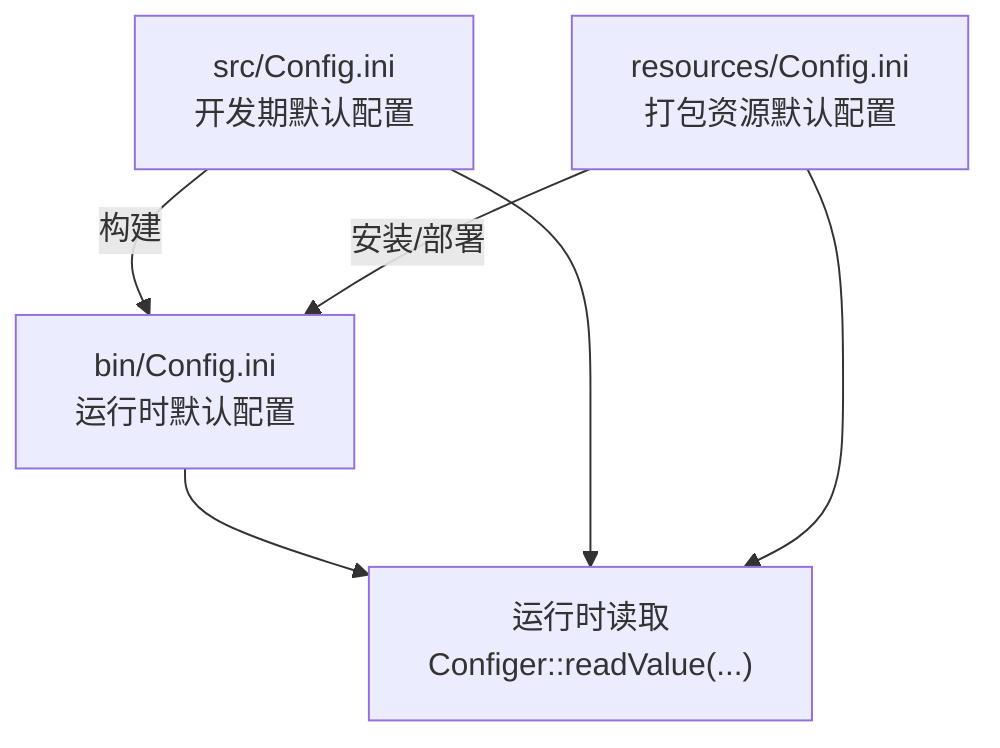
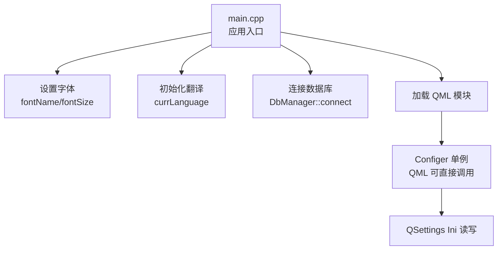
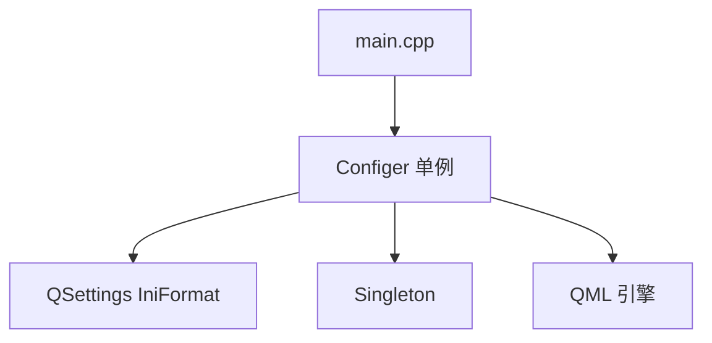
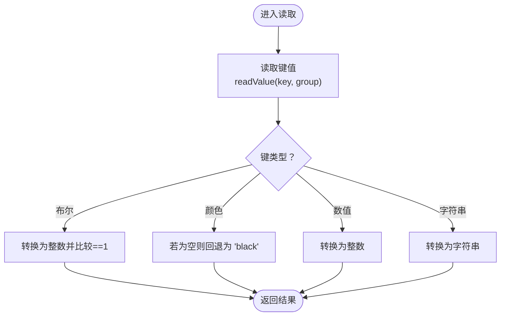

# 配置文件管理

<cite>
**本文引用的文件**
- [configer.h](file://src/configer.h)
- [configer.cpp](file://src/configer.cpp)
- [Config.ini（源码）](file://src/Config.ini)
- [Config.ini（bin）](file://bin/Config.ini)
- [Config.ini（resources）](file://resources/Config.ini)
- [main.cpp](file://src/main.cpp)
- [singleton.h](file://src/singleton.h)
- [utils.cpp](file://src/utils.cpp)
</cite>

## 目录
1. [简介](#简介)
2. [项目结构](#项目结构)
3. [核心组件](#核心组件)
4. [架构总览](#架构总览)
5. [详细组件分析](#详细组件分析)
6. [依赖关系分析](#依赖关系分析)
7. [性能考量](#性能考量)
8. [故障排查指南](#故障排查指南)
9. [结论](#结论)
10. [附录](#附录)

## 简介
本文件面向 QmlPlugins 项目的配置文件管理，系统性阐述 Config.ini 的结构与配置项分类、运行时与开发环境配置文件的差异与用途、读取机制与默认值策略、验证规则、热重载与变更监听机制现状、安全管理与备份策略，并提供基于仓库现有实现的读写操作示例与最佳实践建议。

## 项目结构
配置相关文件分布于多个位置，分别服务于不同阶段与用途：
- 源码目录：src/Config.ini 作为开发期默认配置模板
- 构建产物目录：bin/Config.ini 作为运行时默认配置
- 资源目录：resources/Config.ini 作为打包资源默认配置
- 运行时配置读取：通过宏定义定位实际配置文件路径

图表来源
- [Config.ini（源码）:1-103](file://src/Config.ini#L1-L103)
- [Config.ini（bin）:1-103](file://bin/Config.ini#L1-L103)
- [Config.ini（resources）:1-103](file://resources/Config.ini#L1-L103)
- [configer.cpp:412-419](file://src/configer.cpp#L412-L419)

章节来源
- [configer.h:55-62](file://src/configer.h#L55-L62)
- [configer.cpp:404-419](file://src/configer.cpp#L404-L419)

## 核心组件
- Configer 单例：提供统一的配置访问接口，封装读取与写入逻辑，暴露 Q_INVOKABLE 方法供 QML 调用
- QSettings 驱动：以 Ini 格式读写配置，支持分组（group）组织键值
- 宏路径：通过编译期宏决定配置文件的实际路径，区分开发/部署环境
- 单例基类：提供线程安全、无异常的现代单例实现

章节来源
- [configer.h:98-120](file://src/configer.h#L98-L120)
- [configer.cpp:404-419](file://src/configer.cpp#L404-L419)
- [singleton.h:21-78](file://src/singleton.h#L21-L78)

## 架构总览
Configer 作为 QML 单例注册到引擎上下文，应用启动时由 main.cpp 初始化字体、语言、数据库连接等，随后在 QML 中通过 Configer 访问配置项。

图表来源
- [main.cpp:32-58](file://src/main.cpp#L32-L58)
- [configer.cpp:62-80](file://src/configer.cpp#L62-L80)
- [configer.cpp:52-60](file://src/configer.cpp#L52-L60)

## 详细组件分析

### 配置文件结构与分类
- 分组组织
  - default 组：存放通用配置项，如语言、主题、界面行为、打印预览、报表模板等
  - Log 组：存放日志级别等日志相关配置
- 键命名约定
  - 普通键：如 Language、Theme、FontName、FontSize 等
  - 备注键：键名以 “-memo” 结尾，用于描述该键的作用与可选值，例如 Language-memo、ReportPreviewed-memo
  - 扩展键：带编号后缀（如 1..N），用于多模板或多实体配置，如 HospitalName1、ReportTitleColor1 等
- 示例键（节选）
  - 通用：Language、Theme、FontName、FontSize、WarnDialogCloseTime、EnableSplash、SplashFormShowMode、SplashCanClose、EnableLogin、LoginFormShowMode、MainFormShowMode、UseWallPaper、LiveWallPaper、HeartbeatTime、ReportPreviewed、ReportDesigned、ReportTemplate、ImagePath
  - 相机与图像：CameraName、CameraSize、CameraHuesH/S/L/C、CameraRoiX/Y/W/H
  - 报告模板：ReportTitleN、HospitalNameN、HospitalNameColorN、ReportTitleColorN、HospitalNameSizeN、ReportTitleSizeN、HospitalLogoN

章节来源
- [Config.ini（源码）:1-103](file://src/Config.ini#L1-L103)
- [Config.ini（bin）:1-103](file://bin/Config.ini#L1-L103)
- [Config.ini（resources）:1-103](file://resources/Config.ini#L1-L103)

### 运行时配置文件与开发环境配置文件
- 开发期配置：src/Config.ini 作为模板，包含默认键值与备注键，便于开发者理解各配置项含义
- 运行时配置：bin/Config.ini 与 resources/Config.ini 提供最终运行所需的默认值；运行时通过宏路径定位实际文件
- 宏路径解析：宏定义根据平台与部署状态选择相对路径前缀，最终指向 PATH_PRE + "Config.ini"

章节来源
- [configer.h:35-41](file://src/configer.h#L35-L41)
- [configer.h:55-56](file://src/configer.h#L55-L56)

### 读取机制、默认值与验证规则
- 读取机制
  - 通过 readValue(key, group, file) 读取指定分组下的键值
  - QSettings 以 Ini 格式打开文件，beginGroup 后 value(key) 返回 QVariant
- 默认值策略
  - 对于布尔型键（如 EnableSplash、ReportPreviewed），若读取结果非 1 则视为 false
  - 对于颜色类键（如 HospitalNameColorN、ReportTitleColorN），若为空字符串则回退为 "black"
- 验证规则
  - 数值型键（如 FontSize、WarnDialogCloseTime、HeartbeatTime）按整数解析
  - 字符串型键（如 Theme、Language、ImagePath）按字符串解析
  - 未在配置中出现的键将返回无效 QVariant，需由调用方进行存在性判断与容错处理

章节来源
- [configer.cpp:102-112](file://src/configer.cpp#L102-L112)
- [configer.cpp:207-217](file://src/configer.cpp#L207-L217)
- [configer.cpp:263-274](file://src/configer.cpp#L263-L274)
- [configer.cpp:412-419](file://src/configer.cpp#L412-L419)

### 写入机制与持久化
- 写入流程
  - 通过 writeValue(key, value, group, file) 将键值写入指定分组
  - QSettings 以 Ini 格式打开文件，beginGroup 后 setValue(key, value)，endGroup 结束
- 注意事项
  - 写入后不会自动触发 QML 层刷新，需要在业务层自行 emit 信号或通过 Q_PROPERTY 通知
  - 若目标文件不存在，QSettings 会在首次写入时创建

章节来源
- [configer.cpp:404-410](file://src/configer.cpp#L404-L410)

### 热重载、变更监听与响应机制
- 现状
  - Configer 未内置文件系统监控或自动重载逻辑
  - 未提供配置变更事件的信号（除自定义 changedBool 信号外，未见在写入后主动发射）
- 建议
  - 在写入成功后发射对应配置项的信号，以便 QML 或其他模块订阅并刷新 UI
  - 如需热重载，可在应用层引入文件监控（如 QFileSystemWatcher），在检测到配置文件变更后触发 reload 流程

章节来源
- [configer.h:259-262](file://src/configer.h#L259-L262)
- [configer.cpp:404-410](file://src/configer.cpp#L404-L410)

### 安全管理、权限控制与备份策略
- 权限控制
  - 配置文件为 Ini 文本文件，建议在部署时限制写权限，仅允许服务账户或管理员用户修改
  - 运行时尽量避免以管理员权限启动，减少潜在风险面
- 备份策略
  - 建议在写入前自动备份原配置文件，失败时回滚
  - 可结合 utils.cpp 中的同步/复制工具实现增量备份或版本化备份
- 加密与敏感信息
  - 对于敏感字段（如路径、模板名等），建议在业务层做最小化暴露与访问控制
  - 不建议在配置文件中存储明文密码等高敏信息

章节来源
- [utils.cpp:27-133](file://src/utils.cpp#L27-L133)
- [utils.cpp:326-407](file://src/utils.cpp#L326-L407)

### QML 侧使用与最佳实践
- 单例注册
  - Configer 通过 QML_SINGLETON 注册为 QML 单例，可在 QML 中直接调用其公开方法
- 最佳实践
  - 在应用启动时读取字体与语言配置，确保 UI 初始化一致
  - 对于可能为空或默认值的键，提供本地默认值兜底
  - 写入配置后，建议在业务层发出信号，驱动 UI 刷新
  - 对于多模板或多实体配置（带编号后缀），建议集中管理列表与当前选中项

章节来源
- [configer.h:98-120](file://src/configer.h#L98-L120)
- [main.cpp:32-58](file://src/main.cpp#L32-L58)

## 依赖关系分析
Configer 依赖 QSettings 实现 Ini 文件读写，依赖单例基类提供线程安全的实例管理；main.cpp 在启动阶段使用 Configer 初始化应用外观与语言。

图表来源
- [main.cpp:32-58](file://src/main.cpp#L32-L58)
- [configer.h:98-120](file://src/configer.h#L98-L120)
- [configer.cpp:404-419](file://src/configer.cpp#L404-L419)
- [singleton.h:21-78](file://src/singleton.h#L21-L78)

章节来源
- [main.cpp:32-58](file://src/main.cpp#L32-L58)
- [configer.h:98-120](file://src/configer.h#L98-L120)
- [configer.cpp:404-419](file://src/configer.cpp#L404-L419)

## 性能考量
- QSettings 读写为轻量级操作，通常不影响启动与运行时性能
- 对于频繁读取的键（如字体、语言、心跳间隔），可在 Configer 内部缓存，减少重复 IO
- 批量写入时建议合并为一次事务式写入，降低磁盘写入次数

## 故障排查指南
- 配置项读取为空或类型不符
  - 检查键名与分组是否正确
  - 确认配置文件路径是否指向预期文件（PATH_PRE）
- 布尔型配置不生效
  - 确认写入的是 1/0 数值而非字符串
  - 检查读取端是否按数值比较（ret == 1）
- 颜色类键为空
  - 读取端需对空字符串进行回退处理
- 写入后 QML 未刷新
  - 确认业务层是否发射了对应的信号，或在写入后主动刷新 UI
- 文件权限问题
  - 确保运行用户对配置文件具有读写权限

章节来源
- [configer.cpp:102-112](file://src/configer.cpp#L102-L112)
- [configer.cpp:263-274](file://src/configer.cpp#L263-L274)
- [configer.cpp:404-410](file://src/configer.cpp#L404-L410)

## 结论
QmlPlugins 的配置体系以 Configer 为核心，采用 QSettings Ini 格式实现简洁可靠的读写机制。通过分组与键命名约定，实现了配置项的清晰分类与扩展支持。当前实现未内置热重载与变更监听，建议在业务层补充信号与文件监控以满足动态配置需求。配合合理的权限控制与备份策略，可进一步提升配置管理的安全性与可靠性。

## 附录

### 配置项读取与写入示例（路径指引）
- 读取日志级别
  - [readValue("TraceLevel","Log"):42-49](file://src/configer.cpp#L42-L49)
- 设置语言
  - [writeValue("Language", lang):57-59](file://src/configer.cpp#L57-L59)
- 设置主题
  - [writeValue("Theme", style):87-89](file://src/configer.cpp#L87-L89)
- 设置报警对话框自动关闭时间
  - [writeValue("WarnDialogCloseTime", sec):97-99](file://src/configer.cpp#L97-L99)
- 设置是否启用 Splash 界面
  - [writeValue("EnableSplash", val):109-111](file://src/configer.cpp#L109-L111)
- 设置 Splash 界面显示模式
  - [writeValue("SplashFormShowMode", mode):119-121](file://src/configer.cpp#L119-L121)
- 设置是否显示关闭按钮
  - [writeValue("SplashCanClose", val):131-133](file://src/configer.cpp#L131-L133)
- 设置是否启用 Login 界面
  - [writeValue("EnableLogin", val):143-145](file://src/configer.cpp#L143-L145)
- 设置 LoginForm 显示模式
  - [writeValue("LoginFormShowMode", mode):153-155](file://src/configer.cpp#L153-L155)
- 设置 MainForm 显示模式
  - [writeValue("MainFormShowMode", mode):164-166](file://src/configer.cpp#L164-L166)
- 设置是否使用壁纸
  - [writeValue("UseWallPaper", val):175-177](file://src/configer.cpp#L175-L177)
- 设置是否使用动态壁纸
  - [writeValue("LiveWallPaper", val):188-190](file://src/configer.cpp#L188-L190)
- 设置心跳时间
  - [writeValue("HeartbeatTime", num):203-204](file://src/configer.cpp#L203-L204)
- 设置打印预览
  - [writeValue("ReportPreviewed", reportPreviewed):214-216](file://src/configer.cpp#L214-L216)
- 设置打印前设计
  - [writeValue("ReportDesigned", reportDesigned):226-228](file://src/configer.cpp#L226-L228)
- 设置默认报表模板
  - [writeValue("ReportTemplate", text):248-250](file://src/configer.cpp#L248-L250)
- 设置图片存储路径
  - [writeValue("ImagePath", path):336-337](file://src/configer.cpp#L336-L337)
- 设置相机名称
  - [writeValue("CameraName", camera):346-347](file://src/configer.cpp#L346-L347)
- 设置相机分辨率
  - [writeValue("CameraSize", r):356-357](file://src/configer.cpp#L356-L357)
- 设置相机色调参数
  - [writeValue("CameraHuesH/S/L/C", ...):376-379](file://src/configer.cpp#L376-L379)
- 设置相机 ROI 参数
  - [writeValue("CameraRoiX/Y/W/H", ...):398-401](file://src/configer.cpp#L398-L401)
- 设置报告标题
  - [writeValue("ReportTitle" + reportNo, text):259-260](file://src/configer.cpp#L259-L260)
- 设置报告标题颜色
  - [writeValue("ReportTitleColor" + reportNo, text):273-274](file://src/configer.cpp#L273-L274)
- 设置报告标题字号
  - [writeValue("ReportTitleSize" + reportNo, size):282-283](file://src/configer.cpp#L282-L283)
- 设置医院名称
  - [writeValue("HospitalName" + reportNo, text):293-294](file://src/configer.cpp#L293-L294)
- 设置医院名称颜色
  - [writeValue("HospitalNameColor" + reportNo, text):306-307](file://src/configer.cpp#L306-L307)
- 设置医院名称字号
  - [writeValue("HospitalNameSize" + reportNo, size):316-317](file://src/configer.cpp#L316-L317)
- 设置医院 Logo
  - [writeValue("HospitalLogo" + reportNo, path):326-327](file://src/configer.cpp#L326-L327)

### 关键流程图：配置读取与默认值处理

图表来源
- [configer.cpp:102-112](file://src/configer.cpp#L102-L112)
- [configer.cpp:263-274](file://src/configer.cpp#L263-L274)
- [configer.cpp:412-419](file://src/configer.cpp#L412-L419)