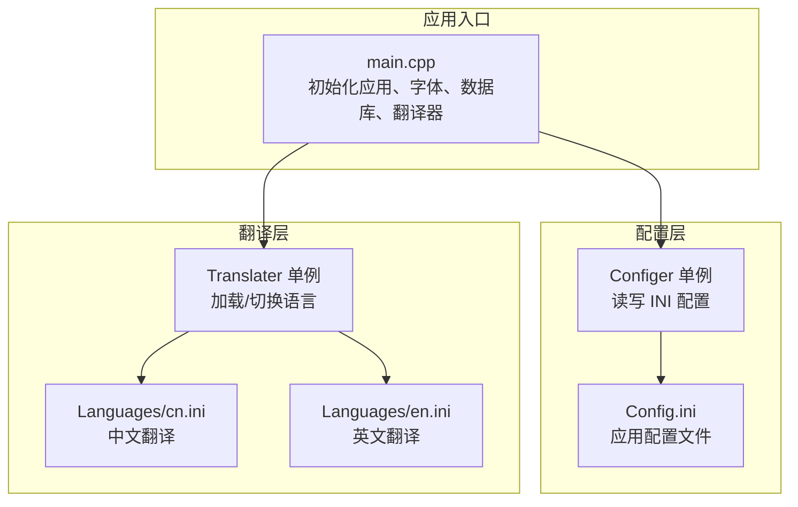
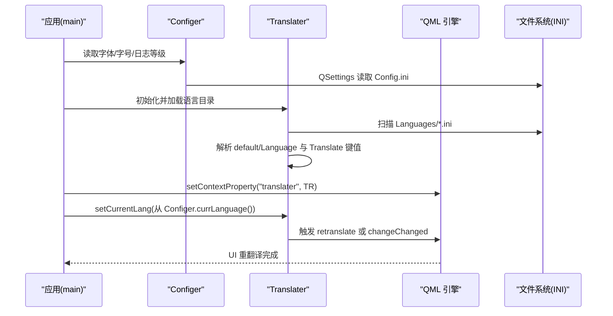
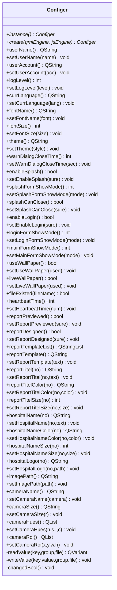
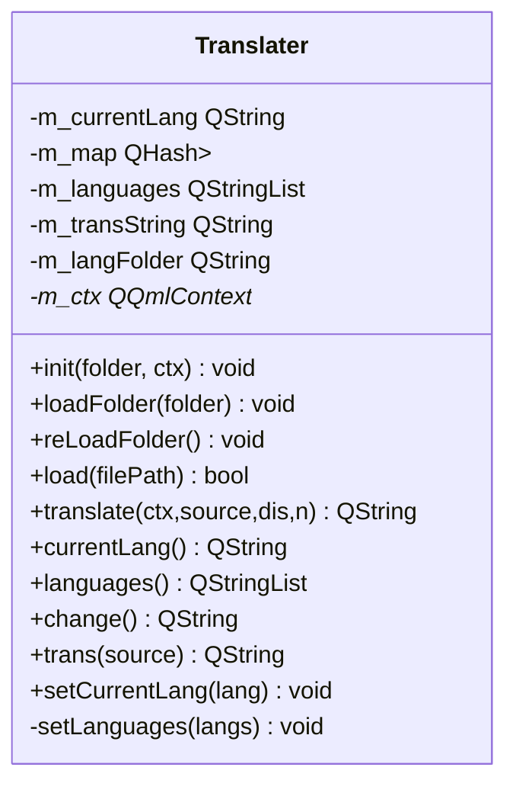
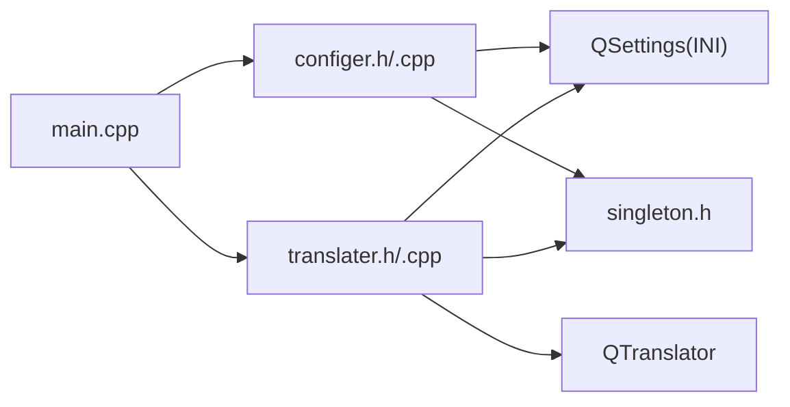

# 配置系统

<cite>
**本文引用的文件**
- [configer.h](file://src/configer.h)
- [configer.cpp](file://src/configer.cpp)
- [translater.h](file://src/translater.h)
- [translater.cpp](file://src/translater.cpp)
- [main.cpp](file://src/main.cpp)
- [singleton.h](file://src/singleton.h)
- [common.h](file://src/common.h)
- [hulalogger.h](file://src/hulalogger.h)
- [Config.ini](file://bin/Config.ini)
- [Config.ini](file://resources/Config.ini)
- [cn.ini](file://bin/Languages/cn.ini)
- [en.ini](file://bin/Languages/en.ini)
- [cn.ini](file://resources/Languages/cn.ini)
- [en.ini](file://resources/Languages/en.ini)
</cite>

## 目录
1. [简介](#简介)
2. [项目结构](#项目结构)
3. [核心组件](#核心组件)
4. [架构总览](#架构总览)
5. [详细组件分析](#详细组件分析)
6. [依赖关系分析](#依赖关系分析)
7. [性能与优化](#性能与优化)
8. [故障排查指南](#故障排查指南)
9. [结论](#结论)
10. [附录](#附录)

## 简介
本文件系统性阐述 QmlPlugins 项目的配置系统，涵盖以下方面：
- INI 配置文件的结构设计、配置项定义与解析机制
- 多语言配置的实现方式、语言切换机制与翻译文件管理
- 运行时配置更新、配置验证与回滚机制
- 配置扩展指南：新增配置项、自定义配置文件与配置热重载
- 配置安全性、性能优化与最佳实践

## 项目结构
配置系统主要由三部分组成：
- 应用配置：通过 INI 文件集中管理应用行为与界面参数
- 多语言翻译：基于 INI 的键值映射，支持运行时切换
- 单例与上下文：通过单例模式提供全局访问，并在 QML 中暴露配置与翻译能力

图表来源
- [main.cpp:17-99](file://src/main.cpp#L17-L99)
- [configer.h:98-277](file://src/configer.h#L98-L277)
- [configer.cpp:404-421](file://src/configer.cpp#L404-L421)
- [translater.h:27-112](file://src/translater.h#L27-L112)
- [translater.cpp:48-94](file://src/translater.cpp#L48-L94)

章节来源
- [main.cpp:17-99](file://src/main.cpp#L17-L99)
- [configer.h:98-277](file://src/configer.h#L98-L277)
- [translater.h:27-112](file://src/translater.h#L27-L112)

## 核心组件
- Configer：应用配置单例，封装 INI 读写、常用配置项访问与信号通知
- Translater：多语言翻译器，负责加载语言文件、维护语言映射、切换语言并触发 QML 重翻译
- 单例框架：提供线程安全的单例模板与便捷宏
- 日志与错误码：为配置系统提供日志与错误码支撑

章节来源
- [configer.h:98-277](file://src/configer.h#L98-L277)
- [configer.cpp:404-421](file://src/configer.cpp#L404-L421)
- [translater.h:27-112](file://src/translater.h#L27-L112)
- [translater.cpp:48-94](file://src/translater.cpp#L48-L94)
- [singleton.h:21-81](file://src/singleton.h#L21-L81)
- [common.h:63-117](file://src/common.h#L63-L117)

## 架构总览
配置系统采用“单例 + INI 文件 + QML 上下文”的架构：
- Configer 以单例形式提供全局配置访问，内部使用 QSettings 读写 INI
- Translater 以单例形式提供多语言能力，加载多个语言文件，维护内存映射，切换语言时触发 QML 重翻译
- main.cpp 在启动阶段完成字体、数据库、翻译器初始化，并将 Translater 暴露给 QML

图表来源
- [main.cpp:32-58](file://src/main.cpp#L32-L58)
- [configer.cpp:42-60](file://src/configer.cpp#L42-L60)
- [translater.cpp:24-46](file://src/translater.cpp#L24-L46)
- [translater.cpp:78-94](file://src/translater.cpp#L78-L94)
- [translater.cpp:123-136](file://src/translater.cpp#L123-L136)

## 详细组件分析

### Configer 组件分析
Configer 是应用配置的核心，提供大量 Q_INVOKABLE 属性与方法，统一管理 INI 配置文件。其关键特性：
- 单例模式：通过 SINGLETON 宏与 Singleton 模板确保全局唯一
- INI 读写：内部使用 QSettings::IniFormat，支持分组与键值读写
- 配置项覆盖：提供用户、主题、界面、打印、相机等配置项的读写接口
- 信号通知：配置变更时发出 changedBool 信号，便于 UI 同步

图表来源
- [configer.h:98-277](file://src/configer.h#L98-L277)
- [configer.cpp:404-421](file://src/configer.cpp#L404-L421)

章节来源
- [configer.h:98-277](file://src/configer.h#L98-L277)
- [configer.cpp:42-421](file://src/configer.cpp#L42-L421)

### Translater 组件分析
Translater 实现了多语言翻译器，具备以下能力：
- 目录加载：扫描指定目录下的所有 .ini 文件，构建语言映射
- 语言切换：根据当前语言在内存映射中查找翻译，未命中则回退原文
- QML 集成：将自身注册为 QML 上下文属性，支持 QML 中的翻译调用
- 重翻译：在语言切换时触发 QML 重翻译，保证 UI 实时更新

图表来源
- [translater.h:27-112](file://src/translater.h#L27-L112)
- [translater.cpp:19-146](file://src/translater.cpp#L19-L146)

章节来源
- [translater.h:27-112](file://src/translater.h#L27-L112)
- [translater.cpp:24-146](file://src/translater.cpp#L24-L146)

### INI 配置文件结构与解析机制
- 结构：INI 文件包含若干分组，常见为 default 与 Log；键值为字符串或整型
- 解析：Configer 使用 QSettings::IniFormat 读取/写入 INI；读取时自动定位到对应分组与键值
- 示例：Config.ini 中包含语言、主题、界面模式、打印预览、相机参数等键值

章节来源
- [Config.ini:1-103](file://bin/Config.ini#L1-L103)
- [Config.ini:1-103](file://resources/Config.ini#L1-L103)
- [configer.cpp:404-421](file://src/configer.cpp#L404-L421)

### 多语言配置与翻译文件管理
- 语言文件：每个语言文件包含 default 与 Translate 两个分组；default 分组包含 Language 名称；Translate 分组包含键值对
- 加载策略：Translater 扫描目录，逐个加载 ini 文件，维护内存映射；将“简体中文”置于首位
- 切换流程：通过 setCurrentLang 切换当前语言，触发 QML 重翻译

章节来源
- [cn.ini:1-300](file://bin/Languages/cn.ini#L1-L300)
- [en.ini:1-298](file://bin/Languages/en.ini#L1-L298)
- [cn.ini:1-300](file://resources/Languages/cn.ini#L1-L300)
- [en.ini:1-298](file://resources/Languages/en.ini#L1-L298)
- [translater.cpp:48-94](file://src/translater.cpp#L48-L94)
- [translater.cpp:123-136](file://src/translater.cpp#L123-L136)

### 运行时配置更新、验证与回滚
- 更新：Configer 的 setter 方法通过 writeValue 将值写入 INI；UI 通过 changedBool 信号感知变化
- 验证：当前代码未提供显式的配置校验逻辑；可在 setter 中增加类型与范围校验
- 回滚：当前代码未提供配置回滚机制；可通过备份/恢复 INI 文件实现

章节来源
- [configer.cpp:404-421](file://src/configer.cpp#L404-L421)
- [configer.h:259-262](file://src/configer.h#L259-L262)

### 配置扩展指南
- 新增配置项
  - 在 configer.h 中声明新的 Q_INVOKABLE 方法
  - 在 configer.cpp 中实现读取与写入逻辑，使用 readValue/writeValue
  - 在 Config.ini 中添加默认键值
- 自定义配置文件
  - 使用 writeValue 的 file 参数指向自定义文件路径
  - 读取时同样传入该文件路径
- 配置热重载
  - 在 QML 中监听 changedBool 信号，触发 UI 更新
  - 对于翻译，切换语言后触发 QML 重翻译

章节来源
- [configer.h:108-277](file://src/configer.h#L108-L277)
- [configer.cpp:404-421](file://src/configer.cpp#L404-L421)

## 依赖关系分析
- Configer 依赖 QSettings 与单例框架，提供全局配置访问
- Translater 依赖 QSettings、QTranslator、QReadWriteLock，提供多语言能力
- main.cpp 依赖 Configer 与 Translater，完成应用初始化与上下文集成

图表来源
- [main.cpp:17-99](file://src/main.cpp#L17-L99)
- [configer.cpp:1-10](file://src/configer.cpp#L1-L10)
- [translater.cpp:1-15](file://src/translater.cpp#L1-L15)
- [singleton.h:21-81](file://src/singleton.h#L21-L81)

章节来源
- [main.cpp:17-99](file://src/main.cpp#L17-L99)
- [configer.cpp:1-10](file://src/configer.cpp#L1-L10)
- [translater.cpp:1-15](file://src/translater.cpp#L1-L15)
- [singleton.h:21-81](file://src/singleton.h#L21-L81)

## 性能与优化
- INI 读写性能
  - QSettings 为跨平台配置读写方案，适合小规模配置；若配置项增多，建议：
    - 缓存热点键值，减少频繁 IO
    - 批量写入：合并多次写入为一次提交
- 翻译性能
  - 内存映射查找为 O(1)；建议：
    - 控制语言文件数量与大小
    - 避免在高频路径中重复切换语言
- 线程安全
  - Translater 使用 QReadWriteLock 保护映射；建议：
    - 读多写少场景优先使用读锁
    - 避免在 UI 线程中进行长时间文件操作
- 日志与错误码
  - HulaLogger 提供线程安全与轮转；建议：
    - 合理设置日志级别与轮转阈值
    - 错误码分类清晰，便于定位问题

章节来源
- [translater.cpp:85-90](file://src/translater.cpp#L85-L90)
- [hulalogger.h:49-175](file://src/hulalogger.h#L49-L175)
- [common.h:63-117](file://src/common.h#L63-L117)

## 故障排查指南
- 配置文件未生效
  - 检查 Config.ini 路径与分组是否正确
  - 确认 writeValue 的 group 与 file 参数
- 语言切换无效
  - 确认 Translater::setCurrentLang 已调用
  - 检查 QML 是否正确绑定 translater.change 或调用 retranslate
- 翻译缺失
  - 检查语言文件中是否存在 Translate 分组与目标键
  - 确认语言文件编码与格式正确
- 日志不输出
  - 检查日志级别与目录配置
  - 确认 HulaLogger::init 已调用

章节来源
- [configer.cpp:404-421](file://src/configer.cpp#L404-L421)
- [translater.cpp:123-136](file://src/translater.cpp#L123-L136)
- [hulalogger.h:67-100](file://src/hulalogger.h#L67-L100)

## 结论
QmlPlugins 的配置系统以 INI 文件为核心，结合单例与 QML 上下文，实现了简洁而实用的应用配置与多语言能力。通过本文档的分析与建议，开发者可以：
- 理解配置文件结构与解析机制
- 实现多语言切换与翻译文件管理
- 在运行时更新配置并扩展新配置项
- 在性能与安全性方面进行优化与加固

## 附录
- 配置项清单（节选）
  - 语言与主题：Language、Theme
  - 界面模式：EnableSplash、SplashFormShowMode、SplashCanClose、EnableLogin、LoginFormShowMode、MainFormShowMode
  - 字体与日志：FontName、FontSize、TraceLevel
  - 壁纸与心跳：UseWallPaper、LiveWallPaper、HeartbeatTime
  - 打印与报表：ReportPreviewed、ReportDesigned、ReportTemplate、ReportTitle*、HospitalName*、HospitalNameColor*、HospitalNameSize*、HospitalLogo*
  - 相机参数：CameraName、CameraSize、CameraHuesH/S/L/C、CameraRoiX/Y/W/H、ImagePath

章节来源
- [Config.ini:1-103](file://bin/Config.ini#L1-L103)
- [Config.ini:1-103](file://resources/Config.ini#L1-L103)
- [configer.cpp:42-421](file://src/configer.cpp#L42-L421)