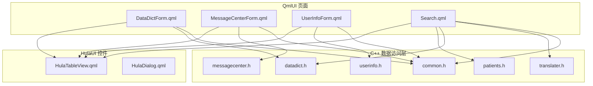
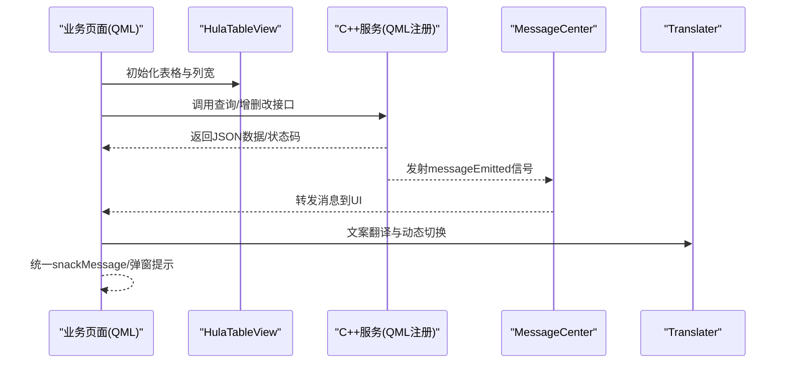
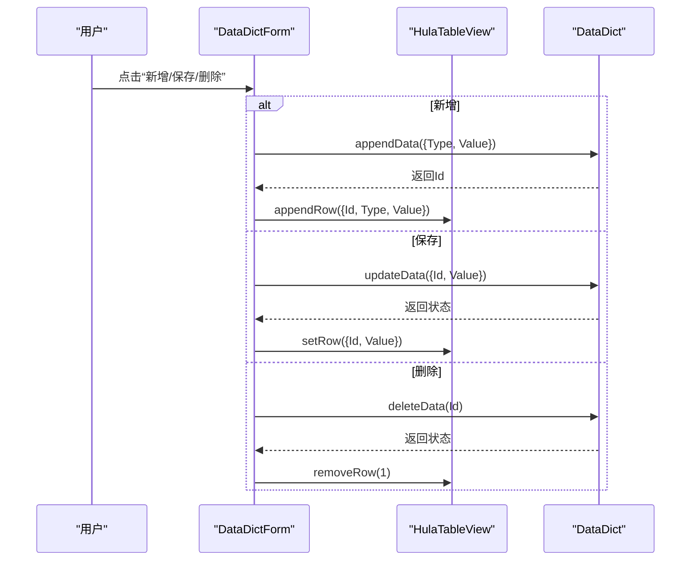
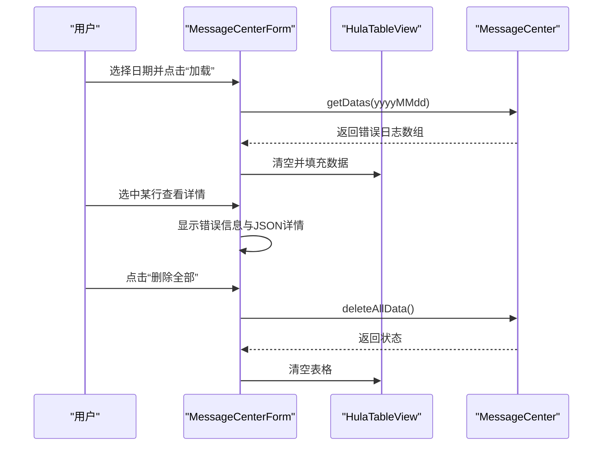
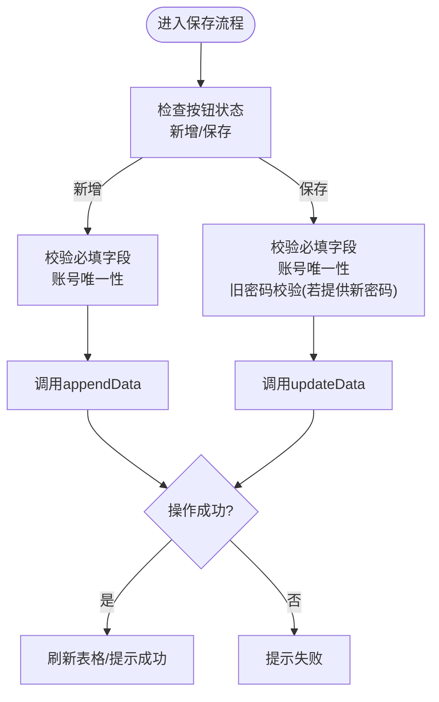
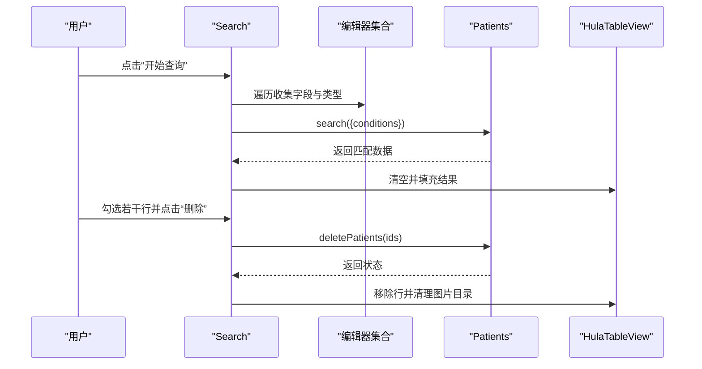
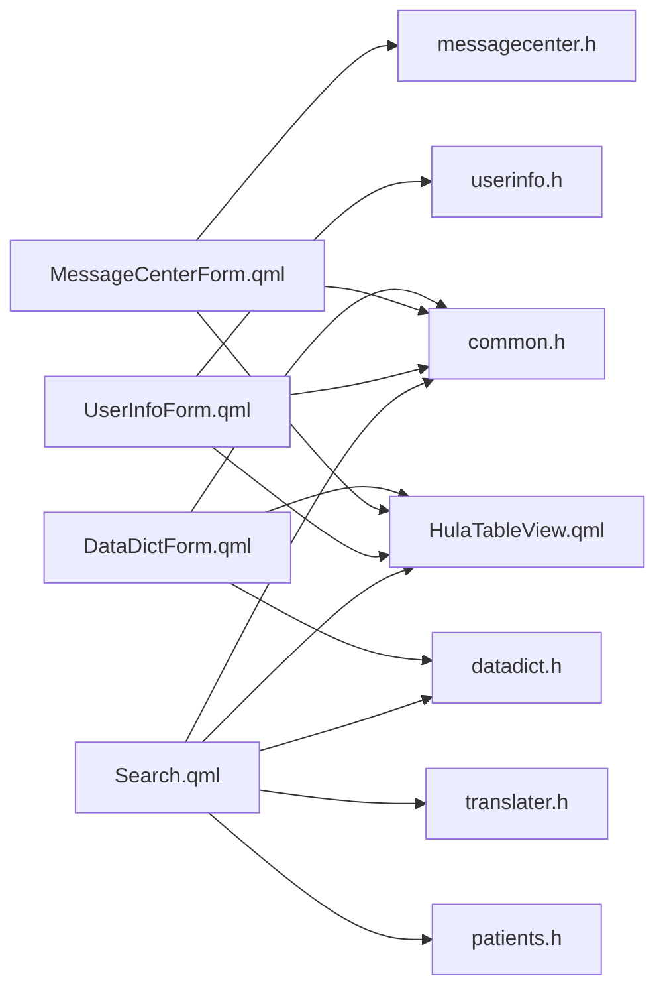

# 业务功能页面

<cite>
**本文引用的文件**
- [DataDictForm.qml](file://src/QmlUI/DataDictForm.qml)
- [MessageCenterForm.qml](file://src/QmlUI/MessageCenterForm.qml)
- [UserInfoForm.qml](file://src/QmlUI/UserInfoForm.qml)
- [Search.qml](file://src/QmlUI/Search.qml)
- [HulaTableView.qml](file://src/HulaUI/HulaTableView.qml)
- [HulaDialog.qml](file://src/HulaUI/HulaDialog.qml)
- [datadict.h](file://src/datadict.h)
- [messagecenter.h](file://src/messagecenter.h)
- [userinfo.h](file://src/userinfo.h)
- [patients.h](file://src/patients.h)
- [common.h](file://src/common.h)
- [translater.h](file://src/translater.h)
</cite>

## 目录
1. [简介](#简介)
2. [项目结构](#项目结构)
3. [核心组件](#核心组件)
4. [架构总览](#架构总览)
5. [详细组件分析](#详细组件分析)
6. [依赖关系分析](#依赖关系分析)
7. [性能考虑](#性能考虑)
8. [故障排查指南](#故障排查指南)
9. [结论](#结论)
10. [附录](#附录)

## 简介
本文件面向QmlPlugins项目的业务功能页面，围绕以下四个页面展开：
- DataDictForm数据字典页面：提供数据字典的增删改查与展示，支持文本输入与富文本编辑两种模式，并与数据字典服务交互。
- MessageCenterForm消息中心页面：集中展示系统错误日志，支持按日期筛选、删除单条与全部、查看错误详情与解决方案说明。
- UserInfoForm用户信息页面：支持管理员对用户进行增删改查，普通用户可修改自身资料；内置密码校验与账号唯一性校验。
- Search搜索页面：提供多字段组合查询、结果展示、批量导出、数据库备份/恢复、批量删除等功能。

文档将从数据绑定、CRUD操作、业务规则、页面定制、数据验证策略与性能优化等维度进行深入说明，并辅以可视化图示帮助理解。

## 项目结构
业务功能页面位于QmlUI目录，基础UI控件位于HulaUI目录，数据访问层由C++模块提供，通过QML注册为可调用接口。

图表来源
- [DataDictForm.qml:10-235](file://src/QmlUI/DataDictForm.qml#L10-L235)
- [MessageCenterForm.qml:7-280](file://src/QmlUI/MessageCenterForm.qml#L7-L280)
- [UserInfoForm.qml:9-397](file://src/QmlUI/UserInfoForm.qml#L9-L397)
- [Search.qml:10-976](file://src/QmlUI/Search.qml#L10-L976)
- [HulaTableView.qml:5-415](file://src/HulaUI/HulaTableView.qml#L5-L415)
- [HulaDialog.qml:8-383](file://src/HulaUI/HulaDialog.qml#L8-L383)
- [datadict.h:30-103](file://src/datadict.h#L30-L103)
- [messagecenter.h:27-127](file://src/messagecenter.h#L27-L127)
- [userinfo.h:30-172](file://src/userinfo.h#L30-L172)
- [patients.h:24-150](file://src/patients.h#L24-L150)
- [common.h:16-159](file://src/common.h#L16-L159)
- [translater.h:27-112](file://src/translater.h#L27-L112)

章节来源
- [DataDictForm.qml:10-235](file://src/QmlUI/DataDictForm.qml#L10-L235)
- [MessageCenterForm.qml:7-280](file://src/QmlUI/MessageCenterForm.qml#L7-L280)
- [UserInfoForm.qml:9-397](file://src/QmlUI/UserInfoForm.qml#L9-L397)
- [Search.qml:10-976](file://src/QmlUI/Search.qml#L10-L976)

## 核心组件
- HulaTableView：封装TableView、表头、行选择、复选框、滚动条与列宽计算，统一表格行为与样式。
- HulaDialog：封装对话框标题栏、拖拽、动画显示/隐藏、生命周期回调（showForm/hideForm）、自动销毁。
- DataDict：数据字典服务，提供字典值获取、新增、更新、删除、重复性校验等。
- MessageCenter：消息中心服务，提供按日期查询错误日志、删除单条/全部、接收系统消息并转发至UI。
- UserInfo：用户信息服务，提供用户查询、新增、更新、删除、账号唯一性校验、密码校验、登录等。
- Patients：患者/样本信息服务，提供查询、搜索、导出Excel、备份/恢复、删除及关联图片目录清理等。
- Translater：多语言翻译器，提供动态切换语言与翻译资源加载。
- Common：全局错误码与消息结构体定义，统一错误类型与提示策略。

章节来源
- [HulaTableView.qml:5-415](file://src/HulaUI/HulaTableView.qml#L5-L415)
- [HulaDialog.qml:8-383](file://src/HulaUI/HulaDialog.qml#L8-L383)
- [datadict.h:30-103](file://src/datadict.h#L30-L103)
- [messagecenter.h:27-127](file://src/messagecenter.h#L27-L127)
- [userinfo.h:30-172](file://src/userinfo.h#L30-L172)
- [patients.h:24-150](file://src/patients.h#L24-L150)
- [translater.h:27-112](file://src/translater.h#L27-L112)
- [common.h:16-159](file://src/common.h#L16-L159)

## 架构总览
四个业务页面均基于HulaDialog与HulaTableView构建，通过QML注册的C++服务实现数据访问与业务逻辑。页面间共享的消息与错误处理通过Common中的MessageInfo与Translater实现国际化与统一提示。

图表来源
- [DataDictForm.qml:152-233](file://src/QmlUI/DataDictForm.qml#L152-L233)
- [MessageCenterForm.qml:215-278](file://src/QmlUI/MessageCenterForm.qml#L215-L278)
- [UserInfoForm.qml:285-395](file://src/QmlUI/UserInfoForm.qml#L285-L395)
- [Search.qml:814-976](file://src/QmlUI/Search.qml#L814-L976)
- [messagecenter.h:108-118](file://src/messagecenter.h#L108-L118)
- [common.h:131-159](file://src/common.h#L131-L159)
- [translater.h:31-89](file://src/translater.h#L31-L89)

## 详细组件分析

### DataDictForm数据字典页面
- 数据绑定与展示
  - 使用HulaTableView承载字典列表，列定义包含“Id”和“Value”，支持行选择与双击事件。
  - 根据dictType动态切换编辑器：普通文本框或富文本区域，适配不同字典类型。
- CRUD操作
  - 新增：收集当前编辑器内容，调用DataDict.appendData，插入后追加到表格模型。
  - 修改：获取当前行数据，更新Value后调用DataDict.updateData，回写表格。
  - 删除：确认后调用DataDict.deleteData，移除行并清空编辑器。
- 业务规则
  - 字典类型枚举包括性别、送检科室、送检医生、标本状态、标本类型、诊断等。
  - 双击特定类型字典项可触发selected信号，供上层窗口接收并回填。
- 页面定制
  - 可通过dictType属性控制字典类型，编辑器可见性与内容类型随之变化。
  - 支持自定义列宽与表头标题，便于扩展更多字典类型。

图表来源
- [DataDictForm.qml:152-233](file://src/QmlUI/DataDictForm.qml#L152-L233)
- [datadict.h:69-75](file://src/datadict.h#L69-L75)

章节来源
- [DataDictForm.qml:10-235](file://src/QmlUI/DataDictForm.qml#L10-L235)
- [datadict.h:38-57](file://src/datadict.h#L38-L57)

### MessageCenterForm消息中心页面
- 数据绑定与展示
  - 使用HulaTableView展示错误日志，列包含Id、错误码、错误信息、用户名、记录时间。
  - 顶部日期选择器支持按日期筛选，筛选后刷新表格与详情区。
- CRUD操作
  - 删除单条：选中行后确认，调用MessageCenter.deleteData，移除行并清空详情。
  - 删除全部：确认后调用MessageCenter.deleteAllData，清空表格与详情。
- 业务规则
  - 详情区显示错误信息与JSON化的完整记录，便于定位问题。
  - 日期格式化为yyyyMMdd传入服务层，确保查询一致性。
- 页面定制
  - 可调整列宽、表头标题与颜色主题，适配不同业务场景。

图表来源
- [MessageCenterForm.qml:215-278](file://src/QmlUI/MessageCenterForm.qml#L215-L278)
- [messagecenter.h:56-69](file://src/messagecenter.h#L56-L69)

章节来源
- [MessageCenterForm.qml:7-280](file://src/QmlUI/MessageCenterForm.qml#L7-L280)
- [messagecenter.h:27-127](file://src/messagecenter.h#L27-L127)

### UserInfoForm用户信息页面
- 数据绑定与展示
  - 管理员可见用户列表，普通用户仅能查看自身信息。
  - 编辑区包含用户类型、姓名、账号、新密码、旧密码等字段。
- CRUD操作
  - 新增：管理员在新增模式下填写信息，调用UserInfo.appendData，插入后追加到表格。
  - 保存：根据按钮状态判断为新增或更新，校验必填与重复后调用对应接口。
  - 删除：管理员选中用户后确认删除，调用UserInfo.deleteData。
- 业务规则
  - 账号唯一性校验：accountExisted支持排除当前Id的重复检测。
  - 密码校验：新增/更新时若提供新密码需二次确认一致；修改自身资料时需校验旧密码。
  - 权限控制：isAdmin标识决定按钮可用性与编辑器可见性。
- 页面定制
  - 可通过ComboBox动态设置用户类型，支持管理员与普通用户两种角色。

图表来源
- [UserInfoForm.qml:285-395](file://src/QmlUI/UserInfoForm.qml#L285-L395)
- [userinfo.h:72-86](file://src/userinfo.h#L72-L86)

章节来源
- [UserInfoForm.qml:9-397](file://src/QmlUI/UserInfoForm.qml#L9-L397)
- [userinfo.h:30-172](file://src/userinfo.h#L30-L172)

### Search搜索页面
- 数据绑定与展示
  - 左侧为多字段过滤器（文本、日期、下拉），右侧为搜索结果表格，支持复选框批量勾选。
  - 底部显示当前行号与总记录数。
- 查询逻辑
  - 遍历左侧编辑器，收集非空字段与类型信息，调用Patients.search生成查询条件。
  - 日期字段进行格式校验，不符合格式则提示错误。
- 批量操作
  - 导出：勾选字段后导出Excel，文件名与字段列表由服务层处理。
  - 删除：批量删除选中记录，同时清理对应图片目录。
  - 备份/恢复：调用数据库备份与恢复接口，刷新搜索结果。
- 页面定制
  - 可通过DictType与ComboBox联动加载数据字典值，支持多类型字典。
  - 支持动态生成导出字段选择面板。

图表来源
- [Search.qml:814-976](file://src/QmlUI/Search.qml#L814-L976)
- [patients.h:44-73](file://src/patients.h#L44-L73)

章节来源
- [Search.qml:10-976](file://src/QmlUI/Search.qml#L10-L976)
- [patients.h:24-150](file://src/patients.h#L24-L150)

## 依赖关系分析
- 页面与控件
  - 四个业务页面均依赖HulaTableView与HulaDialog，统一表格与对话框行为。
- 页面与服务
  - DataDictForm依赖DataDict；MessageCenterForm依赖MessageCenter；UserInfoForm依赖UserInfo；Search依赖Patients与DataDict。
- 错误与国际化
  - 所有服务通过messageEmitted信号向MessageCenter上报，UI统一通过snackMessage或弹窗呈现。
  - Translater提供动态语言切换能力，页面标题与文案随change信号更新。

图表来源
- [DataDictForm.qml:10-235](file://src/QmlUI/DataDictForm.qml#L10-L235)
- [MessageCenterForm.qml:7-280](file://src/QmlUI/MessageCenterForm.qml#L7-L280)
- [UserInfoForm.qml:9-397](file://src/QmlUI/UserInfoForm.qml#L9-L397)
- [Search.qml:10-976](file://src/QmlUI/Search.qml#L10-L976)
- [HulaTableView.qml:5-415](file://src/HulaUI/HulaTableView.qml#L5-L415)
- [HulaDialog.qml:8-383](file://src/HulaUI/HulaDialog.qml#L8-L383)
- [datadict.h:30-103](file://src/datadict.h#L30-L103)
- [messagecenter.h:27-127](file://src/messagecenter.h#L27-L127)
- [userinfo.h:30-172](file://src/userinfo.h#L30-L172)
- [patients.h:24-150](file://src/patients.h#L24-L150)
- [translater.h:27-112](file://src/translater.h#L27-L112)
- [common.h:16-159](file://src/common.h#L16-L159)

## 性能考虑
- 表格渲染
  - HulaTableView提供列宽计算与可视列缓存，减少布局重排；合理设置columnsWidth避免频繁计算。
  - 对于大数据集，建议分页或虚拟化策略，避免一次性appendRow过多数据导致卡顿。
- 服务调用
  - 批量删除与导出应限制单次处理数量，必要时采用异步线程与进度反馈。
  - 日期筛选与查询条件构造应在前端做基本校验，减少无效请求。
- UI响应
  - 使用定时器selectRow在数据加载完成后延迟选中，避免模型行数与视图不一致。
  - 对话框动画与自动销毁在关闭时启用，避免内存泄漏。

## 故障排查指南
- 常见提示与错误码
  - 通过MessageInfo统一传递错误信息与提示类型，错误码参考Common中的ErrorCode枚举。
  - snackbar与弹窗提示用于区分Toast、Log、Confirmation、Error四类提示。
- 数据字典
  - 新增/更新失败时检查返回状态码，确认Value非空且Type有效。
  - 删除失败时确认Id是否存在，避免重复删除。
- 消息中心
  - 若筛选无结果，检查日期格式是否为yyyyMMdd。
  - 删除全部失败时检查服务层返回状态。
- 用户信息
  - 新增失败通常为账号重复或必填字段为空；保存失败检查旧密码校验与账号唯一性。
  - 权限不足时isAdmin为false，相关按钮不可用。
- 搜索
  - 日期格式错误会弹出提示，修正后再查询。
  - 导出前需至少有一条记录，且至少勾选一个字段。
  - 备份/恢复失败时检查文件路径与权限。

章节来源
- [common.h:63-117](file://src/common.h#L63-L117)
- [DataDictForm.qml:181-233](file://src/QmlUI/DataDictForm.qml#L181-L233)
- [MessageCenterForm.qml:245-278](file://src/QmlUI/MessageCenterForm.qml#L245-L278)
- [UserInfoForm.qml:285-395](file://src/QmlUI/UserInfoForm.qml#L285-L395)
- [Search.qml:814-976](file://src/QmlUI/Search.qml#L814-L976)

## 结论
四个业务页面通过统一的UI控件与服务层实现一致的交互体验与数据流。DataDictForm负责基础字典管理，MessageCenterForm集中展示与处理系统错误，UserInfoForm提供用户资料维护与权限控制，Search页面实现复杂查询与批量操作。结合国际化与错误码体系，系统具备良好的可维护性与扩展性。

## 附录
- 页面定制要点
  - 通过dictType与headerTitles、columnsWidth灵活定制表格列与标题。
  - 使用HulaDialog的动画类型与autoDestroy参数控制对话框行为。
  - 利用Translater.change信号实现标题与文案的动态刷新。
- 数据验证策略
  - 前端必填校验与格式校验（如日期）先行，减少无效请求。
  - 服务端返回状态码与MessageInfo统一处理，UI据此提示。
- 性能优化建议
  - 大数据表格采用分页或虚拟化；批量操作采用异步与进度反馈。
  - 合理使用缓存与列宽计算，避免频繁布局重算。