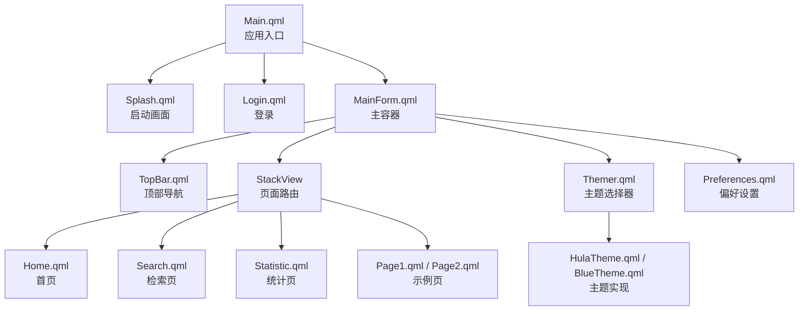
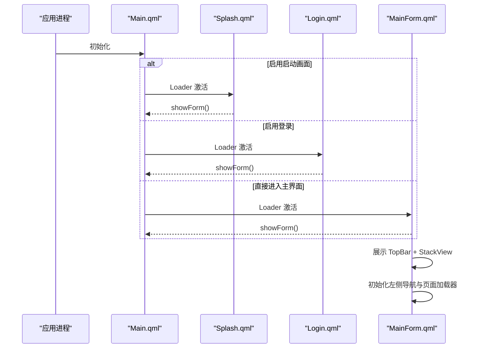
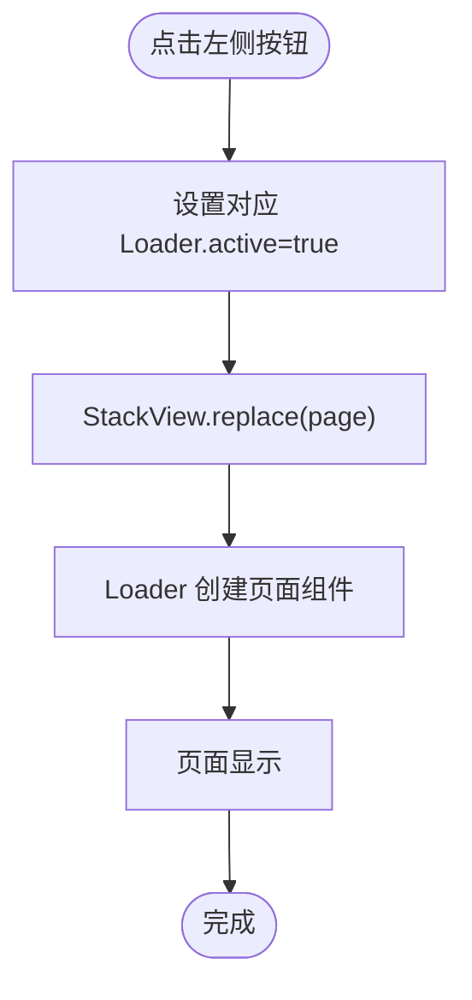
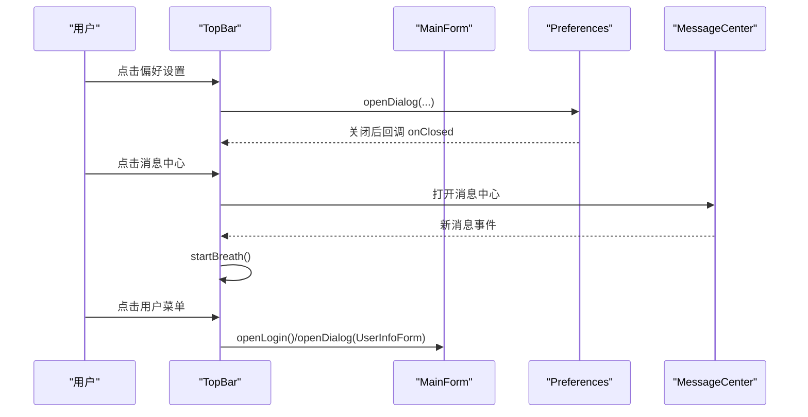
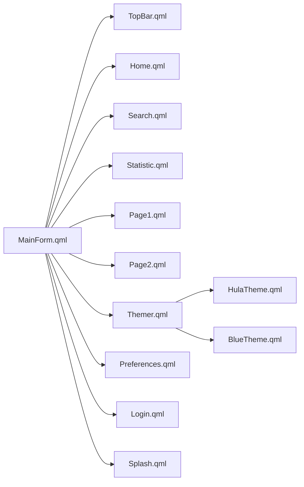

# 主界面组件

<cite>
**本文引用的文件**
- [Main.qml](file://src/QmlUI/Main.qml)
- [MainForm.qml](file://src/QmlUI/MainForm.qml)
- [Home.qml](file://src/QmlUI/Home.qml)
- [TopBar.qml](file://src/QmlUI/TopBar.qml)
- [Login.qml](file://src/QmlUI/Login.qml)
- [Splash.qml](file://src/QmlUI/Splash.qml)
- [Themer.qml](file://src/QmlUI/Themer.qml)
- [HulaTheme.qml](file://src/QmlUI/HulaTheme.qml)
- [BlueTheme.qml](file://src/QmlUI/BlueTheme.qml)
- [Preferences.qml](file://src/QmlUI/Preferences.qml)
- [Page1.qml](file://src/QmlUI/Page1.qml)
- [Page2.qml](file://src/QmlUI/Page2.qml)
- [Search.qml](file://src/QmlUI/Search.qml)
- [Statistic.qml](file://src/QmlUI/Statistic.qml)
</cite>

## 目录
1. [简介](#简介)
2. [项目结构](#项目结构)
3. [核心组件](#核心组件)
4. [架构总览](#架构总览)
5. [详细组件分析](#详细组件分析)
6. [依赖关系分析](#依赖关系分析)
7. [性能考虑](#性能考虑)
8. [故障排查指南](#故障排查指南)
9. [结论](#结论)
10. [附录](#附录)

## 简介
本文件聚焦于 QmlPlugins 项目的主界面组件，系统性梳理以下要点：
- 入口点 Main.qml 的启动流程与加载策略
- 主容器 MainForm 的布局、路由与状态管理
- 首页 Home 的内容组织与动态组件挂载
- 顶部导航 TopBar 的交互逻辑与消息提示机制
- 页面路由机制、状态管理与组件间数据传递
- 主题适配、定制指南与响应式布局支持
- 性能优化建议与用户体验设计原则

## 项目结构
主界面相关文件位于 src/QmlUI 目录，采用“入口 + 容器 + 功能页 + 导航 + 主题”的分层组织方式。入口通过 Loader 条件加载启动画面、登录或主窗体；主容器负责整体布局、路由栈与全局对话框；功能页按需懒加载；TopBar 提供统一的窗口控制、用户信息与消息中心入口。

图示来源
- [Main.qml:1-41](file://src/QmlUI/Main.qml#L1-L41)
- [Splash.qml:1-156](file://src/QmlUI/Splash.qml#L1-L156)
- [Login.qml:1-342](file://src/QmlUI/Login.qml#L1-L342)
- [MainForm.qml:1-488](file://src/QmlUI/MainForm.qml#L1-L488)
- [TopBar.qml:1-402](file://src/QmlUI/TopBar.qml#L1-L402)
- [Home.qml:1-800](file://src/QmlUI/Home.qml#L1-L800)
- [Search.qml:1-800](file://src/QmlUI/Search.qml#L1-L800)
- [Statistic.qml:1-800](file://src/QmlUI/Statistic.qml#L1-L800)
- [Page1.qml:1-42](file://src/QmlUI/Page1.qml#L1-L42)
- [Page2.qml:1-197](file://src/QmlUI/Page2.qml#L1-L197)
- [Themer.qml:1-26](file://src/QmlUI/Themer.qml#L1-L26)
- [HulaTheme.qml:1-85](file://src/QmlUI/HulaTheme.qml#L1-L85)
- [BlueTheme.qml:1-72](file://src/QmlUI/BlueTheme.qml#L1-L72)
- [Preferences.qml:1-352](file://src/QmlUI/Preferences.qml#L1-L352)

章节来源
- [Main.qml:1-41](file://src/QmlUI/Main.qml#L1-L41)
- [MainForm.qml:1-488](file://src/QmlUI/MainForm.qml#L1-L488)

## 核心组件
- 启动入口与条件加载
  - Main.qml 基于配置决定是否启用启动画面与登录流程，并通过 Loader 异步加载对应组件，避免阻塞主线程。
- 主容器与路由
  - MainForm 以 Window 为根容器，左侧导航区使用 Repeater + ButtonGroup 实现互斥切换；右侧区域由 StackView 承载页面路由，支持 replace 切换与过渡效果。
- 顶部导航
  - TopBar 提供窗口拖拽、最小化/恢复/关闭、偏好设置、消息中心、用户菜单等交互；内置呼吸动画用于提示新消息。
- 首页与功能页
  - Home 在可见时动态挂载 TabBar 到 TopBar 左侧，离开时自动移除；Search/Statistic 等页提供复杂编辑器与表格视图。
- 主题系统
  - Themer 单例根据配置选择主题实例，HulaTheme/BlueTheme 提供不同配色方案与渐变资源。

章节来源
- [Main.qml:1-41](file://src/QmlUI/Main.qml#L1-L41)
- [MainForm.qml:1-488](file://src/QmlUI/MainForm.qml#L1-L488)
- [TopBar.qml:1-402](file://src/QmlUI/TopBar.qml#L1-L402)
- [Home.qml:1-800](file://src/QmlUI/Home.qml#L1-L800)
- [Themer.qml:1-26](file://src/QmlUI/Themer.qml#L1-L26)
- [HulaTheme.qml:1-85](file://src/QmlUI/HulaTheme.qml#L1-L85)
- [BlueTheme.qml:1-72](file://src/QmlUI/BlueTheme.qml#L1-L72)

## 架构总览
下图展示从应用启动到主界面呈现的关键调用链路与组件协作：

图示来源
- [Main.qml:14-39](file://src/QmlUI/Main.qml#L14-L39)
- [Splash.qml:46-58](file://src/QmlUI/Splash.qml#L46-L58)
- [Login.qml:22-44](file://src/QmlUI/Login.qml#L22-L44)
- [MainForm.qml:42-53](file://src/QmlUI/MainForm.qml#L42-L53)

## 详细组件分析

### 入口点 Main.qml
- 关键职责
  - 依据配置项 useSplash/useLogin 决定加载顺序与激活条件
  - 使用 Loader 异步加载，避免阻塞 UI
  - 在可见变化时清理 Loader 资源，减少内存占用
- 设计要点
  - 条件激活与 onLoaded 回调确保启动流程可控
  - 异步加载提升首帧表现

章节来源
- [Main.qml:1-41](file://src/QmlUI/Main.qml#L1-L41)

### 主容器 MainForm
- 布局与状态
  - Window 根容器，Frameless 窗口，支持普通/最大化/全屏三种显示模式
  - 通过枚举定义工作区页面类型（None/Home/Search/Statistic/Setting）
  - 维护页面加载状态 pageState，避免重复初始化
- 路由与页面装载
  - 左侧 Repeater + ButtonGroup 实现互斥按钮组
  - onClicked 中将对应 Loader 设置为 active，并通过 StackView.replace 切换页面
  - 页面通过 Loader 按需加载，降低初始内存压力
- 对话框与消息
  - openDialog/openLogin 支持参数注入与生命周期管理（自动销毁）
  - openDialogPrompt/openDialogConfirm 提供统一提示与确认对话框
  - snackMessage 集成 HulaSnackbar 进行轻提示
- 时间显示与壁纸
  - Timer 每秒刷新日期时间标签
  - 壁纸模块支持静态与动态切换，受配置控制

图示来源
- [MainForm.qml:154-187](file://src/QmlUI/MainForm.qml#L154-L187)
- [MainForm.qml:236-264](file://src/QmlUI/MainForm.qml#L236-L264)
- [MainForm.qml:95-100](file://src/QmlUI/MainForm.qml#L95-L100)

章节来源
- [MainForm.qml:1-488](file://src/QmlUI/MainForm.qml#L1-L488)

### 首页 Home
- 动态组件挂载
  - 可见时在 Component.onCompleted 中创建 TabBar 并通过 mainForm.appendTopbarLeftItem 注入 TopBar 左侧
  - 离开时移除 TabBar，支持 autoDestroy 时自动销毁
- 编辑器与列表
  - 左侧患者列表使用 ListView + 自定义 delegate，支持高亮与多选
  - 右侧编辑区使用 Flow 布局，字段名与尺寸通过属性统一管理
- 数据与交互
  - 通过 ownerLoader/source 控制页面卸载与销毁
  - 组件宽度变化时统一调整编辑器标签宽度

章节来源
- [Home.qml:1-800](file://src/QmlUI/Home.qml#L1-L800)

### 顶部导航 TopBar
- 交互逻辑
  - 鼠标拖拽移动窗口，双击恢复窗口大小
  - 最小化/恢复/关闭按钮绑定到主窗体操作
  - 偏好设置打开 Preferences 对话框
- 用户与消息
  - 用户名显示，支持重新登录与用户信息查看
  - 消息中心按钮与呼吸动画联动，新消息时闪烁提示
- 方法桥接
  - appendLeftItem/removeLeftItem 用于动态挂载自定义控件（如 Home 的 TabBar）

图示来源
- [TopBar.qml:176-195](file://src/QmlUI/TopBar.qml#L176-L195)
- [TopBar.qml:221-225](file://src/QmlUI/TopBar.qml#L221-L225)
- [TopBar.qml:248-269](file://src/QmlUI/TopBar.qml#L248-L269)
- [TopBar.qml:314-326](file://src/QmlUI/TopBar.qml#L314-L326)

章节来源
- [TopBar.qml:1-402](file://src/QmlUI/TopBar.qml#L1-L402)

### 登录 Login
- 流程控制
  - 根据配置决定显示模式（普通/最大化/全屏）
  - 可模态显示，关闭时触发 closed 信号
- 用户认证
  - 输入账号/密码，校验失败显示提示
  - 成功后关闭登录窗体并触发主界面 showForm

章节来源
- [Login.qml:1-342](file://src/QmlUI/Login.qml#L1-L342)

### 启动画面 Splash
- 动画与过渡
  - 显示进度条动画，完成后关闭并切换到主界面或登录
- 条件加载
  - visible 变化时激活后续 Loader，确保资源准备就绪

章节来源
- [Splash.qml:1-156](file://src/QmlUI/Splash.qml#L1-L156)

### 主题系统 Themer 与主题实现
- 主题选择
  - Themer 单例根据配置选择 HulaTheme 或 BlueTheme
- 主题属性
  - 提供背景色、工作区色、渐变、字体与图标颜色等统一资源
- 切换与应用
  - 通过 Configer 主题配置项生效，影响全局 UI 渲染

章节来源
- [Themer.qml:1-26](file://src/QmlUI/Themer.qml#L1-L26)
- [HulaTheme.qml:1-85](file://src/QmlUI/HulaTheme.qml#L1-L85)
- [BlueTheme.qml:1-72](file://src/QmlUI/BlueTheme.qml#L1-L72)

### 页面路由机制与状态管理
- 路由栈
  - StackView 作为页面容器，支持 replace 切换与过渡
- 状态机
  - MainForm 内部维护 pageState，避免重复加载
  - 通过 Loader.active 控制页面生命周期
- 参数传递
  - openDialog/openLogin 支持向子组件注入属性，实现参数透传

章节来源
- [MainForm.qml:95-100](file://src/QmlUI/MainForm.qml#L95-L100)
- [MainForm.qml:154-187](file://src/QmlUI/MainForm.qml#L154-L187)
- [MainForm.qml:358-372](file://src/QmlUI/MainForm.qml#L358-L372)

### 组件间数据传递
- 顶层注入
  - openDialog/openLogin 通过循环遍历参数对象并写入目标组件属性
- 顶层回调
  - onClosed 连接回调，实现登录成功后的主界面初始化
- 顶层消息
  - TopBar 通过 openDialogPrompt/openDialogConfirm 统一弹出提示

章节来源
- [MainForm.qml:344-372](file://src/QmlUI/MainForm.qml#L344-L372)
- [TopBar.qml:105-110](file://src/QmlUI/TopBar.qml#L105-L110)
- [TopBar.qml:128-134](file://src/QmlUI/TopBar.qml#L128-L134)

## 依赖关系分析
- 组件耦合
  - MainForm 与 TopBar 通过方法桥接（appendLeftItem/removeLeftItem）进行松耦合交互
  - 页面通过 Loader 与主容器解耦，按需加载
- 外部依赖
  - Themer 依赖 Configer 主题配置
  - Login/Preferences 等对话框依赖全局工具与服务（如相机、语言、报告打印等）

图示来源
- [MainForm.qml:1-488](file://src/QmlUI/MainForm.qml#L1-L488)
- [TopBar.qml:1-402](file://src/QmlUI/TopBar.qml#L1-L402)
- [Home.qml:1-800](file://src/QmlUI/Home.qml#L1-L800)
- [Search.qml:1-800](file://src/QmlUI/Search.qml#L1-L800)
- [Statistic.qml:1-800](file://src/QmlUI/Statistic.qml#L1-L800)
- [Page1.qml:1-42](file://src/QmlUI/Page1.qml#L1-L42)
- [Page2.qml:1-197](file://src/QmlUI/Page2.qml#L1-L197)
- [Themer.qml:1-26](file://src/QmlUI/Themer.qml#L1-L26)
- [HulaTheme.qml:1-85](file://src/QmlUI/HulaTheme.qml#L1-L85)
- [BlueTheme.qml:1-72](file://src/QmlUI/BlueTheme.qml#L1-L72)
- [Preferences.qml:1-352](file://src/QmlUI/Preferences.qml#L1-L352)
- [Login.qml:1-342](file://src/QmlUI/Login.qml#L1-L342)
- [Splash.qml:1-156](file://src/QmlUI/Splash.qml#L1-L156)

## 性能考虑
- 懒加载与异步
  - 使用 Loader 的 asynchronous 与 active 控制页面按需加载，降低启动时内存峰值
- 路由与复用
  - StackView.replace 替换页面，避免重复创建；页面离开时可自动销毁（autoDestroy）
- 主题与资源
  - 主题资源集中管理，避免重复计算；壁纸动画与定时器仅在启用时运行
- UI 更新
  - ListView 使用高亮与透明度混合，注意在低端设备上评估合成成本

## 故障排查指南
- 启动无画面
  - 检查 Configer.enableSplash()/enableLogin() 配置，确认 Main.qml Loader 条件分支
- 登录后无法进入主界面
  - 确认 Login.qml 关闭时触发 closed 信号，MainForm.onClosed 回调执行 showForm
- 页面不显示或闪烁
  - 检查 Loader.active 与 StackView.replace 是否正确调用；确认页面可见性 onVisibleChanged 生命周期
- 主题不生效
  - 检查 Themer 主题选择逻辑与 Configer.theme() 配置项
- 壁纸不更新
  - 确认 Configer.useWallPaper()/liveWallPaper() 配置，检查 Timer 与动画状态

章节来源
- [Main.qml:14-39](file://src/QmlUI/Main.qml#L14-L39)
- [Login.qml:30-45](file://src/QmlUI/Login.qml#L30-L45)
- [MainForm.qml:325-342](file://src/QmlUI/MainForm.qml#L325-L342)
- [Themer.qml:16-24](file://src/QmlUI/Themer.qml#L16-L24)

## 结论
本主界面组件以清晰的分层与解耦设计实现了启动流程、路由切换、主题适配与消息提示等核心能力。通过 Loader 懒加载与 StackView 路由，兼顾了启动速度与运行效率；TopBar 与 MainForm 的方法桥接保证了组件间的低耦合交互。建议在实际部署中结合硬件能力调整动画与资源策略，持续优化首帧与滚动性能。

## 附录
- 主题适配方法
  - 在 Configer 中设置主题名称（如 HulaTheme/BlueTheme/DarkBlueTheme），Themer 单例自动选择并应用
- 响应式布局支持
  - 使用 Flow/GridLayout 等布局组件配合固定尺寸属性，适配不同分辨率
- 自定义指南
  - 在 TopBar 通过 appendLeftItem 注入自定义控件；在 MainForm 中通过 openDialog 注入参数
  - 通过 Preferences 调整语言、字体、摄像头与壁纸等全局选项

章节来源
- [Themer.qml:16-24](file://src/QmlUI/Themer.qml#L16-L24)
- [Preferences.qml:17-78](file://src/QmlUI/Preferences.qml#L17-L78)
- [TopBar.qml:394-400](file://src/QmlUI/TopBar.qml#L394-L400)
- [MainForm.qml:358-372](file://src/QmlUI/MainForm.qml#L358-L372)