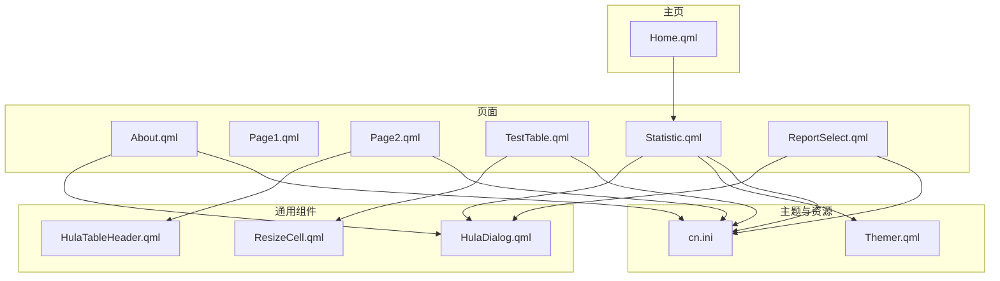
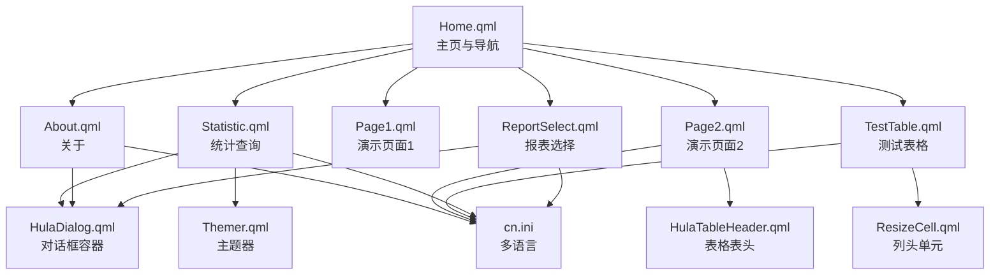
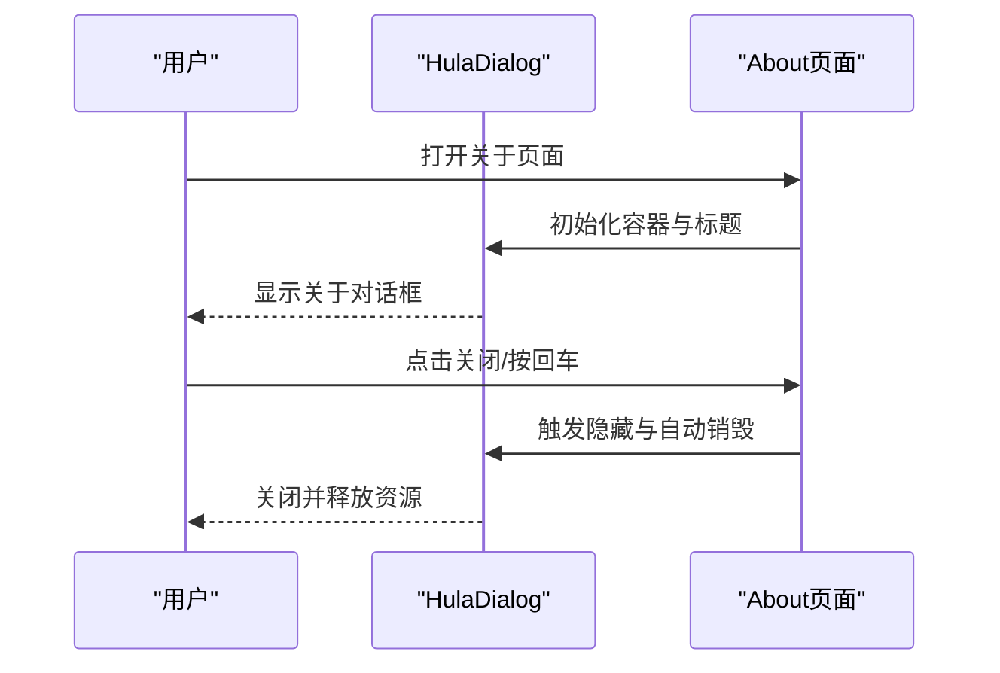
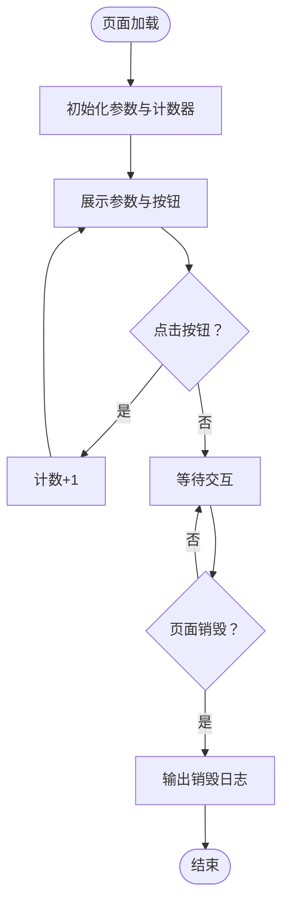
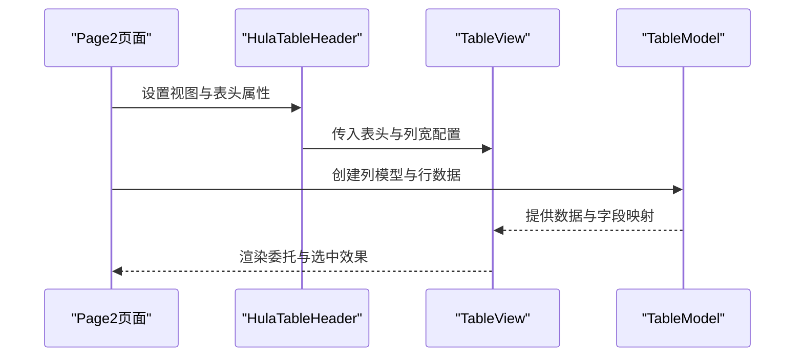
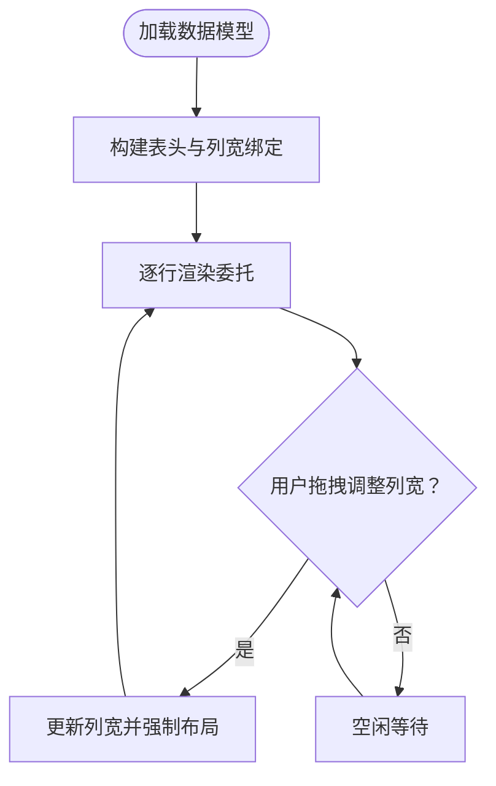
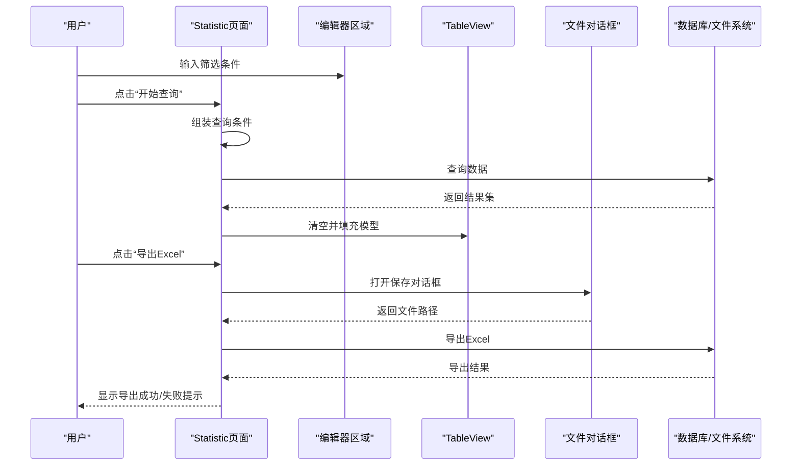
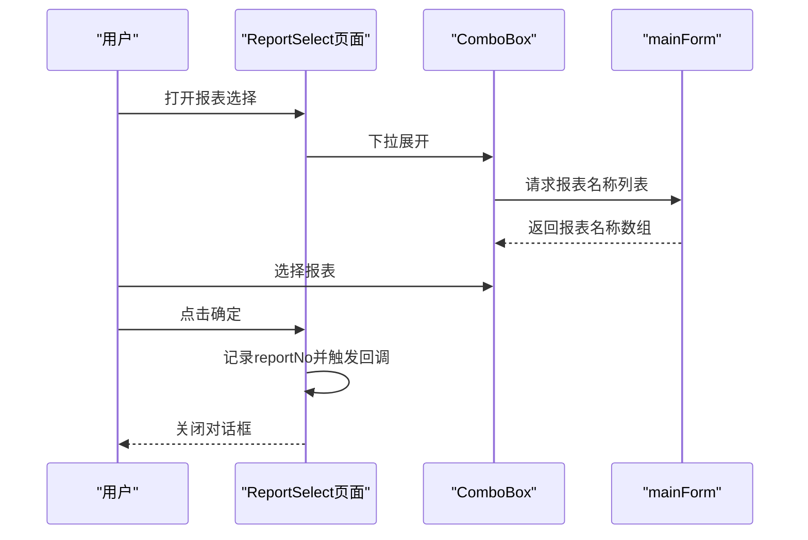
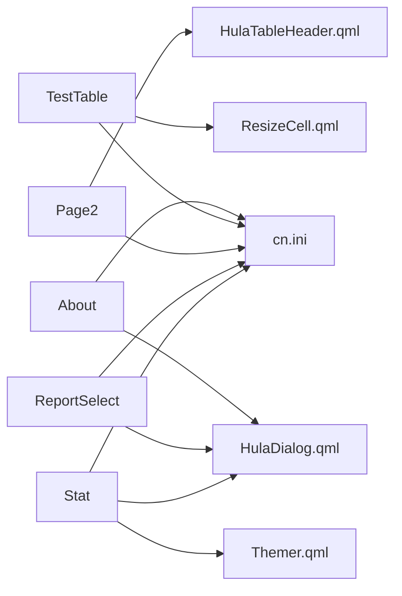

# 工具与辅助页面

<cite>
**本文档引用的文件**
- [About.qml](file://src/QmlUI/About.qml)
- [Page1.qml](file://src/QmlUI/Page1.qml)
- [Page2.qml](file://src/QmlUI/Page2.qml)
- [TestTable.qml](file://src/QmlUI/TestTable.qml)
- [Statistic.qml](file://src/QmlUI/Statistic.qml)
- [ReportSelect.qml](file://src/QmlUI/ReportSelect.qml)
- [HulaDialog.qml](file://src/HulaUI/HulaDialog.qml)
- [HulaTableHeader.qml](file://src/HulaUI/HulaTableHeader.qml)
- [ResizeCell.qml](file://src/QmlUI/ResizeCell.qml)
- [cn.ini](file://resources/Languages/cn.ini)
- [Themer.qml](file://src/QmlUI/Themer.qml)
- [Home.qml](file://src/QmlUI/Home.qml)
</cite>

## 目录
1. [简介](#简介)
2. [项目结构](#项目结构)
3. [核心组件](#核心组件)
4. [架构总览](#架构总览)
5. [详细组件分析](#详细组件分析)
6. [依赖关系分析](#依赖关系分析)
7. [性能考虑](#性能考虑)
8. [故障排查指南](#故障排查指南)
9. [结论](#结论)
10. [附录](#附录)

## 简介
本章节面向QmlPlugins项目的“工具与辅助页面”，系统性梳理以下页面的设计目的、实现方式与使用场景：
- About关于页面：应用信息展示与版权说明
- Page1演示页面：参数接收与本地状态缓存演示
- Page2演示页面：基于自定义表头组件的表格视图
- TestTable测试表格：基础列表与可调整列宽的表格
- Statistic统计页面：数据筛选、结果展示、导入导出、备份恢复、删除等综合功能
- ReportSelect报表选择页面：报表模板选择与回调

同时提供页面扩展指南与功能定制方法，帮助开发者快速集成与二次开发。

## 项目结构
这些页面位于src/QmlUI目录下，采用按功能分层的组织方式：
- 页面文件：About.qml、Page1.qml、Page2.qml、TestTable.qml、Statistic.qml、ReportSelect.qml
- 可复用UI组件：HulaDialog.qml（对话框容器）、HulaTableHeader.qml（表格表头）、ResizeCell.qml（列头可调整）
- 主题与国际化：Themer.qml、cn.ini
- 主页与导航：Home.qml（主页与导航栏）

**图表来源**
- [About.qml:1-126](file://src/QmlUI/About.qml#L1-L126)
- [Page1.qml:1-42](file://src/QmlUI/Page1.qml#L1-L42)
- [Page2.qml:1-197](file://src/QmlUI/Page2.qml#L1-L197)
- [TestTable.qml:1-136](file://src/QmlUI/TestTable.qml#L1-L136)
- [Statistic.qml:1-939](file://src/QmlUI/Statistic.qml#L1-L939)
- [ReportSelect.qml:1-61](file://src/QmlUI/ReportSelect.qml#L1-L61)
- [HulaDialog.qml:1-383](file://src/HulaUI/HulaDialog.qml#L1-L383)
- [HulaTableHeader.qml:1-203](file://src/HulaUI/HulaTableHeader.qml#L1-L203)
- [ResizeCell.qml:1-40](file://src/QmlUI/ResizeCell.qml#L1-L40)
- [Themer.qml:1-26](file://src/QmlUI/Themer.qml#L1-L26)
- [cn.ini:1-300](file://resources/Languages/cn.ini#L1-L300)
- [Home.qml:1-1042](file://src/QmlUI/Home.qml#L1-L1042)

**章节来源**
- [About.qml:1-126](file://src/QmlUI/About.qml#L1-L126)
- [Page1.qml:1-42](file://src/QmlUI/Page1.qml#L1-L42)
- [Page2.qml:1-197](file://src/QmlUI/Page2.qml#L1-L197)
- [TestTable.qml:1-136](file://src/QmlUI/TestTable.qml#L1-L136)
- [Statistic.qml:1-939](file://src/QmlUI/Statistic.qml#L1-L939)
- [ReportSelect.qml:1-61](file://src/QmlUI/ReportSelect.qml#L1-L61)
- [HulaDialog.qml:1-383](file://src/HulaUI/HulaDialog.qml#L1-L383)
- [HulaTableHeader.qml:1-203](file://src/HulaUI/HulaTableHeader.qml#L1-L203)
- [ResizeCell.qml:1-40](file://src/QmlUI/ResizeCell.qml#L1-L40)
- [Themer.qml:1-26](file://src/QmlUI/Themer.qml#L1-L26)
- [cn.ini:1-300](file://resources/Languages/cn.ini#L1-L300)
- [Home.qml:1-1042](file://src/QmlUI/Home.qml#L1-L1042)

## 核心组件
- 对话框容器HulaDialog：提供统一的标题栏、拖拽、动画、模态行为与自动销毁机制，作为弹窗类页面的基础容器
- 表格表头HulaTableHeader：封装横向表头渲染、列宽拖拽、边框与渐变样式，支持与TableView组合使用
- ResizeCell：轻量级列头单元，支持拖拽调整宽度，用于TestTable的表头
- 主题器Themer：根据配置选择主题对象，供页面共享主题色与风格
- 国际化资源cn.ini：提供页面文案与提示语的多语言映射

**章节来源**
- [HulaDialog.qml:1-383](file://src/HulaUI/HulaDialog.qml#L1-L383)
- [HulaTableHeader.qml:1-203](file://src/HulaUI/HulaTableHeader.qml#L1-L203)
- [ResizeCell.qml:1-40](file://src/QmlUI/ResizeCell.qml#L1-L40)
- [Themer.qml:1-26](file://src/QmlUI/Themer.qml#L1-L26)
- [cn.ini:1-300](file://resources/Languages/cn.ini#L1-L300)

## 架构总览
页面间通过组件复用与主题共享形成清晰的层次：
- 页面层：About、Page1、Page2、TestTable、Statistic、ReportSelect
- 组件层：HulaDialog、HulaTableHeader、ResizeCell
- 主题与资源层：Themer、cn.ini
- 导航与入口：Home.qml负责顶部标签与页面挂载

**图表来源**
- [Home.qml:1-1042](file://src/QmlUI/Home.qml#L1-L1042)
- [Statistic.qml:1-939](file://src/QmlUI/Statistic.qml#L1-L939)
- [About.qml:1-126](file://src/QmlUI/About.qml#L1-L126)
- [Page1.qml:1-42](file://src/QmlUI/Page1.qml#L1-L42)
- [Page2.qml:1-197](file://src/QmlUI/Page2.qml#L1-L197)
- [TestTable.qml:1-136](file://src/QmlUI/TestTable.qml#L1-L136)
- [ReportSelect.qml:1-61](file://src/QmlUI/ReportSelect.qml#L1-L61)
- [HulaDialog.qml:1-383](file://src/HulaUI/HulaDialog.qml#L1-L383)
- [HulaTableHeader.qml:1-203](file://src/HulaUI/HulaTableHeader.qml#L1-L203)
- [ResizeCell.qml:1-40](file://src/QmlUI/ResizeCell.qml#L1-L40)
- [Themer.qml:1-26](file://src/QmlUI/Themer.qml#L1-L26)
- [cn.ini:1-300](file://resources/Languages/cn.ini#L1-L300)

## 详细组件分析

### About关于页面
- 设计目的：集中展示应用名称、版本、公司信息、版权声明与网站链接，提供统一的“关于”入口
- 实现要点：
  - 使用HulaDialog作为容器，具备标题栏、拖拽、动画与关闭按钮
  - 左侧放置Logo，右侧以文本形式展示软件名称、版本、发布版本、公司、版权、声明与网站
  - 文案通过qsTr与translater.change实现多语言切换
  - 支持键盘事件处理（如回车关闭）
- 使用场景：系统设置或菜单中的“关于”入口，首次启动引导页的补充说明

**图表来源**
- [About.qml:1-126](file://src/QmlUI/About.qml#L1-L126)
- [HulaDialog.qml:1-383](file://src/HulaUI/HulaDialog.qml#L1-L383)

**章节来源**
- [About.qml:1-126](file://src/QmlUI/About.qml#L1-L126)
- [HulaDialog.qml:1-383](file://src/HulaUI/HulaDialog.qml#L1-L383)
- [cn.ini:286-298](file://resources/Languages/cn.ini#L286-L298)

### Page1演示页面
- 设计目的：演示页面参数接收与本地状态缓存，验证页面生命周期与交互
- 实现要点：
  - 接收userName与userAge两个属性，展示在页面中央
  - 内部维护count计数器，点击按钮递增并实时反映到按钮文本
  - 在组件销毁时输出日志，便于调试页面生命周期
- 使用场景：快速验证页面参数传递、本地状态与生命周期钩子

**图表来源**
- [Page1.qml:1-42](file://src/QmlUI/Page1.qml#L1-L42)

**章节来源**
- [Page1.qml:1-42](file://src/QmlUI/Page1.qml#L1-L42)

### Page2演示页面
- 设计目的：演示基于HulaTableHeader与TableView的表格视图，展示列宽控制与委托渲染
- 实现要点：
  - 使用HulaTableHeader包裹TableView，实现横向表头与列宽拖拽
  - 定义headerTitles、columnsWidth与fieldNames，绑定TableModel数据源
  - 通过delegate实现单元格渲染、边框与选中高亮
  - 支持水平/垂直滚动条与clip裁剪
- 使用场景：需要表格展示与交互的场景，如统计结果、数据列表等

**图表来源**
- [Page2.qml:1-197](file://src/QmlUI/Page2.qml#L1-L197)
- [HulaTableHeader.qml:1-203](file://src/HulaUI/HulaTableHeader.qml#L1-L203)

**章节来源**
- [Page2.qml:1-197](file://src/QmlUI/Page2.qml#L1-L197)
- [HulaTableHeader.qml:1-203](file://src/HulaUI/HulaTableHeader.qml#L1-L203)

### TestTable测试表格
- 设计目的：提供基础列表与可调整列宽的表格示例，便于快速搭建数据展示界面
- 实现要点：
  - 使用ListModel作为原始数据模型，包含姓名、部门、职位等字段
  - 通过ListView与RowLayout构建表头与行代理，支持列宽绑定与动态调整
  - 表头使用ResizeCell组件，实现拖拽调整列宽
  - 支持可见性变化时的自动销毁策略（可选）
- 使用场景：快速原型、教学示例、小型数据展示

**图表来源**
- [TestTable.qml:1-136](file://src/QmlUI/TestTable.qml#L1-L136)
- [ResizeCell.qml:1-40](file://src/QmlUI/ResizeCell.qml#L1-L40)

**章节来源**
- [TestTable.qml:1-136](file://src/QmlUI/TestTable.qml#L1-L136)
- [ResizeCell.qml:1-40](file://src/QmlUI/ResizeCell.qml#L1-L40)

### Statistic统计页面
- 设计目的：提供完整的数据筛选、结果展示、导入导出、备份恢复与删除功能
- 实现要点：
  - 左侧筛选区：包含多个编辑控件（文本、组合框、日期），统一收集查询条件
  - 右侧结果区：TableView展示查询结果，支持多列委托（复选框、数值、文本编辑）
  - 功能按钮：打开报表、开始查询、数据库备份、恢复、导出Excel、删除、关闭
  - 文件交互：FileDialog用于备份/恢复路径选择；导出时生成Excel并反馈消息
  - 数据处理：searchPatients组装查询条件，viewDatas填充模型，deleteData批量删除并清理图片目录
  - 主题与国际化：通过Themer与qsTr实现主题与多语言
- 使用场景：病历/样本数据的检索与管理，报表导出与数据库维护

**图表来源**
- [Statistic.qml:1-939](file://src/QmlUI/Statistic.qml#L1-L939)
- [HulaDialog.qml:1-383](file://src/HulaUI/HulaDialog.qml#L1-L383)

**章节来源**
- [Statistic.qml:1-939](file://src/QmlUI/Statistic.qml#L1-L939)
- [HulaDialog.qml:1-383](file://src/HulaUI/HulaDialog.qml#L1-L383)
- [Themer.qml:1-26](file://src/QmlUI/Themer.qml#L1-L26)
- [cn.ini:181-214](file://resources/Languages/cn.ini#L181-L214)

### ReportSelect报表选择页面
- 设计目的：提供报表模板选择与回调，便于打开指定报表
- 实现要点：
  - 继承HulaDialog，居中显示
  - ComboBox动态加载报表名称列表（通过mainForm.getReportNames）
  - 点击确定后设置reportNo并执行回调callbackOk，随后关闭对话框
- 使用场景：打开特定报表模板前的选择流程

**图表来源**
- [ReportSelect.qml:1-61](file://src/QmlUI/ReportSelect.qml#L1-L61)
- [HulaDialog.qml:1-383](file://src/HulaUI/HulaDialog.qml#L1-L383)

**章节来源**
- [ReportSelect.qml:1-61](file://src/QmlUI/ReportSelect.qml#L1-L61)
- [HulaDialog.qml:1-383](file://src/HulaUI/HulaDialog.qml#L1-L383)

## 依赖关系分析
- 组件耦合：
  - Page2依赖HulaTableHeader实现表头与列宽控制
  - TestTable依赖ResizeCell实现列宽拖拽
  - Statistic与ReportSelect均依赖HulaDialog实现统一对话框体验
  - Statistic通过Themer共享主题色与风格
- 外部依赖：
  - 国际化资源cn.ini提供多语言文案
  - Home.qml作为入口，承载导航与页面挂载

**图表来源**
- [Page2.qml:1-197](file://src/QmlUI/Page2.qml#L1-L197)
- [HulaTableHeader.qml:1-203](file://src/HulaUI/HulaTableHeader.qml#L1-L203)
- [TestTable.qml:1-136](file://src/QmlUI/TestTable.qml#L1-L136)
- [ResizeCell.qml:1-40](file://src/QmlUI/ResizeCell.qml#L1-L40)
- [Statistic.qml:1-939](file://src/QmlUI/Statistic.qml#L1-L939)
- [ReportSelect.qml:1-61](file://src/QmlUI/ReportSelect.qml#L1-L61)
- [HulaDialog.qml:1-383](file://src/HulaUI/HulaDialog.qml#L1-L383)
- [Themer.qml:1-26](file://src/QmlUI/Themer.qml#L1-L26)
- [cn.ini:1-300](file://resources/Languages/cn.ini#L1-L300)

**章节来源**
- [Page2.qml:1-197](file://src/QmlUI/Page2.qml#L1-L197)
- [HulaTableHeader.qml:1-203](file://src/HulaUI/HulaTableHeader.qml#L1-L203)
- [TestTable.qml:1-136](file://src/QmlUI/TestTable.qml#L1-L136)
- [ResizeCell.qml:1-40](file://src/QmlUI/ResizeCell.qml#L1-L40)
- [Statistic.qml:1-939](file://src/QmlUI/Statistic.qml#L1-L939)
- [ReportSelect.qml:1-61](file://src/QmlUI/ReportSelect.qml#L1-L61)
- [HulaDialog.qml:1-383](file://src/HulaUI/HulaDialog.qml#L1-L383)
- [Themer.qml:1-26](file://src/QmlUI/Themer.qml#L1-L26)
- [cn.ini:1-300](file://resources/Languages/cn.ini#L1-L300)

## 性能考虑
- 列宽拖拽与强制布局：HulaTableHeader与ResizeCell在拖拽时会触发forceLayout，建议在大数据量时限制频繁重排或采用虚拟化
- 模态对话框与自动销毁：HulaDialog在关闭时可自动销毁，避免内存泄漏；但需确保父级Loader正确回收
- 表格渲染：TableView的delegate复杂度直接影响渲染性能，建议简化委托逻辑或使用虚拟列表
- 文件IO：导出Excel与数据库备份/恢复涉及磁盘IO，建议异步执行并提供进度反馈

## 故障排查指南
- 关于页面无法关闭或键盘无效
  - 检查HulaDialog的按键事件处理与关闭逻辑
  - 确认translater.change是否生效
- Page2表格列宽拖拽异常
  - 确认HulaTableHeader的MouseArea与width更新逻辑
  - 验证TableView的columnsWidth与列宽提供函数
- TestTable列宽调整无效
  - 检查ResizeCell的MouseArea拖拽目标与父级宽度更新
- Statistic查询无结果或报错
  - 核对筛选条件组装逻辑与字段映射
  - 检查数据源连接与模型appendRow/setRow调用
- 导出/备份/恢复失败
  - 确认文件路径与权限
  - 查看snackMessage提示与FileDialog返回值

**章节来源**
- [HulaDialog.qml:1-383](file://src/HulaUI/HulaDialog.qml#L1-L383)
- [HulaTableHeader.qml:1-203](file://src/HulaUI/HulaTableHeader.qml#L1-L203)
- [ResizeCell.qml:1-40](file://src/QmlUI/ResizeCell.qml#L1-L40)
- [Statistic.qml:778-939](file://src/QmlUI/Statistic.qml#L778-L939)

## 结论
上述工具与辅助页面覆盖了应用中最常见的展示、演示、表格与统计需求。通过HulaDialog、HulaTableHeader与ResizeCell等组件的复用，实现了统一的交互体验与良好的可扩展性。结合Themer与cn.ini，页面具备主题适配与国际化能力。建议在实际业务中遵循现有模式进行扩展与定制。

## 附录
- 页面扩展指南
  - 新建页面：优先继承HulaDialog以获得统一的标题栏与动画
  - 表格页面：优先使用HulaTableHeader与TableView组合，必要时自定义delegate
  - 列宽调整：使用ResizeCell或HulaTableHeader的列宽拖拽机制
  - 主题与文案：通过Themer与qsTr/cn.ini保持一致性
- 功能定制方法
  - 参数传递：在页面属性中定义所需参数，并在页面加载时初始化
  - 生命周期：利用Component.onDestruction与onVisibleChanged进行资源管理
  - 数据绑定：使用ListModel/TableModel作为数据源，配合TableView/ListView渲染
  - 文件交互：通过FileDialog与系统文件接口进行备份/恢复/导出