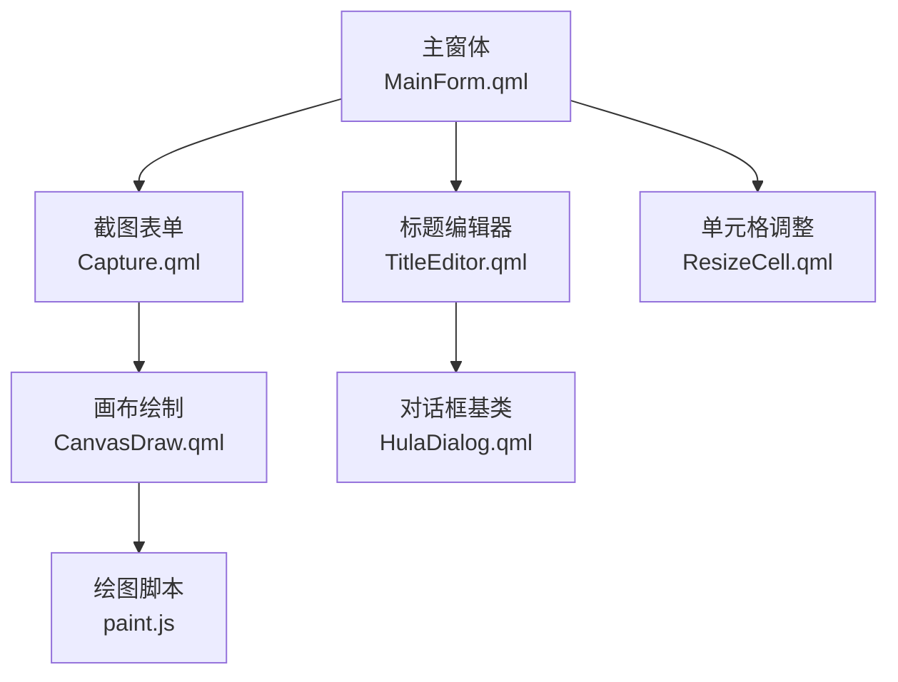
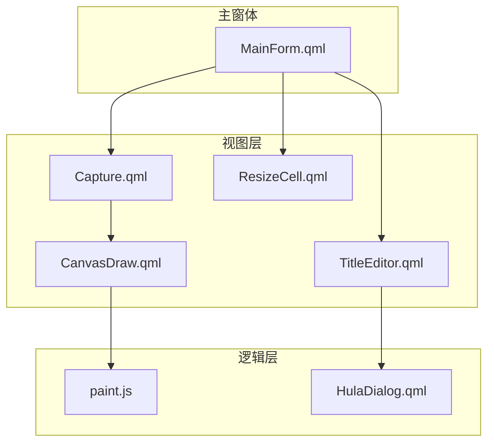
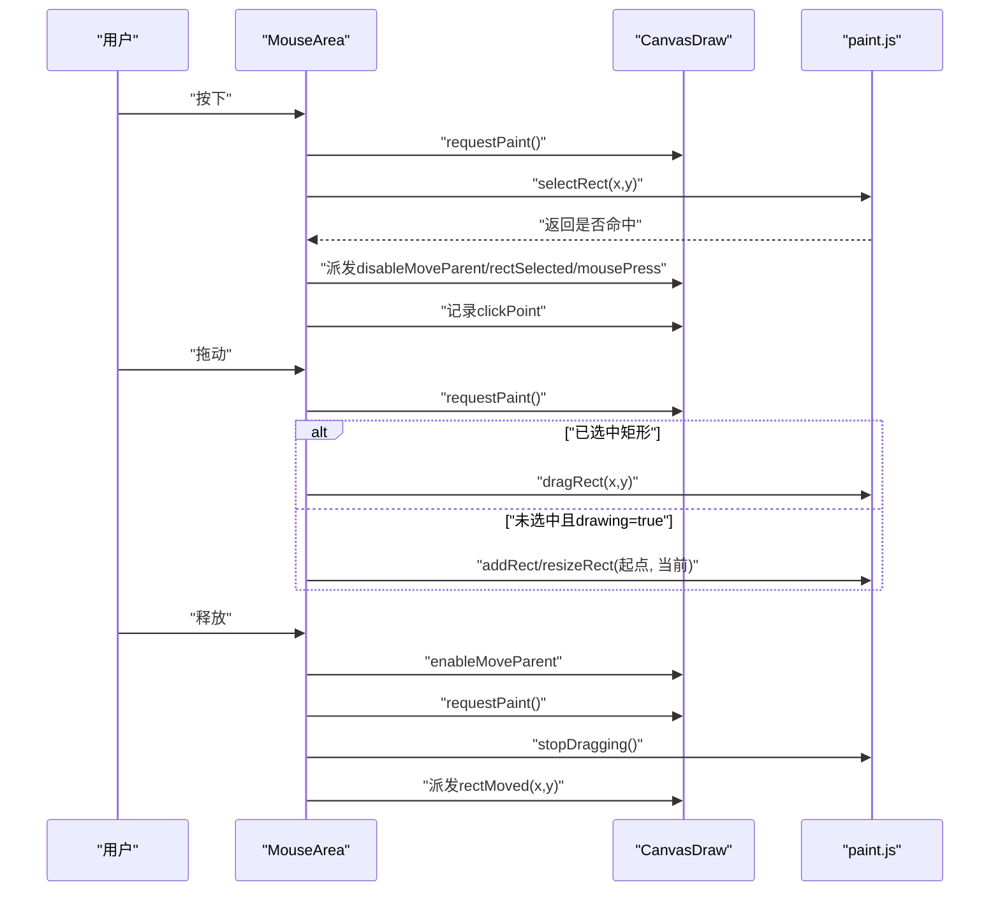
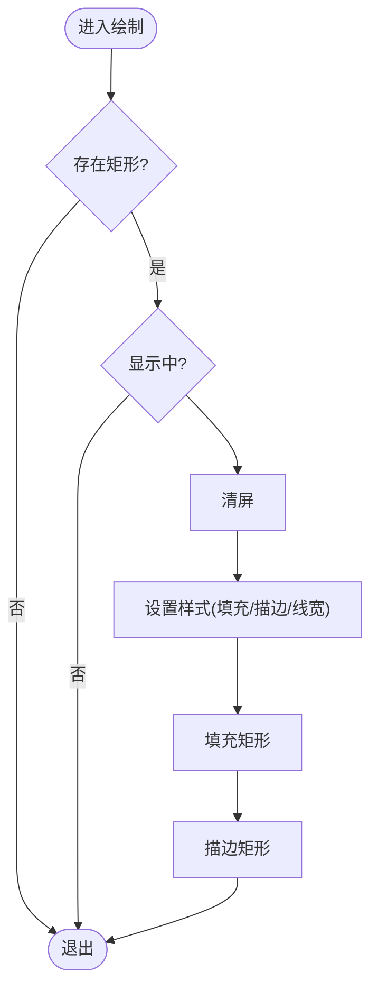
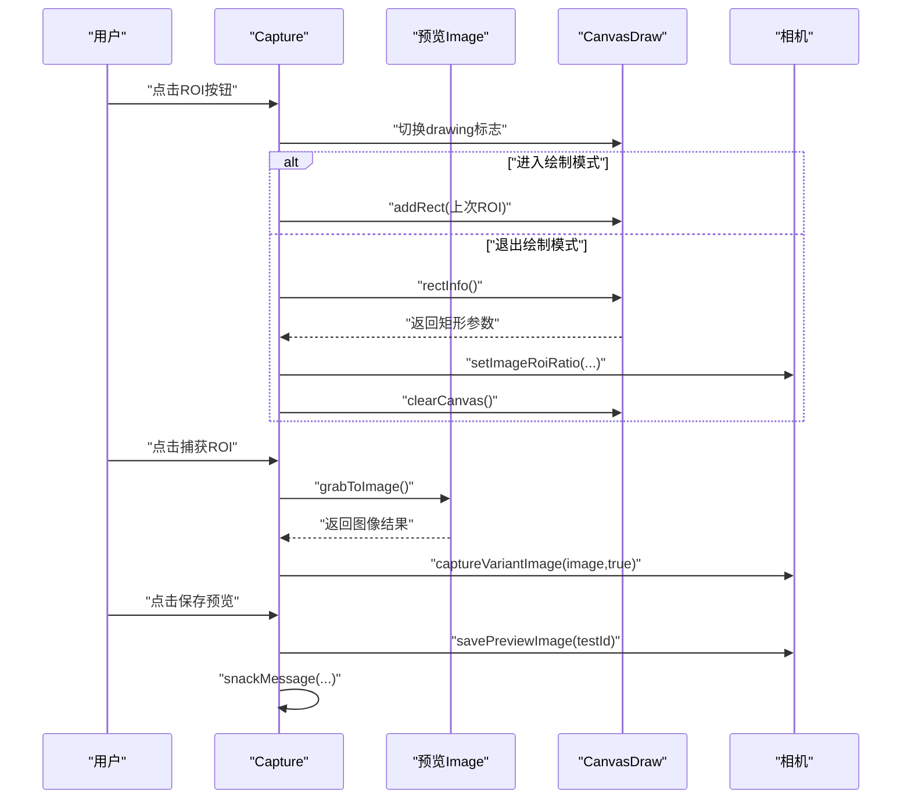
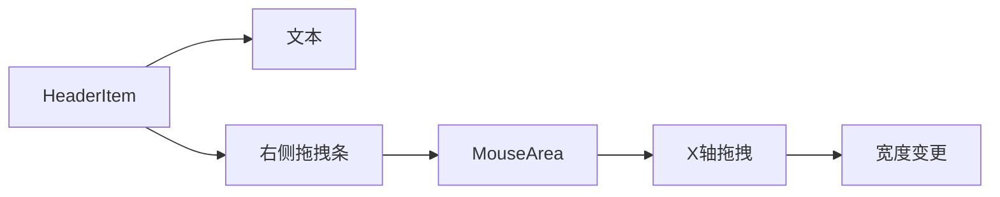
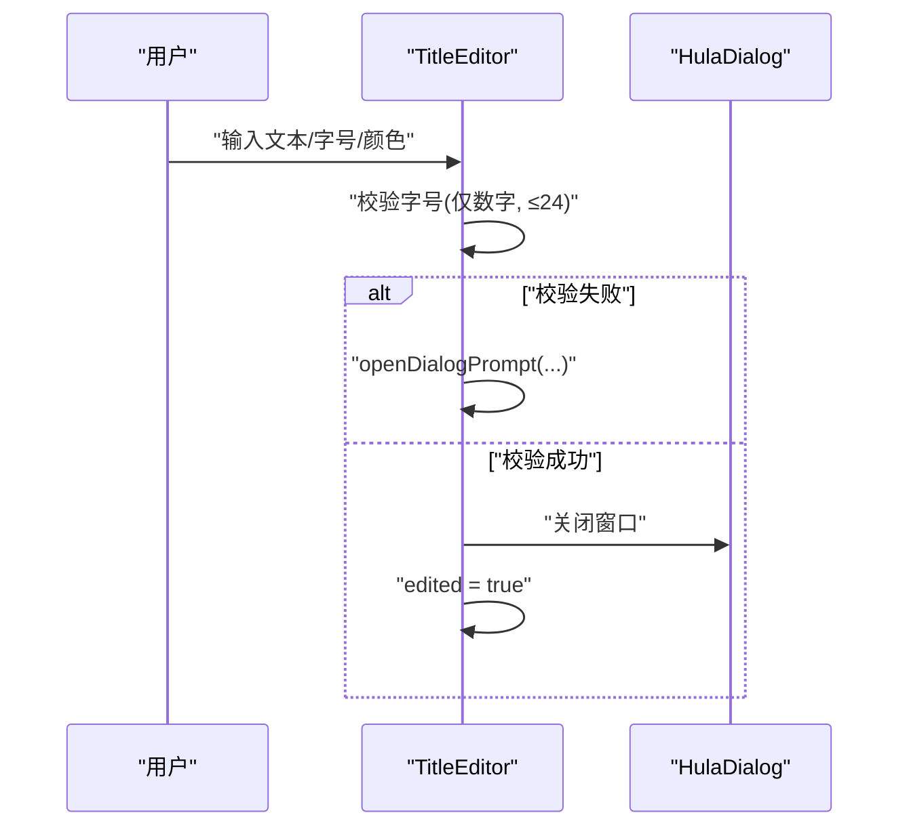
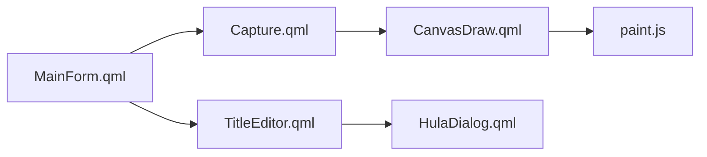

# 画布与绘图页面

<cite>
**本文档引用的文件**
- [CanvasDraw.qml](file://src/QmlUI/CanvasDraw.qml)
- [Capture.qml](file://src/QmlUI/Capture.qml)
- [paint.js](file://src/QmlUI/paint.js)
- [ResizeCell.qml](file://src/QmlUI/ResizeCell.qml)
- [TitleEditor.qml](file://src/QmlUI/TitleEditor.qml)
- [HulaDialog.qml](file://src/HulaUI/HulaDialog.qml)
- [MainForm.qml](file://src/QmlUI/MainForm.qml)
</cite>

## 目录
1. [简介](#简介)
2. [项目结构](#项目结构)
3. [核心组件](#核心组件)
4. [架构总览](#架构总览)
5. [详细组件分析](#详细组件分析)
6. [依赖关系分析](#依赖关系分析)
7. [性能考量](#性能考量)
8. [故障排查指南](#故障排查指南)
9. [结论](#结论)
10. [附录](#附录)

## 简介
本文件面向QmlPlugins项目的“画布与绘图页面”，系统化阐述以下能力：
- CanvasDraw画布绘制：基于Qt Quick Canvas与JavaScript的图形渲染机制、Canvas API使用、交互响应流程
- Capture截图：图像捕获、ROI区域设定、实时预览与图像处理效果联动
- ResizeCell单元格调整：可拖拽列宽的交互处理
- TitleEditor标题编辑器：文本输入、字体大小与颜色管理
- paint.js绘图脚本：JavaScript层的图形状态管理与绘制逻辑

同时给出扩展建议、性能优化策略与跨平台兼容性注意事项。

## 项目结构
围绕画布与绘图页面的关键文件组织如下：
- 画布与绘图：CanvasDraw.qml、paint.js
- 截图与预览：Capture.qml（包含CanvasDraw嵌入）
- 单元格调整：ResizeCell.qml
- 标题编辑器：TitleEditor.qml（基于HulaDialog）
- 对话框基类：HulaDialog.qml
- 主窗体与消息提示：MainForm.qml（含消息提示与对话框）

**图表来源**
- [MainForm.qml:1-223](file://src/QmlUI/MainForm.qml#L1-L223)
- [Capture.qml:1-596](file://src/QmlUI/Capture.qml#L1-L596)
- [CanvasDraw.qml:1-103](file://src/QmlUI/CanvasDraw.qml#L1-L103)
- [paint.js:1-139](file://src/QmlUI/paint.js#L1-L139)
- [TitleEditor.qml:1-139](file://src/QmlUI/TitleEditor.qml#L1-L139)
- [HulaDialog.qml:1-53](file://src/HulaUI/HulaDialog.qml#L1-L53)
- [ResizeCell.qml:1-40](file://src/QmlUI/ResizeCell.qml#L1-L40)

**章节来源**
- [MainForm.qml:1-223](file://src/QmlUI/MainForm.qml#L1-L223)
- [Capture.qml:1-596](file://src/QmlUI/Capture.qml#L1-L596)
- [CanvasDraw.qml:1-103](file://src/QmlUI/CanvasDraw.qml#L1-L103)
- [paint.js:1-139](file://src/QmlUI/paint.js#L1-L139)
- [TitleEditor.qml:1-139](file://src/QmlUI/TitleEditor.qml#L1-L139)
- [HulaDialog.qml:1-53](file://src/HulaUI/HulaDialog.qml#L1-L53)
- [ResizeCell.qml:1-40](file://src/QmlUI/ResizeCell.qml#L1-L40)

## 核心组件
- CanvasDraw画布：承载Canvas与MouseArea，桥接QML与JS绘制逻辑，暴露绘制、清空、矩形信息查询等接口
- paint.js绘图脚本：维护矩形状态、选择与拖拽、Canvas上下文绑定、统一绘制流程
- Capture截图表单：整合相机预览、图像处理效果、ROI绘制与保存、历史图片列表
- TitleEditor标题编辑器：提供文本、字号、颜色编辑，继承HulaDialog
- ResizeCell单元格：可拖拽改变宽度的表头单元格

**章节来源**
- [CanvasDraw.qml:6-103](file://src/QmlUI/CanvasDraw.qml#L6-L103)
- [paint.js:1-139](file://src/QmlUI/paint.js#L1-L139)
- [Capture.qml:1-596](file://src/QmlUI/Capture.qml#L1-L596)
- [TitleEditor.qml:1-139](file://src/QmlUI/TitleEditor.qml#L1-L139)
- [ResizeCell.qml:1-40](file://src/QmlUI/ResizeCell.qml#L1-L40)

## 架构总览
整体采用“QML视图 + JavaScript逻辑”的分层设计：
- 视图层：CanvasDraw负责绘制与事件；Capture负责布局与控制流
- 逻辑层：paint.js集中管理图形状态与绘制
- 交互层：MouseArea响应鼠标事件，触发绘制、选择、拖拽与保存

**图表来源**
- [CanvasDraw.qml:1-103](file://src/QmlUI/CanvasDraw.qml#L1-L103)
- [Capture.qml:1-596](file://src/QmlUI/Capture.qml#L1-L596)
- [paint.js:1-139](file://src/QmlUI/paint.js#L1-L139)
- [TitleEditor.qml:1-139](file://src/QmlUI/TitleEditor.qml#L1-L139)
- [HulaDialog.qml:1-53](file://src/HulaUI/HulaDialog.qml#L1-L53)
- [MainForm.qml:1-223](file://src/QmlUI/MainForm.qml#L1-L223)
- [ResizeCell.qml:1-40](file://src/QmlUI/ResizeCell.qml#L1-L40)

## 详细组件分析

### CanvasDraw画布绘制
- Canvas初始化与上下文绑定：通过available变化信号绑定2D上下文与画布实例
- 重绘机制：requestPaint触发onPaint回调，由JS统一绘制
- 绘图接口：
  - drawCanvas：请求重绘并调用JS绘制
  - addRect/resizeRect/hideRect/clearCanvas：封装JS操作并触发重绘
  - rectInfo：返回当前矩形参数
- 鼠标交互：
  - onPressed：请求重绘、尝试选择矩形、派发信号、记录点击点
  - onReleased：启用父级移动、停止拖拽、派发移动完成信号
  - onPositionChanged：根据drawing标志与是否已选中矩形决定拖拽或动态绘制

**图表来源**
- [CanvasDraw.qml:55-101](file://src/QmlUI/CanvasDraw.qml#L55-L101)
- [paint.js:91-138](file://src/QmlUI/paint.js#L91-L138)

**章节来源**
- [CanvasDraw.qml:6-103](file://src/QmlUI/CanvasDraw.qml#L6-L103)
- [paint.js:1-139](file://src/QmlUI/paint.js#L1-L139)

### paint.js绘图脚本
- 全局状态：矩形对象、选中矩形、拖拽标记与偏移量、Canvas与Context引用
- 数据结构：Rect构造函数定义矩形属性与显示状态
- 关键方法：
  - setContext：建立JS与Canvas的绑定
  - addRect/resizeRect：更新矩形参数并重绘
  - rectInfo：导出矩形参数
  - drawCanvas：清屏、设置样式、填充与描边矩形
  - selectRect/dragRect：命中检测、选中高亮、拖拽位移
  - stopDragging：结束拖拽
  - clearCanvas：清空矩形并清屏

**图表来源**
- [paint.js:69-89](file://src/QmlUI/paint.js#L69-L89)

**章节来源**
- [paint.js:1-139](file://src/QmlUI/paint.js#L1-L139)

### Capture截图功能
- 相机与预览：根据配置设置尺寸与比例，动态调整预览区域尺寸
- 图像处理效果：亮度/对比度/饱和度/色相滑条联动GraphicalEffects
- ROI绘制：在CanvasDraw上绘制蓝色半透明矩形，支持拖拽移动与保存ROI
- 截图与保存：
  - 捕获整幅图像与ROI图像
  - 保存预览图像并提示
- 历史图片：GridView展示本地或相机生成的历史图像，支持删除

**图表来源**
- [Capture.qml:227-340](file://src/QmlUI/Capture.qml#L227-L340)
- [CanvasDraw.qml:23-46](file://src/QmlUI/CanvasDraw.qml#L23-L46)

**章节来源**
- [Capture.qml:1-596](file://src/QmlUI/Capture.qml#L1-L596)
- [CanvasDraw.qml:1-103](file://src/QmlUI/CanvasDraw.qml#L1-L103)

### ResizeCell单元格调整
- 结构：背景矩形+文本+右侧拖拽条
- 交互：右侧矩形区域作为MouseArea，设置drag.target与drag.axis为X轴
- 行为：拖拽改变headerItem宽度，可用于表格列宽自适应

**图表来源**
- [ResizeCell.qml:11-38](file://src/QmlUI/ResizeCell.qml#L11-L38)

**章节来源**
- [ResizeCell.qml:1-40](file://src/QmlUI/ResizeCell.qml#L1-L40)

### TitleEditor标题编辑器
- 功能：编辑报告名称或医院名称，设置字号（仅数字）、选择字体颜色
- 输入校验：字号仅允许数字，超过上限弹出提示
- 状态：edited标记编辑状态，回退时关闭窗口
- 基类：继承HulaDialog，复用对话框通用行为

**图表来源**
- [TitleEditor.qml:75-100](file://src/QmlUI/TitleEditor.qml#L75-L100)
- [HulaDialog.qml:1-53](file://src/HulaUI/HulaDialog.qml#L1-L53)

**章节来源**
- [TitleEditor.qml:1-139](file://src/QmlUI/TitleEditor.qml#L1-L139)
- [HulaDialog.qml:1-53](file://src/HulaUI/HulaDialog.qml#L1-L53)

## 依赖关系分析
- CanvasDraw依赖paint.js：通过import "paint.js" as Painter导入命名空间
- Capture依赖CanvasDraw：在预览区域内嵌套CanvasDraw
- TitleEditor依赖HulaDialog：继承HulaDialog以获得统一的对话框行为
- MainForm提供全局消息提示与对话框创建能力，供TitleEditor等组件使用

**图表来源**
- [Capture.qml:164-167](file://src/QmlUI/Capture.qml#L164-L167)
- [CanvasDraw.qml](file://src/QmlUI/CanvasDraw.qml#L3)
- [paint.js](file://src/QmlUI/paint.js)
- [TitleEditor.qml:1-7](file://src/QmlUI/TitleEditor.qml#L1-L7)
- [HulaDialog.qml:1-53](file://src/HulaUI/HulaDialog.qml#L1-L53)
- [MainForm.qml:378-404](file://src/QmlUI/MainForm.qml#L378-L404)

**章节来源**
- [CanvasDraw.qml:1-103](file://src/QmlUI/CanvasDraw.qml#L1-L103)
- [Capture.qml:1-596](file://src/QmlUI/Capture.qml#L1-L596)
- [paint.js:1-139](file://src/QmlUI/paint.js#L1-L139)
- [TitleEditor.qml:1-139](file://src/QmlUI/TitleEditor.qml#L1-L139)
- [HulaDialog.qml:1-53](file://src/HulaUI/HulaDialog.qml#L1-L53)
- [MainForm.qml:378-404](file://src/QmlUI/MainForm.qml#L378-L404)

## 性能考量
- 绘制优化
  - 使用requestPaint按需触发重绘，避免不必要的全量刷新
  - 在JS侧先清屏再绘制，减少闪烁与重叠
  - 控制绘制频率：在拖拽过程中保持合理帧率，必要时节流
- 内存与资源
  - 预览图像缓存禁用与平滑设置需结合场景权衡
  - ROI绘制完成后及时清理，避免残留绘制影响后续
- 交互响应
  - 拖拽偏移量offsetX/Y在selectRect中一次性计算，降低拖拽抖动
  - 按下/释放阶段分别处理父级移动开关，避免误操作

[本节为通用指导，无需具体文件引用]

## 故障排查指南
- 无法绘制或无响应
  - 确认CanvasDraw的available变化已绑定setContext
  - 检查JS中context与canvas是否为空
  - 确保调用drawCanvas前有requestPaint
- 无法选择或拖拽矩形
  - 检查selectRect命中条件（坐标范围）
  - 确认dragging标志与selectedRect非空
- 截图无效或ROI不正确
  - 检查itemPreview.grabToImage回调是否执行
  - 确认ROI比例计算与预览尺寸一致
  - 确认setImageRoiRatio参数归一化到[0,1]
- 字号校验异常
  - 确认输入法限制与正则替换逻辑生效
  - 弹窗提示需在字号超限分支处理

**章节来源**
- [paint.js:91-138](file://src/QmlUI/paint.js#L91-L138)
- [CanvasDraw.qml:59-101](file://src/QmlUI/CanvasDraw.qml#L59-L101)
- [Capture.qml:236-256](file://src/QmlUI/Capture.qml#L236-L256)
- [TitleEditor.qml:75-100](file://src/QmlUI/TitleEditor.qml#L75-L100)

## 结论
该模块通过“QML画布 + JS逻辑”的组合，实现了直观的ROI绘制与截图流程，并提供了可扩展的编辑器与单元格调整能力。建议在复杂场景下进一步引入节流与批处理策略，确保跨平台稳定性与性能表现。

[本节为总结性内容，无需具体文件引用]

## 附录

### 扩展指南
- 新增图形类型
  - 在paint.js中新增构造函数与绘制逻辑
  - 在CanvasDraw中新增对应接口并调用JS方法
- 自定义交互
  - 在CanvasDraw的MouseArea中扩展事件处理
  - 通过信号与属性与父级通信
- 编辑器增强
  - 在TitleEditor中增加更多格式选项（字体族、对齐等）
  - 复用HulaDialog的动画与布局特性

[本节为概念性内容，无需具体文件引用]