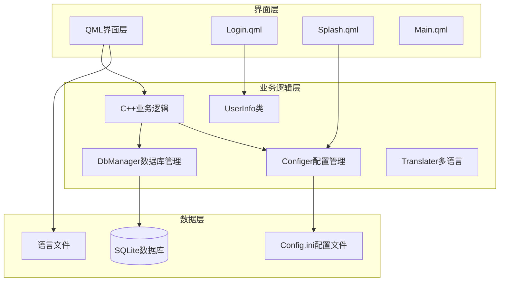
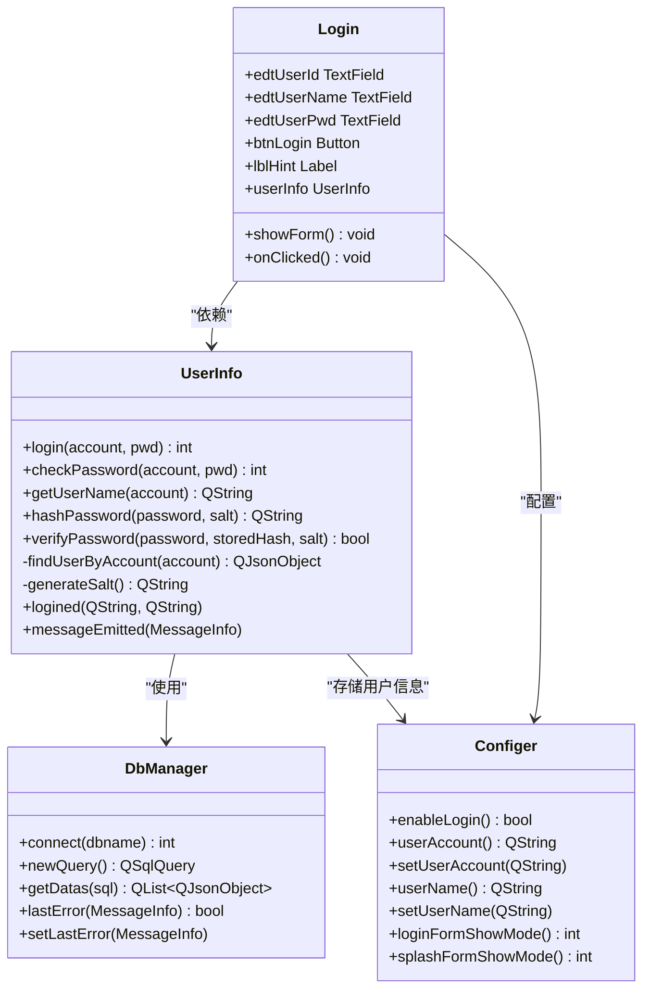
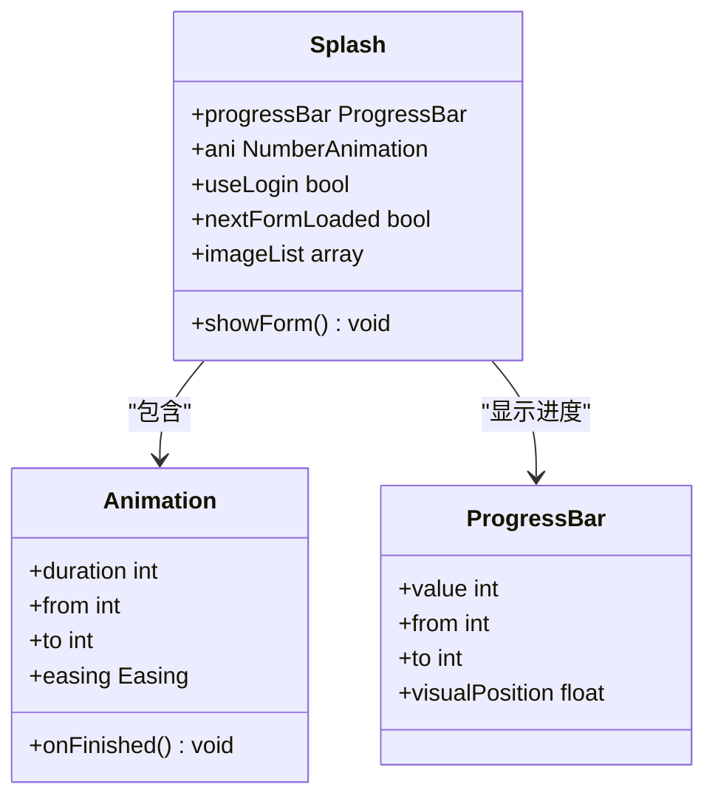
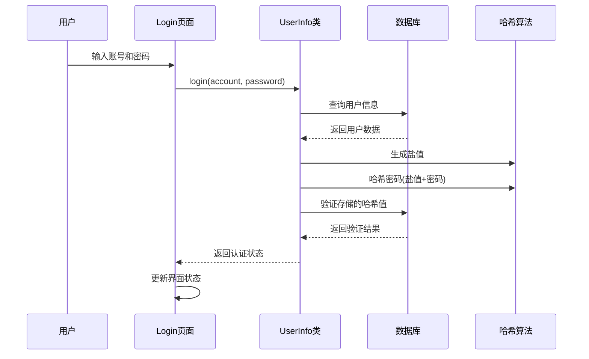
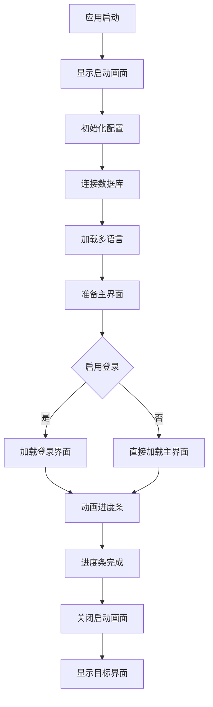
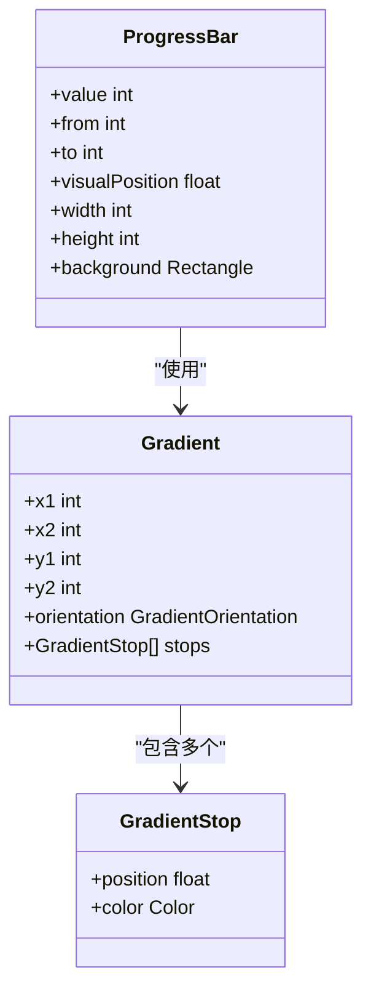
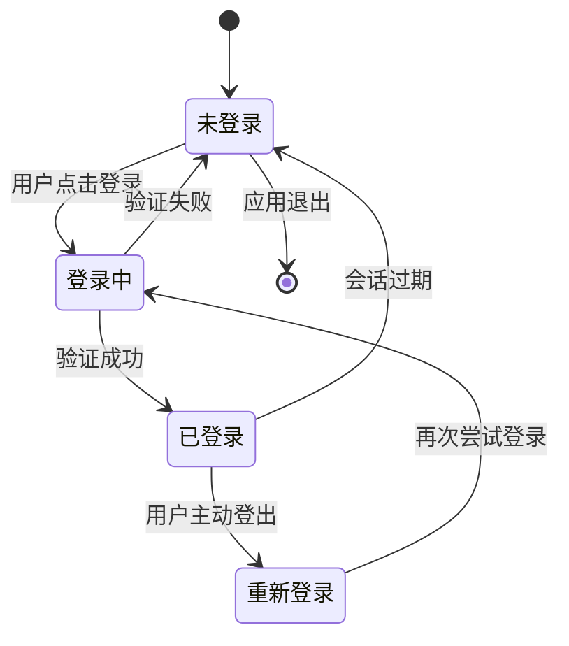
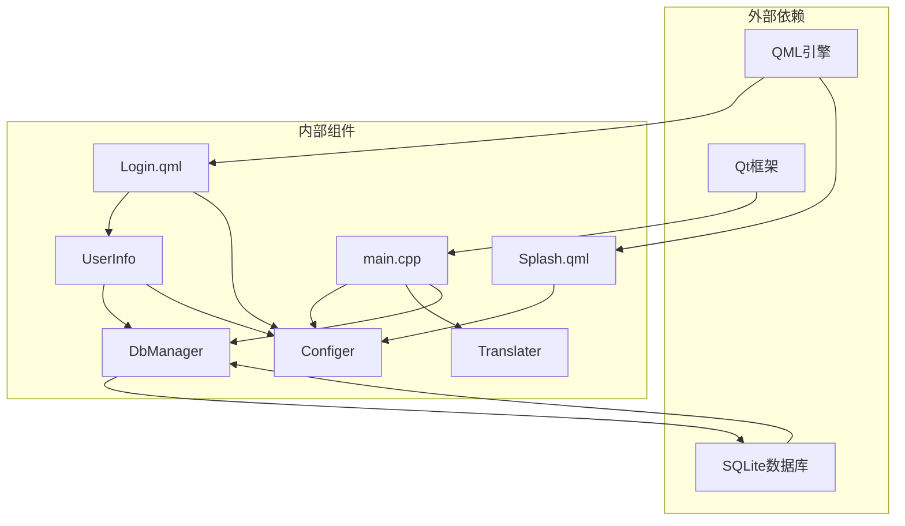

# 认证相关页面

<cite>
**本文档引用的文件**
- [Login.qml](file://src/QmlUI/Login.qml)
- [Splash.qml](file://src/QmlUI/Splash.qml)
- [main.cpp](file://src/main.cpp)
- [userinfo.h](file://src/userinfo.h)
- [userinfo.cpp](file://src/userinfo.cpp)
- [configer.h](file://src/configer.h)
- [configer.cpp](file://src/configer.cpp)
- [dbmanager.h](file://src/dbmanager.h)
- [dbmanager.cpp](file://src/dbmanager.cpp)
- [translater.h](file://src/translater.h)
- [cn.ini](file://resources/Languages/cn.ini)
- [en.ini](file://resources/Languages/en.ini)
- [Config.ini](file://bin/Config.ini)
</cite>

## 目录
1. [简介](#简介)
2. [项目结构](#项目结构)
3. [核心组件](#核心组件)
4. [架构概览](#架构概览)
5. [详细组件分析](#详细组件分析)
6. [依赖关系分析](#依赖关系分析)
7. [性能考虑](#性能考虑)
8. [故障排除指南](#故障排除指南)
9. [结论](#结论)

## 简介

QmlPlugins项目是一个基于Qt Quick和C++构建的企业级应用程序，专注于认证相关页面的设计与实现。本文档深入分析了登录页面和启动画面的核心功能，包括用户认证流程、表单验证机制、安全处理策略、登录状态管理、会话处理以及错误处理最佳实践。

该项目采用模块化架构设计，通过QML界面层与C++业务逻辑层的分离，实现了高度可维护性和可扩展性的认证系统。系统支持多语言国际化、数据库持久化存储、密码安全哈希算法以及完整的用户生命周期管理。

## 项目结构

项目采用分层架构设计，主要分为以下层次：



**图表来源**
- [Login.qml:1-342](file://src/QmlUI/Login.qml#L1-L342)
- [Splash.qml:1-156](file://src/QmlUI/Splash.qml#L1-L156)
- [main.cpp:1-99](file://src/main.cpp#L1-L99)

**章节来源**
- [main.cpp:17-99](file://src/main.cpp#L17-L99)
- [Login.qml:9-342](file://src/QmlUI/Login.qml#L9-L342)
- [Splash.qml:7-156](file://src/QmlUI/Splash.qml#L7-L156)

## 核心组件

### 登录认证组件

登录系统由多个核心组件构成，实现了完整的用户身份验证流程：



**图表来源**
- [userinfo.h:30-172](file://src/userinfo.h#L30-L172)
- [configer.h:98-277](file://src/configer.h#L98-L277)
- [dbmanager.h:52-192](file://src/dbmanager.h#L52-L192)
- [Login.qml:54-342](file://src/QmlUI/Login.qml#L54-L342)

### 启动画面组件

启动画面系统提供了流畅的应用程序加载体验：



**图表来源**
- [Splash.qml:7-156](file://src/QmlUI/Splash.qml#L7-L156)

**章节来源**
- [userinfo.h:30-172](file://src/userinfo.h#L30-L172)
- [userinfo.cpp:226-297](file://src/userinfo.cpp#L226-L297)
- [configer.h:98-277](file://src/configer.h#L98-L277)
- [configer.cpp:136-156](file://src/configer.cpp#L136-L156)

## 架构概览

系统采用分层架构，实现了界面层、业务逻辑层和数据层的有效分离：

```mermaid
graph TB
subgraph "应用启动流程"
A[main.cpp启动] --> B[加载配置]
B --> C[初始化数据库]
C --> D[设置多语言]
D --> E[创建主窗口]
end
subgraph "认证流程"
F[用户输入] --> G[表单验证]
G --> H[密码哈希]
H --> I[数据库查询]
I --> J{验证结果}
J --> |成功| K[设置用户状态]
J --> |失败| L[显示错误信息]
K --> M[跳转主界面]
L --> N[提示用户重试]
end
subgraph "数据持久化"
O[SQLite数据库] <- --> P[DbManager]
P <- --> Q[UserInfo]
Q <- --> R[Configer]
end
E --> F
M --> O
```

**图表来源**
- [main.cpp:17-99](file://src/main.cpp#L17-L99)
- [userinfo.cpp:226-242](file://src/userinfo.cpp#L226-L242)
- [dbmanager.cpp:51-90](file://src/dbmanager.cpp#L51-L90)

## 详细组件分析

### 登录页面详细分析

登录页面实现了完整的用户认证流程，包括实时用户名填充、密码验证和错误处理。

#### 登录表单验证机制

```mermaid
flowchart TD
A[用户输入账号] --> B{账号是否为空}
B --> |是| C[清空用户名字段]
B --> |否| D[查询用户信息]
D --> E{用户是否存在}
E --> |不存在| F[显示"用户不存在"提示]
E --> |存在| G[填充用户名字段]
G --> H[用户输入密码]
H --> I{密码是否为空}
I --> |是| J[等待用户输入]
I --> |否| K[执行登录验证]
K --> L{验证结果}
L --> |成功| M[设置用户状态]
L --> |失败| N[显示"密码错误"提示]
M --> O[关闭登录窗口]
N --> P[清除密码并聚焦]
```

**图表来源**
- [Login.qml:159-172](file://src/QmlUI/Login.qml#L159-L172)
- [Login.qml:321-335](file://src/QmlUI/Login.qml#L321-L335)

#### 密码安全处理

系统采用安全的密码存储机制，使用盐值哈希算法保护用户凭据：



**图表来源**
- [userinfo.cpp:275-291](file://src/userinfo.cpp#L275-L291)
- [userinfo.cpp:226-242](file://src/userinfo.cpp#L226-L242)

**章节来源**
- [Login.qml:146-335](file://src/QmlUI/Login.qml#L146-L335)
- [userinfo.cpp:212-242](file://src/userinfo.cpp#L212-L242)

### 启动画面详细分析

启动画面提供了应用程序的初始加载体验，包含进度显示和资源初始化过程。

#### 启动画面加载逻辑



**图表来源**
- [Splash.qml:19-29](file://src/QmlUI/Splash.qml#L19-L29)
- [Splash.qml:46-58](file://src/QmlUI/Splash.qml#L46-L58)

#### 进度显示机制

启动画面使用渐变进度条展示应用程序的初始化状态：



**图表来源**
- [Splash.qml:97-140](file://src/QmlUI/Splash.qml#L97-L140)

**章节来源**
- [Splash.qml:68-156](file://src/QmlUI/Splash.qml#L68-L156)
- [main.cpp:42-50](file://src/main.cpp#L42-L50)

### 登录状态管理

系统实现了完整的登录状态管理机制，包括用户会话维护和状态同步。

#### 用户会话生命周期



#### 配置管理集成

登录状态与系统配置紧密集成，通过Configer类管理用户相关信息：

**章节来源**
- [configer.h:124-130](file://src/configer.h#L124-L130)
- [configer.cpp:32-40](file://src/configer.cpp#L32-L40)

## 依赖关系分析

系统各组件之间的依赖关系清晰明确，遵循了单一职责原则和依赖倒置原则。



**图表来源**
- [main.cpp:1-99](file://src/main.cpp#L1-L99)
- [Login.qml:1-342](file://src/QmlUI/Login.qml#L1-L342)
- [Splash.qml:1-156](file://src/QmlUI/Splash.qml#L1-L156)

**章节来源**
- [main.cpp:1-99](file://src/main.cpp#L1-L99)
- [userinfo.h:1-172](file://src/userinfo.h#L1-L172)
- [dbmanager.h:1-192](file://src/dbmanager.h#L1-L192)

## 性能考虑

系统在设计时充分考虑了性能优化，采用了多种技术手段提升用户体验：

### 数据库性能优化

- **连接池管理**: 使用线程本地存储避免连接竞争
- **WAL模式**: 启用Write-Ahead Logging提升并发性能
- **忙等待超时**: 设置5秒忙等待超时防止数据库锁定
- **事务批处理**: 使用TransactionGuard确保数据一致性

### 内存管理优化

- **智能指针**: 使用QScopedPointer管理资源生命周期
- **延迟加载**: QML组件按需加载减少内存占用
- **缓存机制**: 用户信息缓存避免重复查询

### 界面响应性优化

- **异步操作**: 数据库操作在后台线程执行
- **进度反馈**: 启动画面提供实时进度指示
- **防抖处理**: 输入验证采用防抖机制减少无效请求

## 故障排除指南

### 常见问题及解决方案

#### 登录失败问题

**问题现象**: 用户输入正确的账号密码但无法登录

**可能原因**:
1. 数据库连接失败
2. 密码哈希算法异常
3. 用户信息查询失败

**解决方案**:
1. 检查数据库文件是否存在且可访问
2. 验证用户密码哈希存储格式
3. 确认用户表结构完整

#### 启动画面卡顿问题

**问题现象**: 应用启动时启动画面停滞不动

**可能原因**:
1. 数据库初始化耗时过长
2. 多语言文件加载失败
3. 界面渲染阻塞

**解决方案**:
1. 优化数据库连接和初始化流程
2. 检查语言文件路径配置
3. 实施异步资源加载

#### 密码安全问题

**问题现象**: 密码验证逻辑异常或安全漏洞

**防护措施**:
1. 确保盐值随机生成且唯一
2. 实施密码哈希迭代增强
3. 防止时间攻击侧信道
4. 定期更新加密算法

**章节来源**
- [dbmanager.cpp:51-90](file://src/dbmanager.cpp#L51-L90)
- [userinfo.cpp:275-291](file://src/userinfo.cpp#L275-L291)
- [Login.qml:321-335](file://src/QmlUI/Login.qml#L321-L335)

## 结论

QmlPlugins项目的认证相关页面展现了现代Qt应用程序的最佳实践。系统通过精心设计的架构实现了：

**安全性**: 采用盐值哈希算法、防时间攻击机制和安全的密码存储策略

**用户体验**: 提供流畅的启动体验、实时表单验证和友好的错误提示

**可维护性**: 模块化设计、清晰的依赖关系和完善的错误处理机制

**可扩展性**: 插件化的架构设计支持功能扩展和定制化需求

该认证系统为类似的企业级应用程序提供了优秀的参考实现，其设计理念和最佳实践值得在其他项目中借鉴和应用。