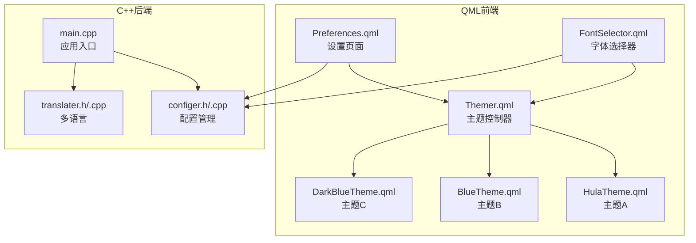
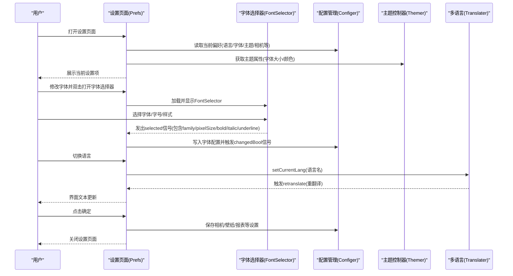
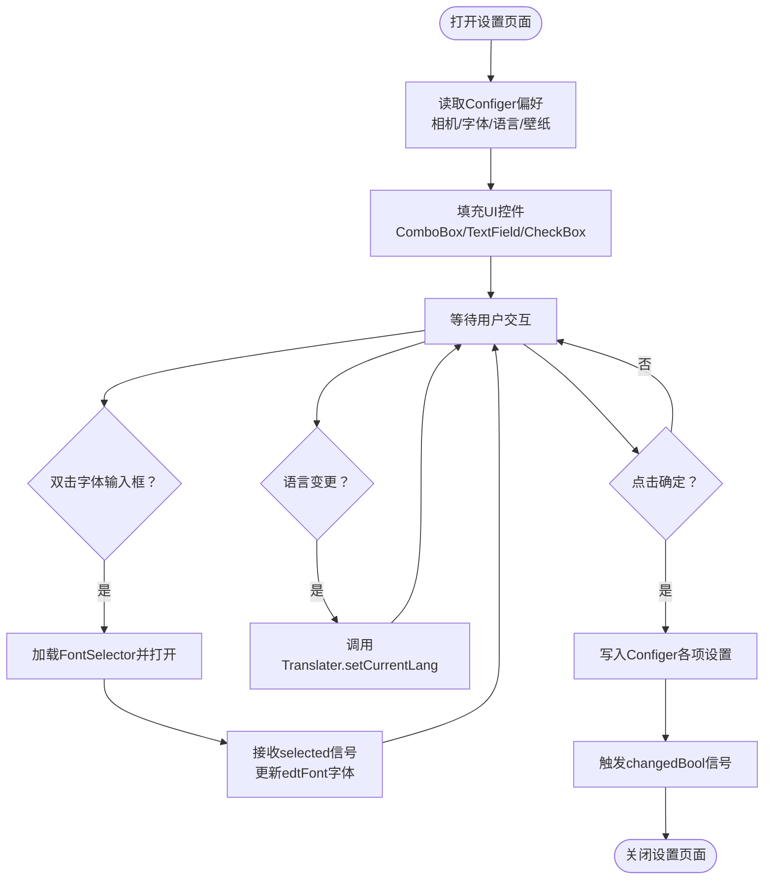
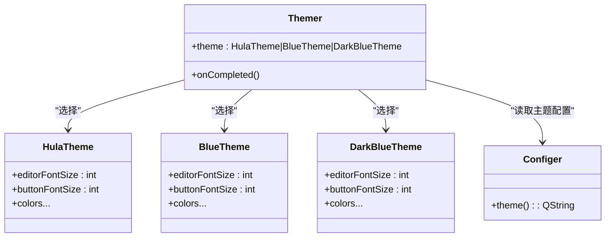
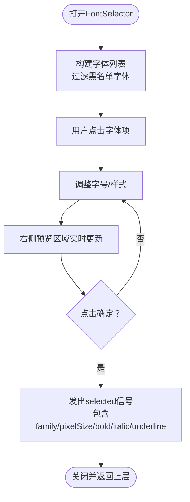
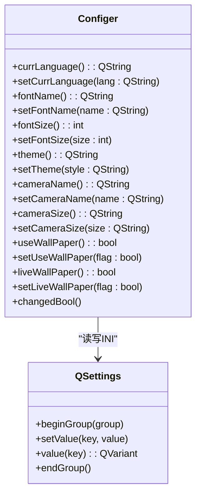
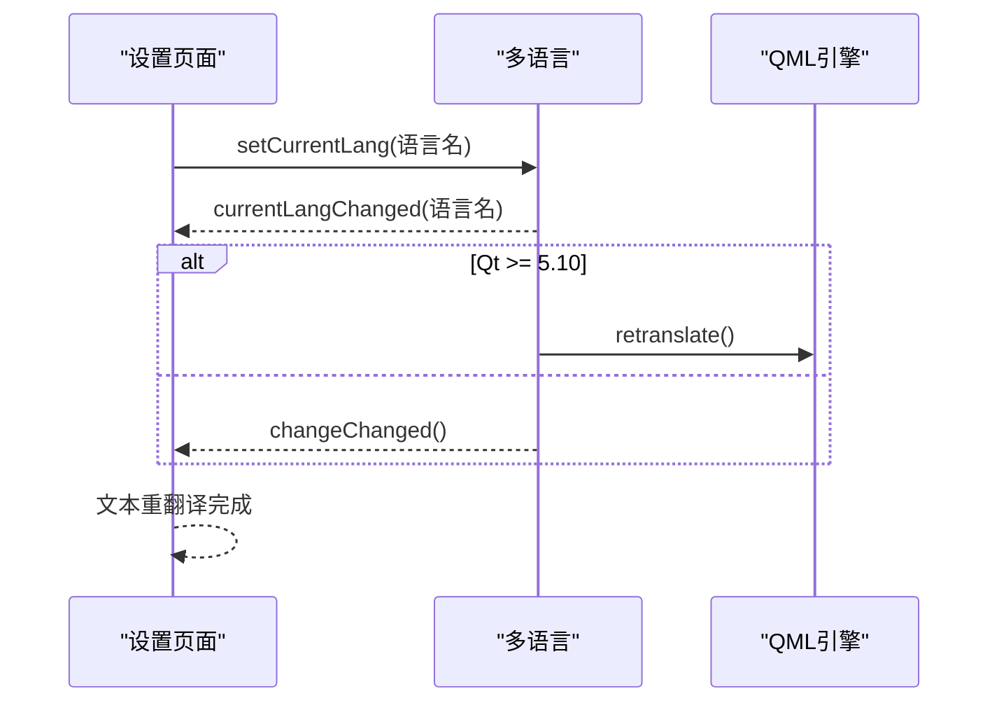
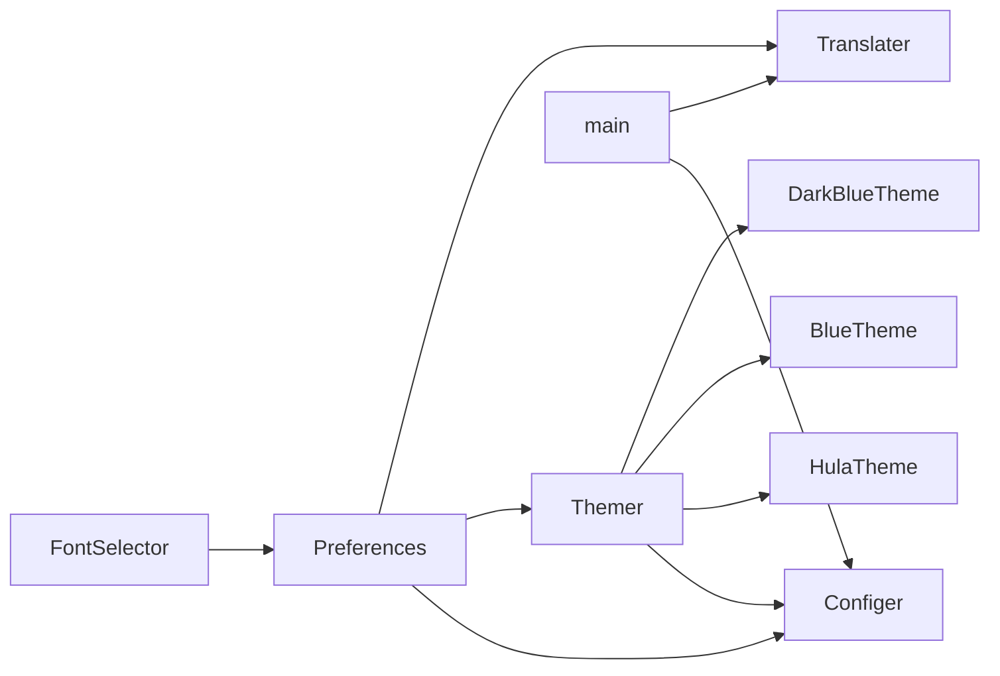

# 设置与偏好页面

<cite>
**本文档引用的文件**
- [Preferences.qml](file://src/QmlUI/Preferences.qml)
- [Themer.qml](file://src/QmlUI/Themer.qml)
- [FontSelector.qml](file://src/QmlUI/FontSelector.qml)
- [configer.h](file://src/configer.h)
- [configer.cpp](file://src/configer.cpp)
- [HulaTheme.qml](file://src/QmlUI/HulaTheme.qml)
- [BlueTheme.qml](file://src/QmlUI/BlueTheme.qml)
- [DarkBlueTheme.qml](file://src/QmlUI/DarkBlueTheme.qml)
- [translater.h](file://src/translater.h)
- [translater.cpp](file://src/translater.cpp)
- [main.cpp](file://src/main.cpp)
</cite>

## 目录
1. [简介](#简介)
2. [项目结构](#项目结构)
3. [核心组件](#核心组件)
4. [架构总览](#架构总览)
5. [详细组件分析](#详细组件分析)
6. [依赖关系分析](#依赖关系分析)
7. [性能考虑](#性能考虑)
8. [故障排除指南](#故障排除指南)
9. [结论](#结论)
10. [附录](#附录)

## 简介
本文件面向QmlPlugins项目的“设置与偏好页面”，系统性阐述以下内容：
- Preferences设置页面的配置管理功能与交互流程
- Themer主题控制器的主题切换机制与主题系统架构
- FontSelector字体选择器的字体管理实现与渲染优化
- 设置数据的持久化存储策略
- 主题扩展方法与用户偏好管理策略
- 设置页面定制指南与最佳实践

## 项目结构
本项目采用“QML前端 + C++后端”的混合架构，设置与偏好相关的核心文件分布如下：
- QML层：设置页面、主题控制器、字体选择器
- C++层：配置管理（Configer）、多语言支持（Translater）、应用入口（main）
- 配置文件：INI格式，位于resources或bin目录下的Config.ini及Languages目录

图示来源
- [Preferences.qml:1-352](file://src/QmlUI/Preferences.qml#L1-L352)
- [Themer.qml:1-26](file://src/QmlUI/Themer.qml#L1-L26)
- [FontSelector.qml:1-217](file://src/QmlUI/FontSelector.qml#L1-L217)
- [configer.h:1-277](file://src/configer.h#L1-L277)
- [configer.cpp:1-421](file://src/configer.cpp#L1-L421)
- [translater.h:1-112](file://src/translater.h#L1-L112)
- [translater.cpp:1-146](file://src/translater.cpp#L1-L146)
- [main.cpp:1-99](file://src/main.cpp#L1-L99)

章节来源
- [Preferences.qml:1-352](file://src/QmlUI/Preferences.qml#L1-L352)
- [Themer.qml:1-26](file://src/QmlUI/Themer.qml#L1-L26)
- [FontSelector.qml:1-217](file://src/QmlUI/FontSelector.qml#L1-L217)
- [configer.h:1-277](file://src/configer.h#L1-L277)
- [configer.cpp:1-421](file://src/configer.cpp#L1-L421)
- [translater.h:1-112](file://src/translater.h#L1-L112)
- [translater.cpp:1-146](file://src/translater.cpp#L1-L146)
- [main.cpp:1-99](file://src/main.cpp#L1-L99)

## 核心组件
- 设置页面（Preferences）：负责相机参数、字体、语言、壁纸、报表等偏好的展示与保存。
- 主题控制器（Themer）：根据配置选择具体主题对象（HulaTheme/BlueTheme/DarkBlueTheme），统一提供字体大小、颜色等主题属性。
- 字体选择器（FontSelector）：提供字体列表、字号、样式（粗体/斜体/下划线）的选择与预览，并向父级回传选中字体。
- 配置管理（Configer）：封装QSettings进行INI文件读写，提供丰富的偏好键值接口（语言、字体、主题、相机、壁纸等）。
- 多语言（Translater）：加载多语言资源，支持运行时切换语言并触发QML重翻译。
- 应用入口（main）：初始化字体、语言、数据库连接，注册全局上下文。

章节来源
- [Preferences.qml:1-352](file://src/QmlUI/Preferences.qml#L1-L352)
- [Themer.qml:1-26](file://src/QmlUI/Themer.qml#L1-L26)
- [FontSelector.qml:1-217](file://src/QmlUI/FontSelector.qml#L1-L217)
- [configer.h:1-277](file://src/configer.h#L1-L277)
- [configer.cpp:1-421](file://src/configer.cpp#L1-L421)
- [translater.h:1-112](file://src/translater.h#L1-L112)
- [translater.cpp:1-146](file://src/translater.cpp#L1-L146)
- [main.cpp:1-99](file://src/main.cpp#L1-L99)

## 架构总览
设置与偏好页面的运行时交互链路如下：

图示来源
- [Preferences.qml:1-352](file://src/QmlUI/Preferences.qml#L1-L352)
- [FontSelector.qml:1-217](file://src/QmlUI/FontSelector.qml#L1-L217)
- [configer.cpp:1-421](file://src/configer.cpp#L1-L421)
- [translater.cpp:1-146](file://src/translater.cpp#L1-L146)
- [Themer.qml:1-26](file://src/QmlUI/Themer.qml#L1-L26)

## 详细组件分析

### 设置页面（Preferences）分析
- 功能职责
  - 相机参数：枚举设备与分辨率，读取/保存当前相机名称与尺寸。
  - 字体设置：双击输入框打开字体选择器，保存字体族名与像素大小。
  - 语言设置：从多语言目录加载语言列表，切换当前语言并触发重翻译。
  - 壁纸设置：启用/禁用背景壁纸与动态壁纸。
  - 报表设计：调用报表打印模块进行设计。
- 数据流
  - 初始化：读取Configer中的各项偏好，填充ComboBox/CheckBox/TextField。
  - 交互：用户修改后，点击确定写回Configer；部分操作触发信号或函数以刷新界面。
- 关键实现点
  - 字体选择器加载：通过Loader动态加载FontSelector并打开。
  - 语言切换：通过Connections监听FontSelector的selected信号，更新edtFont字体信息。
  - 确认保存：逐项调用Configer的setter方法，最后触发changedBool信号。

图示来源
- [Preferences.qml:1-352](file://src/QmlUI/Preferences.qml#L1-L352)
- [FontSelector.qml:1-217](file://src/QmlUI/FontSelector.qml#L1-L217)
- [configer.cpp:1-421](file://src/configer.cpp#L1-L421)
- [translater.cpp:1-146](file://src/translater.cpp#L1-L146)

章节来源
- [Preferences.qml:1-352](file://src/QmlUI/Preferences.qml#L1-L352)

### 主题控制器（Themer）分析
- 设计目标
  - 统一提供主题相关的颜色、字体大小等属性，供所有QML组件使用。
  - 根据Configer中的主题配置动态选择具体主题对象。
- 实现要点
  - 单例模式：Themer为QML单例，全局唯一。
  - 主题选择：在onCompleted阶段读取Configer.theme()，匹配HulaTheme/BlueTheme/DarkBlueTheme并赋值给theme属性。
  - UI适配：所有控件的字体大小与颜色均通过Themer.theme访问，确保风格一致。

图示来源
- [Themer.qml:1-26](file://src/QmlUI/Themer.qml#L1-L26)
- [HulaTheme.qml:1-85](file://src/QmlUI/HulaTheme.qml#L1-L85)
- [BlueTheme.qml:1-72](file://src/QmlUI/BlueTheme.qml#L1-L72)
- [DarkBlueTheme.qml:1-82](file://src/QmlUI/DarkBlueTheme.qml#L1-L82)
- [configer.cpp:82-90](file://src/configer.cpp#L82-L90)

章节来源
- [Themer.qml:1-26](file://src/QmlUI/Themer.qml#L1-L26)
- [HulaTheme.qml:1-85](file://src/QmlUI/HulaTheme.qml#L1-L85)
- [BlueTheme.qml:1-72](file://src/QmlUI/BlueTheme.qml#L1-L72)
- [DarkBlueTheme.qml:1-82](file://src/QmlUI/DarkBlueTheme.qml#L1-L82)
- [configer.cpp:82-90](file://src/configer.cpp#L82-L90)

### 字体选择器（FontSelector）分析
- 功能特性
  - 字体列表：过滤不可用字体，仅展示可用字体家族。
  - 字号与样式：支持8-72的字号范围，可勾选粗体/斜体/下划线。
  - 实时预览：右侧矩形区域实时预览所选字体效果。
  - 结果回传：通过selected信号向外传递font对象（family/pixelSize/bold/italic/underline）。
- 渲染优化
  - 字体过滤：预先过滤掉可能引发DirectWrite错误的旧系统字体，减少渲染失败。
  - 高亮与滚动：自定义高亮样式与垂直滚动条，提升交互体验。
- 与设置页面集成
  - Preferences通过Loader动态加载FontSelector，双击字体输入框触发打开。
  - 接收selected信号后，更新edtFont的字体信息，并在确认时写入Configer。

图示来源
- [FontSelector.qml:1-217](file://src/QmlUI/FontSelector.qml#L1-L217)

章节来源
- [FontSelector.qml:1-217](file://src/QmlUI/FontSelector.qml#L1-L217)

### 配置管理（Configer）分析
- 数据持久化
  - 使用QSettings以INI格式读写配置，默认文件为CFG_FILE（通常指向resources或bin目录下的Config.ini）。
  - 支持分组（group）与键值（key）的组织方式，便于分类管理。
- 偏好键值
  - 语言：currLanguage()/setCurrLanguage()
  - 字体：fontName()/setFontName()、fontSize()/setFontSize()
  - 主题：theme()/setTheme()
  - 相机：cameraName()/setCameraName()、cameraSize()/setCameraSize()
  - 壁纸：useWallPaper()/setUseWallPaper()、liveWallPaper()/setLiveWallPaper()
  - 其他：登录、启动画面、心跳间隔、报表模板等
- 信号与事件
  - changedBool信号用于通知配置已更新，触发UI刷新或后续处理。

图示来源
- [configer.h:1-277](file://src/configer.h#L1-L277)
- [configer.cpp:1-421](file://src/configer.cpp#L1-L421)

章节来源
- [configer.h:1-277](file://src/configer.h#L1-L277)
- [configer.cpp:1-421](file://src/configer.cpp#L1-L421)

### 多语言（Translater）分析
- 资源加载
  - 从指定目录加载多个.ini语言文件，合并为内存映射表。
  - 将“简体中文”置于语言列表首位，便于用户优先选择。
- 运行时切换
  - setCurrentLang后，触发currentLangChanged信号，并在Qt 5.10+环境下调用引擎retranslate()完成重翻译。
- 与设置页面协作
  - Preferences中的语言ComboBox绑定到Translater.languages，用户选择后调用setCurrentLang，从而更新界面文本。

图示来源
- [translater.cpp:1-146](file://src/translater.cpp#L1-L146)
- [translater.h:1-112](file://src/translater.h#L1-L112)
- [Preferences.qml:1-352](file://src/QmlUI/Preferences.qml#L1-L352)

章节来源
- [translater.h:1-112](file://src/translater.h#L1-L112)
- [translater.cpp:1-146](file://src/translater.cpp#L1-L146)
- [Preferences.qml:1-352](file://src/QmlUI/Preferences.qml#L1-L352)

### 应用入口（main）分析
- 启动流程
  - 初始化单实例检测、日志级别。
  - 从Configer读取字体与字号，设置全局字体。
  - 初始化数据库连接、注册上下文属性。
  - 初始化Translater，加载语言资源并设置当前语言。
  - 加载QML主模块。
- 与设置页面的关系
  - 全局字体设置影响所有组件的默认字体显示。
  - 语言初始化决定初始界面文本，后续可通过设置页面动态切换。

章节来源
- [main.cpp:1-99](file://src/main.cpp#L1-L99)

## 依赖关系分析
- 组件耦合
  - Preferences强依赖Configer与Themer；弱依赖Translater（语言切换）。
  - FontSelector独立于Configer，但通过信号与Preferences交互。
  - Themer依赖Configer读取主题配置，依赖主题对象提供视觉属性。
- 外部依赖
  - QSettings用于INI文件持久化。
  - QTranslator/QQmlEngine用于多语言与重翻译。
  - QtQuick Controls用于UI控件与布局。

图示来源
- [Preferences.qml:1-352](file://src/QmlUI/Preferences.qml#L1-L352)
- [Themer.qml:1-26](file://src/QmlUI/Themer.qml#L1-L26)
- [FontSelector.qml:1-217](file://src/QmlUI/FontSelector.qml#L1-L217)
- [configer.cpp:1-421](file://src/configer.cpp#L1-L421)
- [translater.cpp:1-146](file://src/translater.cpp#L1-L146)
- [main.cpp:1-99](file://src/main.cpp#L1-L99)

章节来源
- [Preferences.qml:1-352](file://src/QmlUI/Preferences.qml#L1-L352)
- [Themer.qml:1-26](file://src/QmlUI/Themer.qml#L1-L26)
- [FontSelector.qml:1-217](file://src/QmlUI/FontSelector.qml#L1-L217)
- [configer.cpp:1-421](file://src/configer.cpp#L1-L421)
- [translater.cpp:1-146](file://src/translater.cpp#L1-L146)
- [main.cpp:1-99](file://src/main.cpp#L1-L99)

## 性能考虑
- 字体渲染优化
  - FontSelector在构建字体列表时过滤黑名单字体，避免渲染异常导致的性能损耗。
  - 预览区域按需更新，仅在用户调整字号/样式时刷新，降低重绘频率。
- 配置读写
  - Configer使用QSettings进行INI读写，建议在批量写入时合并操作，减少磁盘IO。
- 多语言重翻译
  - 仅在语言切换时触发retranslate，避免频繁重翻译造成主线程阻塞。

## 故障排除指南
- 设置页面不显示语言选项
  - 检查Translater是否正确加载语言目录，确认Languages目录下存在.ini文件。
  - 确认Preferences中语言ComboBox的数据模型是否被正确填充。
- 字体选择无效或无预览
  - 确认FontSelector的selected信号是否被正确接收并更新edtFont。
  - 检查Configer的fontName与fontSize写入是否成功。
- 主题未生效
  - 确认Configer.theme()返回值与实际主题文件名一致。
  - 检查Themer在onCompleted阶段是否正确选择了对应主题对象。
- 壁纸设置不生效
  - 确认Configer.useWallPaper与Configer.liveWallPaper的读写逻辑正常。
  - 检查相关UI组件是否响应changedBool信号。

章节来源
- [translater.cpp:1-146](file://src/translater.cpp#L1-L146)
- [configer.cpp:1-421](file://src/configer.cpp#L1-L421)
- [Themer.qml:1-26](file://src/QmlUI/Themer.qml#L1-L26)
- [FontSelector.qml:1-217](file://src/QmlUI/FontSelector.qml#L1-L217)
- [Preferences.qml:1-352](file://src/QmlUI/Preferences.qml#L1-L352)

## 结论
本设置与偏好页面通过清晰的职责划分与稳定的组件交互，实现了对用户偏好的集中管理与持久化存储。Themer提供统一的主题风格，FontSelector提供直观的字体管理体验，Configer与Translater分别承担配置与多语言两大支撑能力。整体架构具备良好的扩展性与维护性，适合进一步定制与增强。

## 附录

### 设置页面定制指南
- 新增设置项
  - 在Configer中添加新的键值接口（读取/写入/信号）。
  - 在Preferences中添加对应的UI控件，并在onShowForm中读取初始值，在确认保存时写回。
- 语言国际化
  - 在Languages目录新增翻译条目，确保设置页面文本可被重翻译。
- 主题扩展
  - 新建主题文件（如NewTheme.qml），在Themer中增加分支选择逻辑。
  - 更新Configer.theme()的可选值集合，确保与主题文件名一致。

### 主题扩展方法
- 创建新主题对象：定义颜色、字体大小等属性，保持与现有主题一致的命名规范。
- 注册主题：在Themer的onCompleted中增加条件分支，根据Configer.theme()返回值选择新主题。
- 应用主题：确保所有QML控件通过Themer.theme访问属性，避免硬编码颜色与字号。

### 用户偏好管理策略
- 分组存储：将相关设置归入同一组，便于维护与迁移。
- 默认值策略：在Configer中为每个键提供合理的默认值，保证首次使用体验。
- 版本兼容：新增键值时保留旧键兼容逻辑，避免升级破坏历史配置。
- 权限与安全：敏感设置（如登录、心跳间隔）应结合业务需求进行权限控制与校验。