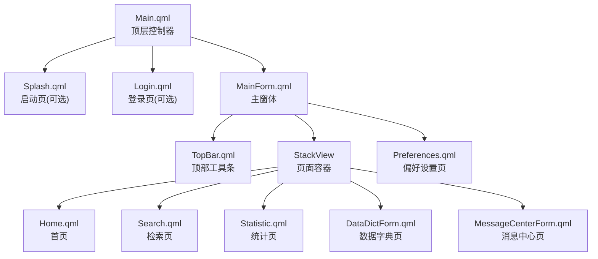
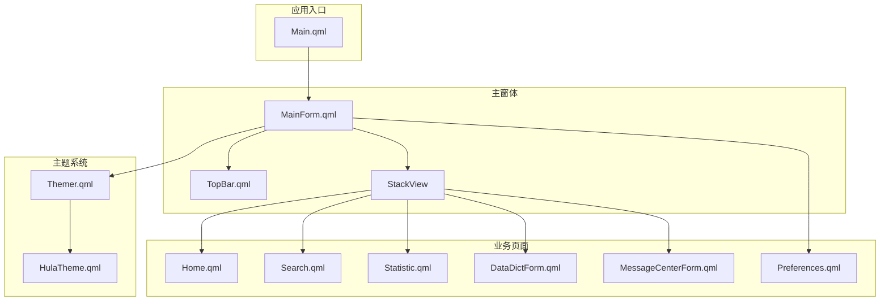
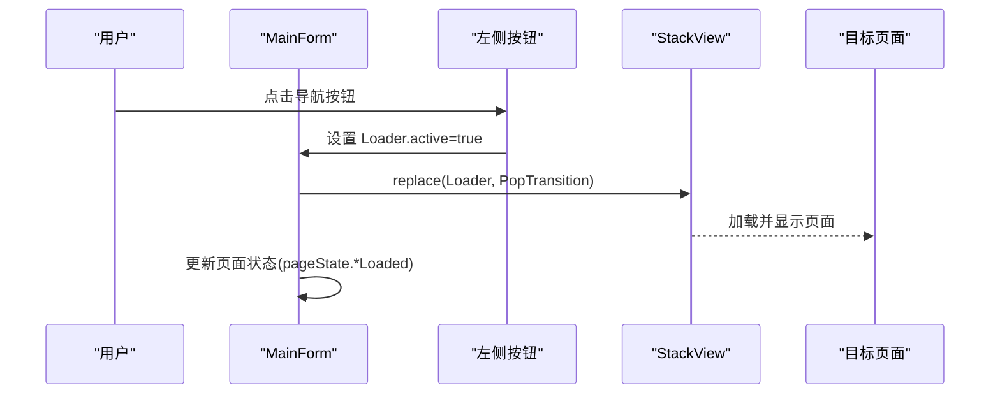
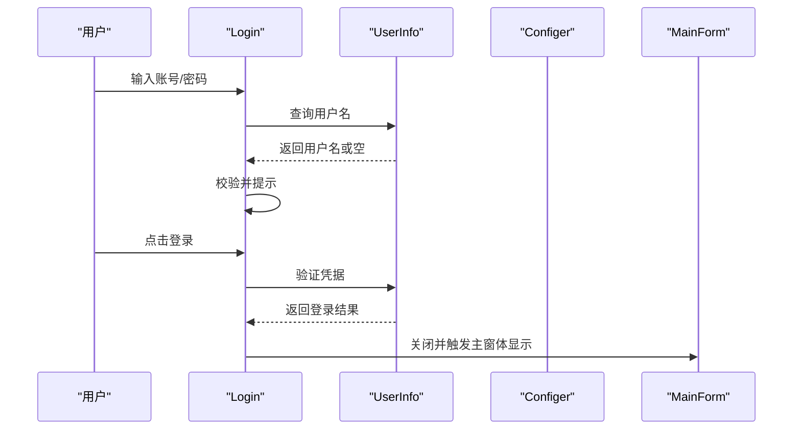
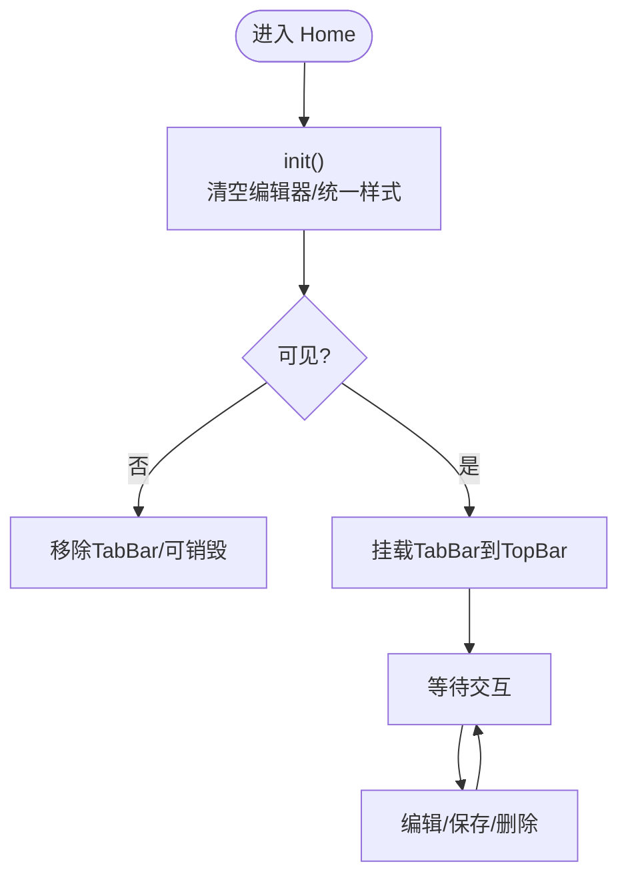
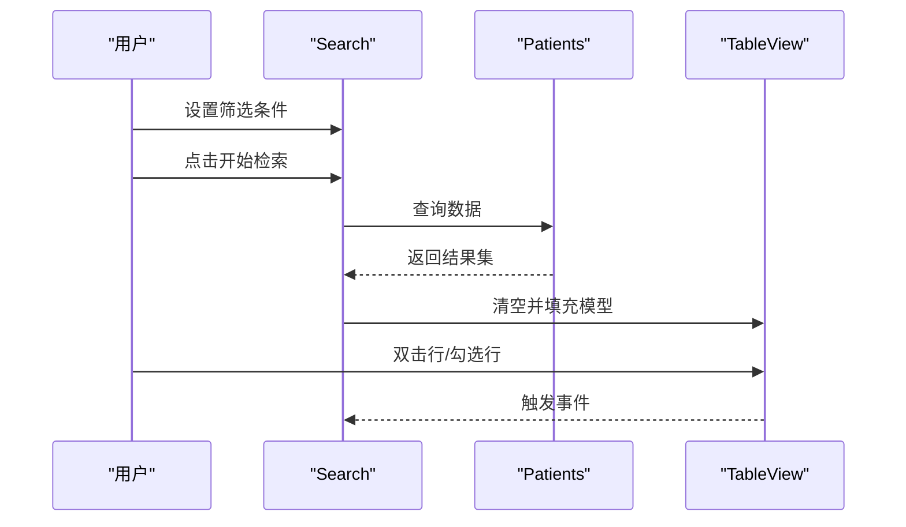
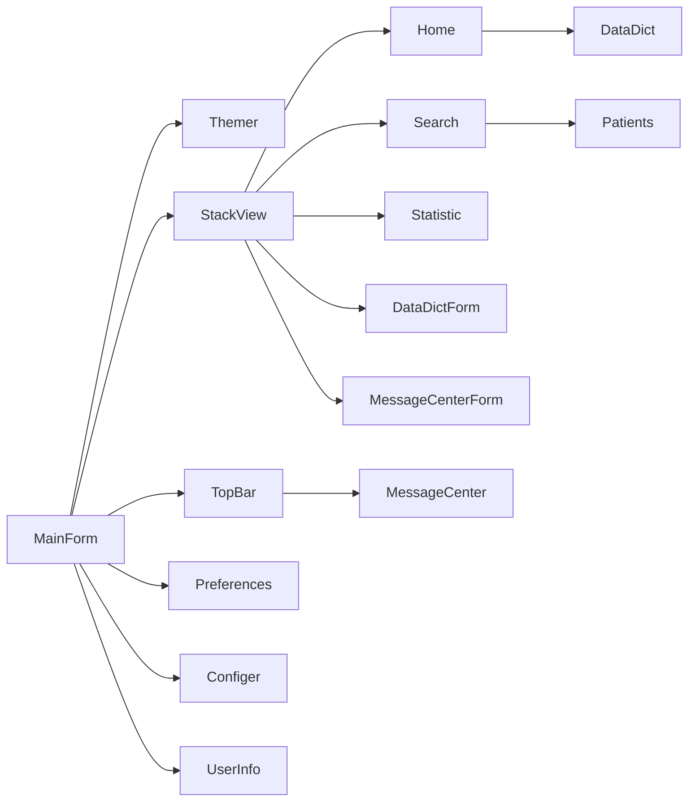

# 页面组件

<cite>
**本文引用的文件**
- [Main.qml](file://src/QmlUI/Main.qml)
- [MainForm.qml](file://src/QmlUI/MainForm.qml)
- [Home.qml](file://src/QmlUI/Home.qml)
- [Login.qml](file://src/QmlUI/Login.qml)
- [Preferences.qml](file://src/QmlUI/Preferences.qml)
- [DataDictForm.qml](file://src/QmlUI/DataDictForm.qml)
- [MessageCenterForm.qml](file://src/QmlUI/MessageCenterForm.qml)
- [Search.qml](file://src/QmlUI/Search.qml)
- [Statistic.qml](file://src/QmlUI/Statistic.qml)
- [TopBar.qml](file://src/QmlUI/TopBar.qml)
- [Themer.qml](file://src/QmlUI/Themer.qml)
- [HulaTheme.qml](file://src/QmlUI/HulaTheme.qml)
- [Page1.qml](file://src/QmlUI/Page1.qml)
- [Page2.qml](file://src/QmlUI/Page2.qml)
</cite>

## 目录
1. [简介](#简介)
2. [项目结构](#项目结构)
3. [核心组件](#核心组件)
4. [架构总览](#架构总览)
5. [详细组件分析](#详细组件分析)
6. [依赖分析](#依赖分析)
7. [性能考虑](#性能考虑)
8. [故障排查指南](#故障排查指南)
9. [结论](#结论)
10. [附录](#附录)

## 简介
本文件面向 QmlPlugins 的页面组件系统，系统性梳理主界面、登录页、设置页、数据字典页、消息中心页等业务页面的功能、布局与交互逻辑；阐明页面间导航关系、数据传递机制与状态管理；提供页面定制、主题适配与响应式设计建议；并总结页面生命周期管理、内存优化与用户体验优化最佳实践。

## 项目结构
- 入口与启动流程由顶层控制器负责，按配置决定是否展示启动页或登录页，最终进入主窗体。
- 主窗体采用左右分区布局：左侧为工作区导航按钮，右侧为内容区域，使用栈视图承载各业务页面。
- 顶部工具条提供窗口控制、偏好设置入口、消息中心提示与用户菜单。
- 主题系统通过单例注入，支持多套主题切换。

**图示来源**
- [Main.qml:1-41](file://src/QmlUI/Main.qml#L1-L41)
- [MainForm.qml:95-101](file://src/QmlUI/MainForm.qml#L95-L101)

**章节来源**
- [Main.qml:1-41](file://src/QmlUI/Main.qml#L1-L41)
- [MainForm.qml:10-25](file://src/QmlUI/MainForm.qml#L10-L25)

## 核心组件
- 顶层控制器 Main.qml：根据配置决定加载启动页、登录页或直接进入主窗体；负责在主窗体可见时清理加载器资源。
- 主窗体 MainForm：定义窗口尺寸、标题、边框样式、背景色与主题；维护页面状态与工作区枚举；提供打开对话框、消息提示、时间显示、壁纸轮播等功能；通过 StackView 承载业务页面。
- 顶部工具条 TopBar：提供窗口拖拽、最小化/恢复/关闭、偏好设置、消息中心、用户菜单等能力；集成主题色与提示气泡动画。
- 主题系统 Themer 与 HulaTheme：单例注入当前主题对象，支持多主题切换；提供标题栏、视图、编辑器等统一配色与渐变。

**章节来源**
- [Main.qml:6-40](file://src/QmlUI/Main.qml#L6-L40)
- [MainForm.qml:9-25](file://src/QmlUI/MainForm.qml#L9-L25)
- [TopBar.qml:11-22](file://src/QmlUI/TopBar.qml#L11-L22)
- [Themer.qml:6-25](file://src/QmlUI/Themer.qml#L6-L25)
- [HulaTheme.qml:5-84](file://src/QmlUI/HulaTheme.qml#L5-L84)

## 架构总览
页面组件围绕“顶层控制器 → 主窗体 → 内容区(栈视图) → 业务页面”的层次展开；顶部工具条贯穿全局；主题系统以单例方式注入到各组件。

**图示来源**
- [Main.qml:1-41](file://src/QmlUI/Main.qml#L1-L41)
- [MainForm.qml:95-101](file://src/QmlUI/MainForm.qml#L95-L101)
- [TopBar.qml:11-22](file://src/QmlUI/TopBar.qml#L11-L22)
- [Themer.qml:6-25](file://src/QmlUI/Themer.qml#L6-L25)
- [HulaTheme.qml:5-84](file://src/QmlUI/HulaTheme.qml#L5-L84)

## 详细组件分析

### 主界面（MainForm）
- 功能要点
  - 窗口模式：支持普通、最大化、全屏三种显示模式。
  - 背景与透明度：根据壁纸开关调整工作区透明度。
  - 壁纸轮播：动态读取本地图片目录，定时淡入淡出切换。
  - 时间显示：右下角实时显示日期与时间。
  - 对话框与消息：封装通用提示框、确认框与 Snackbar。
  - 用户信息：从配置器读取用户名，顶部工具条展示。
- 导航与状态
  - 通过枚举定义工作区页面类型，配合左侧行为按钮与 Loader 切换。
  - 维护页面加载状态，避免重复初始化。
- 数据传递
  - 通过 Loader 的 active 属性与 replace 操作实现页面切换。
  - 对话框创建时可通过参数对象传参，回调中销毁对象释放资源。

**图示来源**
- [MainForm.qml:154-187](file://src/QmlUI/MainForm.qml#L154-L187)
- [MainForm.qml:236-264](file://src/QmlUI/MainForm.qml#L236-L264)
- [MainForm.qml:95-100](file://src/QmlUI/MainForm.qml#L95-L100)

**章节来源**
- [MainForm.qml:10-53](file://src/QmlUI/MainForm.qml#L10-L53)
- [MainForm.qml:266-342](file://src/QmlUI/MainForm.qml#L266-L342)
- [MainForm.qml:344-372](file://src/QmlUI/MainForm.qml#L344-L372)
- [MainForm.qml:378-404](file://src/QmlUI/MainForm.qml#L378-L404)
- [MainForm.qml:418-430](file://src/QmlUI/MainForm.qml#L418-L430)
- [MainForm.qml:432-459](file://src/QmlUI/MainForm.qml#L432-L459)

### 登录页（Login）
- 功能要点
  - 支持多种显示模式（普通/最大化/全屏），模态阻塞。
  - 自动等待主窗体加载完成后再显示。
  - 用户名输入联动查询用户信息，异常时提示未找到。
  - 登录成功后关闭自身并触发主窗体显示。
- 数据流
  - 输入校验与提示；登录失败弹出提示；成功后关闭并通知主窗体。

**图示来源**
- [Login.qml:146-172](file://src/QmlUI/Login.qml#L146-L172)
- [Login.qml:325-335](file://src/QmlUI/Login.qml#L325-L335)
- [Login.qml:32-45](file://src/QmlUI/Login.qml#L32-L45)

**章节来源**
- [Login.qml:9-45](file://src/QmlUI/Login.qml#L9-L45)
- [Login.qml:146-172](file://src/QmlUI/Login.qml#L146-L172)
- [Login.qml:325-335](file://src/QmlUI/Login.qml#L325-L335)

### 首页（Home）
- 功能要点
  - 左侧患者列表，支持全选/多选；右侧为信息编辑区。
  - 编辑器采用统一布局参数，随宽度变化自适应。
  - 提供添加/保存/删除等操作按钮。
  - TabBar 可动态挂载到顶部工具条。
- 生命周期
  - 可见时初始化并挂载 TabBar；不可见时移除并可自动销毁。
  - 支持 ownerLoader 清空 source 实现懒加载回收。

**图示来源**
- [Home.qml:18-45](file://src/QmlUI/Home.qml#L18-L45)
- [Home.qml:49-52](file://src/QmlUI/Home.qml#L49-L52)

**章节来源**
- [Home.qml:10-45](file://src/QmlUI/Home.qml#L10-L45)
- [Home.qml:49-68](file://src/QmlUI/Home.qml#L49-L68)

### 检索页（Search）
- 功能要点
  - 左侧过滤条件（文本、下拉、日期等），右侧结果表格。
  - 支持导出 Excel、数据库备份/恢复、批量删除等。
  - 结果表格支持复选框、双击打开报告。
- 数据流
  - 构造查询条件，调用数据层接口获取结果集，填充表格。
  - 导出时收集勾选项字段，弹出文件对话框写入。

**图示来源**
- [Search.qml:78-100](file://src/QmlUI/Search.qml#L78-L100)
- [Search.qml:602-655](file://src/QmlUI/Search.qml#L602-L655)

**章节来源**
- [Search.qml:10-52](file://src/QmlUI/Search.qml#L10-L52)
- [Search.qml:602-655](file://src/QmlUI/Search.qml#L602-L655)

### 统计页（Statistic）
- 功能要点
  - 与检索页类似的过滤与表格展示，但委托更丰富（复选、数值输入、自定义编辑）。
  - 支持导出、备份/恢复、删除等操作。
- 交互差异
  - 表格委托使用 DelegateChooser，针对不同列采用不同控件。

**章节来源**
- [Statistic.qml:10-39](file://src/QmlUI/Statistic.qml#L10-L39)
- [Statistic.qml:674-750](file://src/QmlUI/Statistic.qml#L674-L750)

### 数据字典页（DataDictForm）
- 功能要点
  - 以对话框形式展示，支持新增、保存、删除字典项。
  - 根据字典类型决定编辑控件（文本框或富文本）。
  - 选中行后可双击回填到调用方。
- 数据流
  - 加载数据 → 查看/编辑 → 新增/更新/删除 → 提示反馈。

**章节来源**
- [DataDictForm.qml:10-20](file://src/QmlUI/DataDictForm.qml#L10-L20)
- [DataDictForm.qml:152-167](file://src/QmlUI/DataDictForm.qml#L152-L167)
- [DataDictForm.qml:181-233](file://src/QmlUI/DataDictForm.qml#L181-L233)

### 消息中心页（MessageCenterForm）
- 功能要点
  - 日期筛选，列出错误信息，支持删除单条/全部。
  - 选中行查看错误详情与处理建议。
- 交互
  - 通过日期选择器触发刷新；删除前二次确认。

**章节来源**
- [MessageCenterForm.qml:7-17](file://src/QmlUI/MessageCenterForm.qml#L7-L17)
- [MessageCenterForm.qml:215-231](file://src/QmlUI/MessageCenterForm.qml#L215-L231)
- [MessageCenterForm.qml:245-278](file://src/QmlUI/MessageCenterForm.qml#L245-L278)

### 偏好设置页（Preferences）
- 功能要点
  - 相机设备与分辨率选择、字体选择、语言切换、报表设计、壁纸开关等。
  - 与配置器交互，变更后通知主窗体刷新主题或壁纸。
- 交互
  - 选择相机后联动加载分辨率列表；字体选择通过 Loader 打开字体选择器。

**章节来源**
- [Preferences.qml:8-78](file://src/QmlUI/Preferences.qml#L8-L78)
- [Preferences.qml:133-147](file://src/QmlUI/Preferences.qml#L133-L147)
- [Preferences.qml:321-334](file://src/QmlUI/Preferences.qml#L321-L334)

### 顶部工具条（TopBar）
- 功能要点
  - 窗口控制（最小化/恢复/关闭）、偏好设置、消息中心、用户菜单。
  - 消息中心有呼吸动画提示新消息；支持托盘风格的用户菜单。
- 交互
  - 顶部拖拽移动窗口；双击恢复默认大小。

**章节来源**
- [TopBar.qml:24-42](file://src/QmlUI/TopBar.qml#L24-L42)
- [TopBar.qml:105-134](file://src/QmlUI/TopBar.qml#L105-L134)
- [TopBar.qml:194](file://src/QmlUI/TopBar.qml#L194)
- [TopBar.qml:215-225](file://src/QmlUI/TopBar.qml#L215-L225)
- [TopBar.qml:248-269](file://src/QmlUI/TopBar.qml#L248-L269)

### 主题系统（Themer 与 HulaTheme）
- 功能要点
  - 单例注入当前主题对象，依据配置选择主题。
  - 提供标题栏、视图、编辑器、按钮、线条等统一配色与渐变。
- 适配建议
  - 新增主题时扩展配置项并在 Themer 中映射。

**章节来源**
- [Themer.qml:6-25](file://src/QmlUI/Themer.qml#L6-L25)
- [HulaTheme.qml:5-84](file://src/QmlUI/HulaTheme.qml#L5-L84)

### 辅助页面（Page1、Page2）
- Page1：演示参数接收与状态保留，适合作为轻量页面模板。
- Page2：演示表格视图与表头控件组合，适合复制粘贴到实际页面。

**章节来源**
- [Page1.qml:4-42](file://src/QmlUI/Page1.qml#L4-L42)
- [Page2.qml:7-197](file://src/QmlUI/Page2.qml#L7-L197)

## 依赖分析
- 组件耦合
  - MainForm 依赖 Themer、TopBar、StackView、各业务页面 Loader。
  - 业务页面之间低耦合，通过 Loader 与 StackView 解耦。
  - TopBar 依赖消息中心与配置器，用于提示与用户菜单。
- 外部依赖
  - 配置器 Configer 控制启动/登录模式、主题、壁纸、语言等。
  - 用户信息服务 UserInfo 提供登录与用户查询。
  - 数据字典 DataDict、消息中心 MessageCenter、病人数据 Patients 等业务模块。

**图示来源**
- [MainForm.qml:95-101](file://src/QmlUI/MainForm.qml#L95-L101)
- [TopBar.qml:52-57](file://src/QmlUI/TopBar.qml#L52-L57)

**章节来源**
- [MainForm.qml:95-101](file://src/QmlUI/MainForm.qml#L95-L101)
- [TopBar.qml:52-57](file://src/QmlUI/TopBar.qml#L52-L57)

## 性能考虑
- 懒加载与异步
  - 主窗体 Loader 使用异步加载，减少启动阻塞。
  - 页面可见时再初始化，不可见时可销毁或清空 source 回收。
- 图形与动画
  - 壁纸轮播使用 PropertyAnimation 与定时器，注意在非活动状态下停止以节省资源。
  - 顶部工具条的呼吸动画仅在有新消息时启用。
- 列表与表格
  - 使用 ListView/TableView 的复用与 clip，避免超大模型一次性渲染。
  - 适当设置列宽与行高提供者，提升滚动性能。

[本节为通用指导，无需特定文件引用]

## 故障排查指南
- 登录页无法关闭
  - 检查登录页 onVisibleChanged 信号与主窗体 Loader 激活逻辑。
  - 参考路径：[Login.qml:35-45](file://src/QmlUI/Login.qml#L35-L45)
- 壁纸不轮播
  - 检查 Configer 开关与图片目录是否存在；确认定时器与动画运行状态。
  - 参考路径：[MainForm.qml:284-342](file://src/QmlUI/MainForm.qml#L284-L342)
- 顶部消息提示不闪烁
  - 检查消息中心是否有新消息；确认动画是否被暂停/停止。
  - 参考路径：[TopBar.qml:328-377](file://src/QmlUI/TopBar.qml#L328-L377)
- 页面切换后状态未重置
  - 确认页面 onVisibleChanged 中的初始化与销毁逻辑。
  - 参考路径：[Home.qml:23-45](file://src/QmlUI/Home.qml#L23-L45)

**章节来源**
- [Login.qml:35-45](file://src/QmlUI/Login.qml#L35-L45)
- [MainForm.qml:284-342](file://src/QmlUI/MainForm.qml#L284-L342)
- [TopBar.qml:328-377](file://src/QmlUI/TopBar.qml#L328-L377)
- [Home.qml:23-45](file://src/QmlUI/Home.qml#L23-L45)

## 结论
QmlPlugins 的页面组件系统以清晰的分层与解耦设计实现了良好的可维护性与扩展性。通过顶层控制器统一调度、主窗体集中管理、主题系统统一配色以及顶部工具条的横切关注点，形成了稳定且易定制的页面框架。建议在新增页面时遵循现有模式（Loader + StackView + 生命周期钩子），并充分利用主题系统与工具条能力，确保一致的用户体验与较低的维护成本。

[本节为总结，无需特定文件引用]

## 附录

### 页面间导航与数据传递清单
- 导航方式
  - 左侧按钮点击 → Loader.active → StackView.replace
  - 顶部按钮 → 打开对话框（如偏好设置、消息中心）
- 数据传递
  - 打开对话框时通过参数对象传入初始数据
  - 页面间通过全局对象（如 mainForm）共享状态

**章节来源**
- [MainForm.qml:154-187](file://src/QmlUI/MainForm.qml#L154-L187)
- [MainForm.qml:344-372](file://src/QmlUI/MainForm.qml#L344-L372)
- [TopBar.qml:194](file://src/QmlUI/TopBar.qml#L194)

### 页面定制指南
- 新增页面
  - 在主窗体中新增 Loader 并加入左侧按钮列表
  - 在 StackView 中注册页面源文件
- 参数接收
  - 在页面根元素声明 property，通过 openDialog/openLogin 传入
- 生命周期
  - onVisibleChanged 中进行初始化/清理
  - 需要持久化的状态放入 mainForm.pageState 或配置器

**章节来源**
- [MainForm.qml:154-187](file://src/QmlUI/MainForm.qml#L154-L187)
- [Page1.qml:6-13](file://src/QmlUI/Page1.qml#L6-L13)

### 主题适配方法
- 切换主题
  - 在配置器中设置主题键值，在 Themer 单例中映射到具体主题对象
- 统一配色
  - 使用 Themer.theme.* 属性，避免硬编码颜色
- 渐变与图标
  - 通过主题对象提供的 Gradient 与图标路径保持一致性

**章节来源**
- [Themer.qml:16-24](file://src/QmlUI/Themer.qml#L16-L24)
- [HulaTheme.qml:38-83](file://src/QmlUI/HulaTheme.qml#L38-L83)

### 响应式设计支持
- 尺寸与间距
  - 使用统一的布局参数（如字号、控件高宽、间距）随窗口变化
- 列表与表格
  - 采用 columnWidthProvider/rowHeightProvider 动态计算尺寸
- 文本与排版
  - 使用相对单位与对齐属性，避免固定像素导致的溢出

**章节来源**
- [Home.qml:382-396](file://src/QmlUI/Home.qml#L382-L396)
- [Page2.qml:42-56](file://src/QmlUI/Page2.qml#L42-L56)