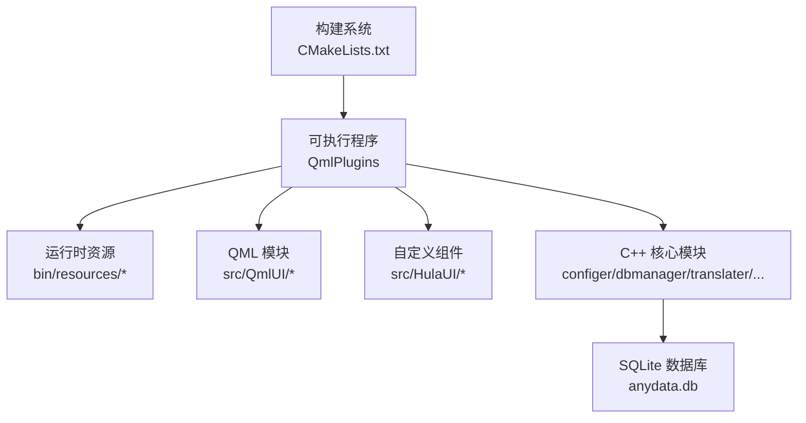
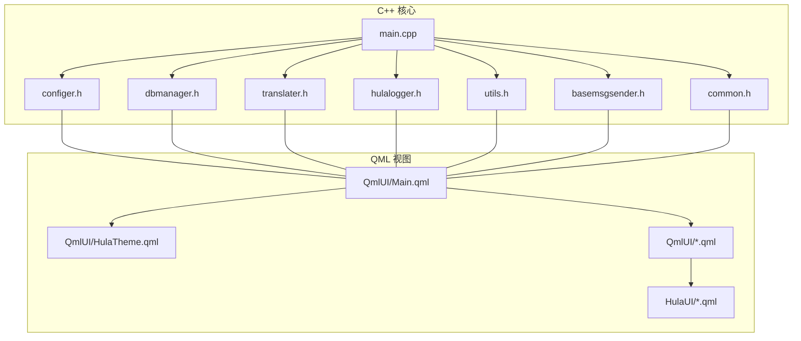
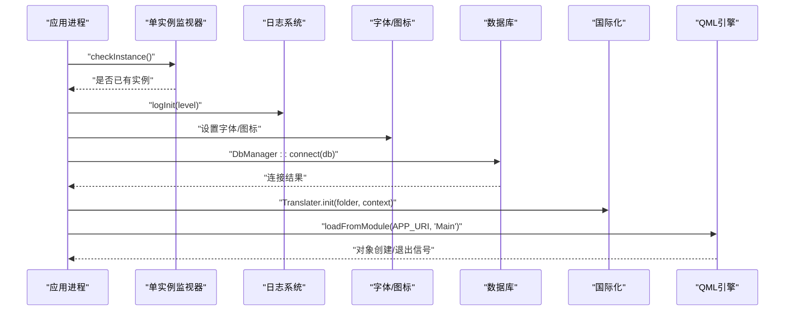
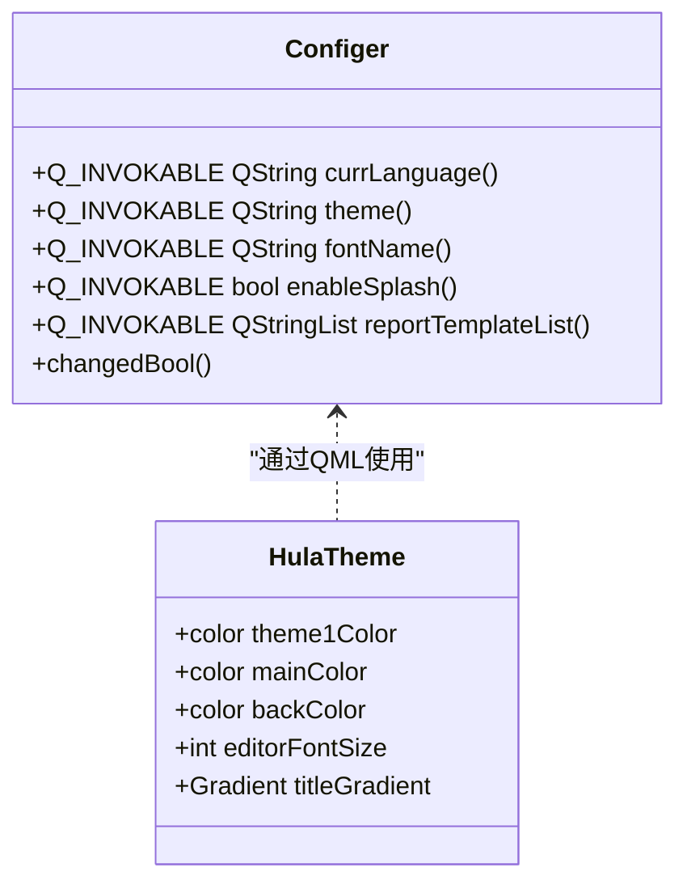
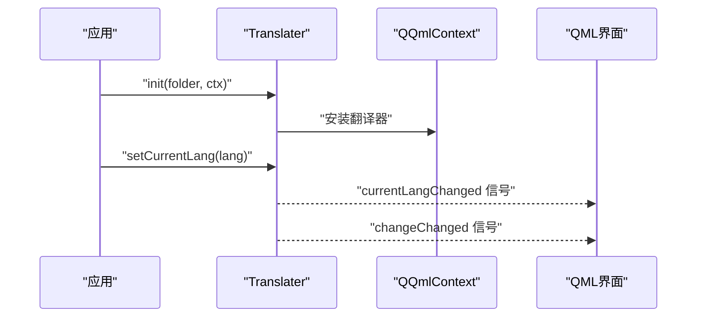
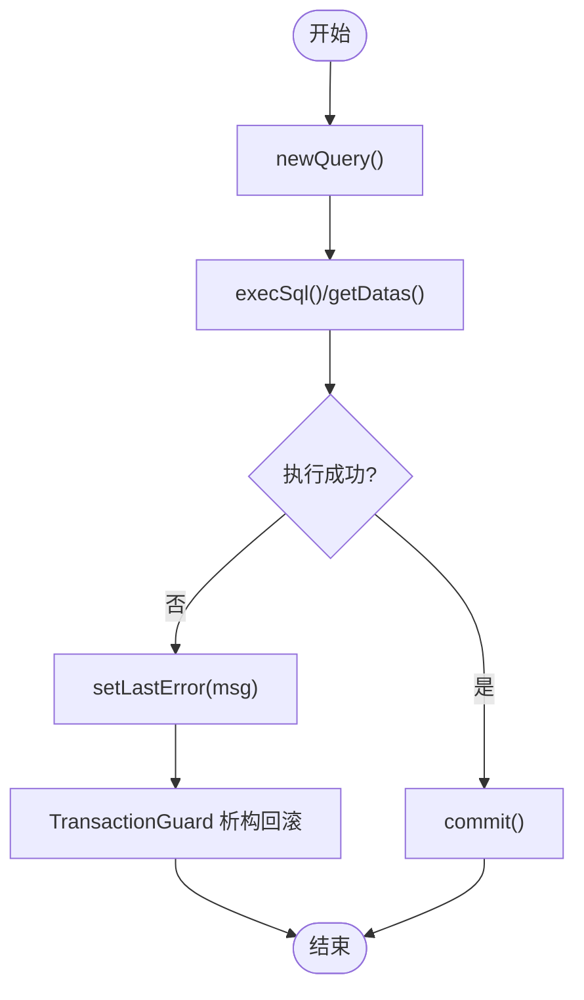
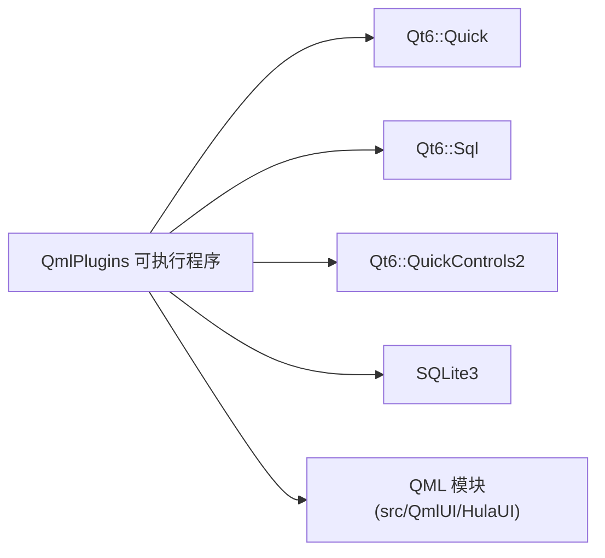

# 项目概述

<cite>
**本文引用的文件**
- [README.md](file://README.md)
- [CMakeLists.txt](file://CMakeLists.txt)
- [src/main.cpp](file://src/main.cpp)
- [src/common.h](file://src/common.h)
- [src/basemsgsender.h](file://src/basemsgsender.h)
- [src/configer.h](file://src/configer.h)
- [src/dbmanager.h](file://src/dbmanager.h)
- [src/translater.h](file://src/translater.h)
- [src/utils.h](file://src/utils.h)
- [src/hulalogger.h](file://src/hulalogger.h)
- [src/QmlUI/Main.qml](file://src/QmlUI/Main.qml)
- [src/QmlUI/HulaTheme.qml](file://src/QmlUI/HulaTheme.qml)
- [src/Config.ini](file://src/Config.ini)
- [resources/Config.ini](file://resources/Config.ini)
</cite>

## 目录
1. [引言](#引言)
2. [项目结构](#项目结构)
3. [核心组件](#核心组件)
4. [架构总览](#架构总览)
5. [详细组件分析](#详细组件分析)
6. [依赖关系分析](#依赖关系分析)
7. [性能考量](#性能考量)
8. [故障排查指南](#故障排查指南)
9. [结论](#结论)
10. [附录](#附录)

## 引言
本项目是一个基于 Qt6/QML 的跨平台桌面应用程序，聚焦于“医疗报告管理”场景，提供多语言支持、主题切换、SQLite 数据库存储、相机图像采集、用户权限与数据字典管理等能力。项目采用“C++ 核心 + QML 界面”的混合架构，既保证了高性能与可维护性，又兼顾了界面开发效率与用户体验。

- 项目定位：面向中小型医疗机构或实验室的报告生成与管理工作流，强调易部署、可定制与跨平台一致性。
- 技术路线：Qt6 + CMake + C++20 + QML，结合 SQLite 本地数据库与 QML 单例/组件体系。
- 差异化优势：
  - 以“配置即功能”为核心理念，通过配置文件驱动界面行为（启动画面、登录、主题、报表模板等）。
  - 将日志、国际化、数据库、消息分发等基础设施模块化封装，便于扩展与替换。
  - 提供统一的错误码与消息模型，降低跨模块沟通成本。

## 项目结构
项目采用“源代码 + 资源 + 构建脚本”的清晰分层：
- src：核心源代码，包含 C++ 模块（配置、数据库、日志、国际化、工具等）、QML 界面与自定义组件。
- bin/resources：运行时资源目录（镜像、语言、启动图、壁纸、配置等），构建产物输出于此。
- CMakeLists.txt：统一的构建配置，负责编译 C++ 源码、打包 QML 模块、链接 Qt 组件与平台适配。

图表来源
- [CMakeLists.txt:1-137](file://CMakeLists.txt#L1-L137)
- [src/main.cpp:1-99](file://src/main.cpp#L1-L99)

章节来源
- [README.md:36-45](file://README.md#L36-L45)
- [CMakeLists.txt:1-137](file://CMakeLists.txt#L1-L137)

## 核心组件
- 应用入口与生命周期
  - main.cpp：设置运行平台、单实例检测、日志初始化、字体与图标、数据库连接、国际化与 QML 引擎加载。
- 配置与主题
  - configer.h：提供 QML 单例访问的全局配置项（语言、主题、字体、启动画面、登录、报表模板等），并支持读写配置文件。
  - HulaTheme.qml：QML 单例主题对象，集中管理色彩、渐变、字号等视觉变量。
- 国际化
  - translater.h：提供 QTranslator 子类，支持目录加载、语言切换、QML 上下文绑定与信号通知。
- 数据库与事务
  - dbmanager.h：封装 SQLite 访问、查询结果转换、事务守卫、备份/恢复、线程安全的连接池式管理。
- 日志系统
  - hulalogger.h：线程安全、可轮转、可清理的 HulaLogger 单例，支持级别控制与目录配置。
- 工具与消息
  - utils.h：常用文件/目录操作（复制、同步、更新）的 QML 可调用工具集。
  - basemsgsender.h：消息发射接口，统一向消息中心发送提示/错误信息。
- 错误与消息模型
  - common.h：统一的错误码枚举、提示类型与消息结构体，贯穿 C++ 与 QML。

章节来源
- [src/main.cpp:17-99](file://src/main.cpp#L17-L99)
- [src/configer.h:98-277](file://src/configer.h#L98-L277)
- [src/QmlUI/HulaTheme.qml:1-85](file://src/QmlUI/HulaTheme.qml#L1-L85)
- [src/translater.h:27-112](file://src/translater.h#L27-L112)
- [src/dbmanager.h:52-192](file://src/dbmanager.h#L52-L192)
- [src/hulalogger.h:49-175](file://src/hulalogger.h#L49-L175)
- [src/utils.h:21-82](file://src/utils.h#L21-L82)
- [src/basemsgsender.h:10-38](file://src/basemsgsender.h#L10-L38)
- [src/common.h:23-159](file://src/common.h#L23-L159)

## 架构总览
应用采用“C++ 核心 + QML 视图”的分层架构：
- C++ 层负责业务与基础设施（配置、数据库、日志、国际化、工具、消息分发）。
- QML 层负责界面与交互（页面、组件、主题、动画、布局）。
- 通过 QQmlContext 将 C++ 对象与 QML 绑定，实现双向通信与状态同步。

图表来源
- [src/main.cpp:17-99](file://src/main.cpp#L17-L99)
- [src/QmlUI/Main.qml:1-41](file://src/QmlUI/Main.qml#L1-L41)
- [src/QmlUI/HulaTheme.qml:1-85](file://src/QmlUI/HulaTheme.qml#L1-L85)

## 详细组件分析

### 应用入口与生命周期（main.cpp）
- 关键职责
  - 强制 XCB 平台以兼容 Wayland 环境；单实例守护；日志初始化；字体与图标设置；数据库连接；国际化初始化；QML 引擎加载与事件处理。
- 控制流
  - 启动 → 单实例检测 → 日志初始化 → 字体/图标 → 数据库连接 → 国际化 → QML 引擎加载 → 事件循环 → 退出。

图表来源
- [src/main.cpp:17-99](file://src/main.cpp#L17-L99)

章节来源
- [src/main.cpp:17-99](file://src/main.cpp#L17-L99)

### 配置与主题（configer.h 与 HulaTheme.qml）
- 配置中心
  - 提供大量 Q_INVOKABLE 的 getter/setter，覆盖语言、主题、字体、启动画面、登录、报表模板、相机参数等。
  - 作为 QML 单例暴露给前端，支持信号通知变更。
- 主题系统
  - HulaTheme.qml 以 QML 单例形式提供统一的颜色、字号、渐变等视觉变量，便于主题切换与样式复用。

图表来源
- [src/configer.h:98-277](file://src/configer.h#L98-L277)
- [src/QmlUI/HulaTheme.qml:1-85](file://src/QmlUI/HulaTheme.qml#L1-L85)

章节来源
- [src/configer.h:98-277](file://src/configer.h#L98-L277)
- [src/QmlUI/HulaTheme.qml:1-85](file://src/QmlUI/HulaTheme.qml#L1-L85)

### 国际化（translater.h）
- 能力概览
  - 目录加载语言文件、动态切换语言、QML 上下文绑定、信号通知。
- 使用建议
  - 在应用启动阶段初始化，将当前语言与 Configer 集成，确保界面与文案一致。

图表来源
- [src/translater.h:27-112](file://src/translater.h#L27-L112)

章节来源
- [src/translater.h:27-112](file://src/translater.h#L27-L112)

### 数据库与事务（dbmanager.h）
- 设计要点
  - 事务守卫（RAII）：构造开启事务，析构自动回滚，显式 commit 提交。
  - 线程安全：每个线程持有独立连接，配合互斥锁与线程存储。
  - Schema 缓存：加载并缓存表结构，提升查询与更新效率。
- 典型流程

图表来源
- [src/dbmanager.h:37-192](file://src/dbmanager.h#L37-L192)

章节来源
- [src/dbmanager.h:37-192](file://src/dbmanager.h#L37-L192)

### 日志系统（hulalogger.h）
- 特性
  - 单例、线程安全、可轮转（按大小/日期）、自动清理过期日志、级别控制、目录可配置。
- 使用建议
  - 结合 Configer 的日志级别与目录配置，在启动阶段初始化；在各模块通过全局日志接口输出。

章节来源
- [src/hulalogger.h:49-175](file://src/hulalogger.h#L49-L175)

### 工具与消息（utils.h 与 basemsgsender.h）
- 工具集
  - 目录/文件操作（复制、同步、条件更新、获取最新修改时间）。
- 消息分发
  - 统一的 messageEmitted 信号，承载 MessageInfo，便于 UI 侧弹窗/提示。

章节来源
- [src/utils.h:21-82](file://src/utils.h#L21-L82)
- [src/basemsgsender.h:10-38](file://src/basemsgsender.h#L10-L38)

### 错误与消息模型（common.h）
- 统一错误码与提示类型，支持从 C++ 传递到 QML 的消息结构，便于前端一致化展示。

章节来源
- [src/common.h:23-159](file://src/common.h#L23-L159)

## 依赖关系分析
- 构建依赖
  - Qt6::Quick、Qt6::Sql、Qt6::QuickControls2 三大模块。
  - C++20 标准与平台适配（Linux 修复、Windows GUI、macOS Bundle）。
- 运行时依赖
  - SQLite3；QML 模块注册与单例；资源文件（语言、图片、启动图、配置）。

图表来源
- [CMakeLists.txt:95-100](file://CMakeLists.txt#L95-L100)
- [CMakeLists.txt:23-23](file://CMakeLists.txt#L23-L23)

章节来源
- [CMakeLists.txt:1-137](file://CMakeLists.txt#L1-L137)

## 性能考量
- 线程与并发
  - 数据库连接按线程隔离，减少锁竞争；日志写入加锁，避免竞态。
- I/O 与资源
  - 通过 Config.ini 控制启动画面、登录、主题等，减少不必要的 UI 初始化开销。
  - 工具类提供高效目录/文件同步策略，避免重复拷贝。
- 构建与打包
  - CMake 统一编译选项与平台适配，确保跨平台一致性与可维护性。

## 故障排查指南
- 启动失败
  - 检查数据库连接返回码与错误信息；确认 Config.ini 路径与权限。
- 国际化不生效
  - 确认 Translater.init 已在 QML 引擎加载前调用，并正确设置当前语言。
- 日志未输出
  - 检查日志级别与目录配置，确认 HulaLogger::init 已调用且目录可写。
- 界面主题异常
  - 确认 HulaTheme 单例已被 QML 正确引用，Configer.theme 返回有效主题名。

章节来源
- [src/main.cpp:46-50](file://src/main.cpp#L46-L50)
- [src/translater.h:58-58](file://src/translater.h#L58-L58)
- [src/hulalogger.h:67-70](file://src/hulalogger.h#L67-L70)
- [src/configer.h:149-150](file://src/configer.h#L149-L150)

## 结论
QmlPlugins 以“配置即功能”的理念，结合 Qt6/QML 的强大生态，构建了一个可扩展、可移植、易维护的桌面应用骨架。其“C++ 核心 + QML 界面”的混合架构，既能满足复杂业务需求，又能快速迭代界面体验。通过模块化的配置、国际化、数据库、日志与工具集，项目为后续接入更多业务模块（如报告模板设计器、设备采集、权限中心等）提供了清晰的扩展路径。

## 附录
- 使用场景示例
  - 多语言部署：通过 Config.ini 与 Translater 切换语言，快速适配不同地区。
  - 主题切换：通过 HulaTheme 与 Configer.theme 实现深色/浅色/蓝色主题无缝切换。
  - 报告模板管理：利用 Configer.reportTemplateList 与 reportTemplate，动态选择与加载模板。
  - 数据迁移：使用 DbManager.backupDb/recoverDb 进行安全备份与恢复。
- 配置参考
  - 默认配置与日志级别：参考 [src/Config.ini:1-103](file://src/Config.ini#L1-L103) 与 [resources/Config.ini:1-103](file://resources/Config.ini#L1-L103)。

章节来源
- [src/Config.ini:1-103](file://src/Config.ini#L1-L103)
- [resources/Config.ini:1-103](file://resources/Config.ini#L1-L103)